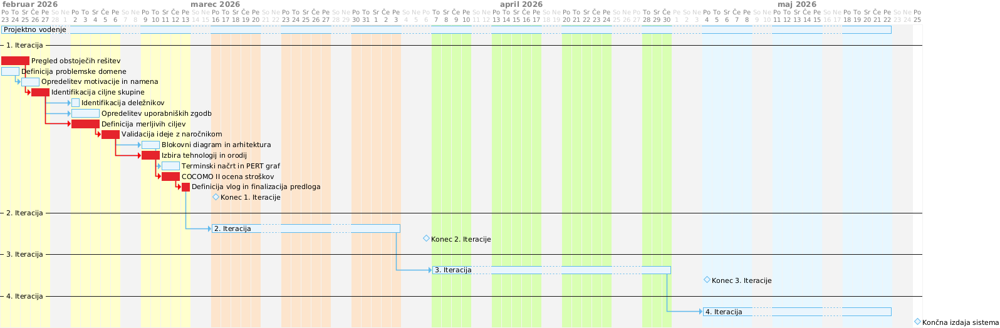
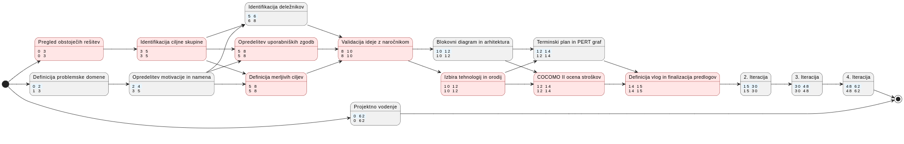

# :yellow_square: Predlog projekta

| Prejšnji dokument |          Trenutni dokument           | Naslednji dokument [:arrow_forward:](02_Osnutek_sistema_1_porocilo_o_stanju.md) |
| :---------------- | :----------------------------------: | ------------------------------------------------------------------------------: |
|                   | :yellow_square: **Predlog projekta** |                   :orange_square: **Osnutek sistema**<br>(1. poročilo o stanju) |


V 1. iteraciji ekipa predlaga projekt, ki je skladen z izzivom dejanskega naročnika (zunaj ekipe). Ekipa določi zahteve, projektne cilje, načrtuje implementacijo in se seznani z orodji in platformami, ki jih bo uporabljala. Na predavanjih v tem času obdelamo potrebe in zahteve uporabnikov. Podrobna vprašanja v predlogu omogočajo, da ekipe delajo vzporedno s predavanji.

V 5. tednu ekipe predstavijo svoj predlog na zagovoru. Povratna informacija pomaga ekipi določiti cilje projekta, ki morajo biti dovolj zahtevni, a izvedljivi.

Predlog projekta in poročila o stanju se nadgrajujejo v celovito končno poročilo. Vsa poročila imajo v osnovi enake odstavke. V predlogu sta poudarjena odseka [**2 Potrebe naročnika**](#2-potrebe-naročnika) in [**3 Cilji projekta**](#3-cilji-projekta). Gradivo iz teh odsekov se lahko uporabi v kasnejših poročilih.

## :page_with_curl: Sistem za spontana družabna srečanja – združi ljudi s skupnimi interesi v tvoji bližini

## :information_desk_person: Ime ekipe: 06. skupina | Člani ekipe: Miha Fabčič, Aleks Gogić, JAKOB JESENKO, Leja Petrič, Tim Pezdirc

## 0 Projektna ideja

### 0.1 Ozadje

V urbanih okoljih Slovenije in med študenti ali mladimi zaposlenimi se pogosto pojavlja problem socialne izolacije. Selitev v novo mesto, delo na daljavo in razpršene socialne mreže zmanjšujejo spontane družabne stike in priložnosti za spoznavanje novih ljudi.

Med najbolj znanimi aplikacijami za spoznavanje novih ljudi je **Tinder**, ki uporabnikom omogoča povezovanje na podlagi lokacije in osebnih preferenc. Aplikacija je primarno namenjena individualnim zmenkom, kjer uporabniki ocenjujejo profile drugih uporabnikov in se povežejo ob obojestranskem interesu.

Podobno deluje tudi **Bumble**, ki poleg romantičnih povezav omogoča tudi spoznavanje prijateljev ali profesionalnih kontaktov. Sistem prav tako temelji predvsem na individualnem ujemanju uporabnikov, ne pa na oblikovanju večjih skupin.

Drugačen pristop uporablja platforma **Meetup**, ki je namenjena organizaciji dogodkov in srečanj za večje skupine ljudi na podlagi skupnih interesov. Uporabniki se lahko pridružijo različnim skupinam ali dogodkom, ki jih organizirajo drugi uporabniki.

V zadnjih letih so se pojavile tudi aplikacije, ki poskušajo uporabnike povezovati v manjše skupine za družabna srečanja. Ena izmed takšnih je **Timeleft**, ki organizira večerje za manjše skupine neznancev na podlagi kratkega vprašalnika o osebnosti. Sistem vsak teden uporabnikom določi restavracijo in skupino ljudi, s katerimi se srečajo, vendar je tak pristop precej omejen na specifično aktivnost in določen čas srečanja.

Podoben koncept uporablja aplikacija **We3**, ki uporabnike povezuje v manjše skupine treh oseb na podlagi osebnostnih vprašalnikov in interesov. Algoritem poskuša ustvariti skupine z visoko socialno kompatibilnostjo, vendar je cilj predvsem oblikovanje dolgoročnih prijateljstev, ne pa spontanih družabnih srečanj.

Novejši primer predstavlja aplikacija **222**, ki uporabnike povezuje v manjše skupine za različne aktivnosti, kot so kava ali sprehodi. Sistem pri tem upošteva lokacijo in interese uporabnikov, vendar je trenutno na voljo predvsem v večjih mestih v Združenih državah.

Kljub temu večina teh rešitev ne ponuja **avtomatskega** oblikovanja manjših skupin uporabnikov za spontana srečanja. Pogosto se osredotočajo bodisi na individualno povezovanje bodisi na organizacijo večjih dogodkov, kjer morajo uporabniki sami poiskati ustrezno skupino ali aktivnost.

**Predlagani sistem** se od obstoječih rešitev razlikuje po tem, da se osredotoča na avtomatsko oblikovanje manjših skupin uporabnikov (npr. 3–5 oseb) na podlagi več kriterijev hkrati, kot so interesi, lokacija in časovna razpoložljivost. Namesto organizacije velikih dogodkov ali individualnih zmenkov sistem poskuša optimizirati sestavo manjših skupin, kjer je verjetnost uspešne socialne interakcije večja.

### 0.2 Področje in motivacija

Problem, ki ga želimo obravnavati, je **oblikovanje manjših skupin ljudi za spontana družabna srečanja** na podlagi njihovih interesov, lokacije in časovne razpoložljivosti.

Organizacija takšnih srečanj pogosto zahteva več korakov usklajevanja med posamezniki, kar zmanjšuje spontanost druženja. Posamezniki morajo:
- Najti ljudi s podobnimi interesi
- Uskladiti lokacijo srečanja
- Najti skupen časovni termin
- Organizirati konkretno aktivnost

**Motivacija projekta** je raziskati, ali lahko informacijski sistem z uporabo algoritma za oblikovanje skupin avtomatizira proces povezovanja uporabnikov v manjše kompatibilne skupine ter tako poveča možnosti za uspešna spontana druženja.

### 0.3 Namen projekta

Namen projekta je razviti **prototip sistema**, ki demonstrira algoritem za oblikovanje manjših skupin uporabnikov za družabna srečanja.

Sistem bi na podlagi:
- **interesov uporabnikov** (aktivnosti, hobiji, preference)
- **njihove lokacije** (geografska bližina)
- **časovne razpoložljivosti** (prosti termini)

predlagal skupine 3–5 ljudi, ki imajo največjo verjetnost za uspešno družabno srečanje.

Sistem, ki ga gradimo bi imel naslednje koristi:
- Zmanjšanje časa, potrebnega za organizacijo srečanja
- Povečanje možnosti za spontana druženja
- Boljša izkušnja uporabnikov pri iskanju družbe za neformalne aktivnosti
- Zmanjšanje socialne izolacije v urbanih okoljih
- Omogočanje spoznavanja novih ljudi v varnem in strukturiranem okolju

### 0.4 Cilji

Glavni cilji, ki jih želimo s projektom doseči so naslednji:

1. **Razvoj prototipa sistema** za zbiranje podatkov o interesih, lokaciji in razpoložljivosti uporabnikov
2. **Implementacija(prilagoditev obstoječega/ih) algoritma** za oblikovanje skupin uporabnikov na podlagi večkriterijske optimizacije
3. **Analiza in ovrednotenje kakovosti** oblikovanih skupin
4. **Testiranje uporabniške izkušnje** z realnimi uporabniki
5. **Dokumentacija sistema** in tehničnih odločitev

Podrobnejša opredelitev ciljev je v poglavju [3 Cilji projekta](#3-cilji-projekta).

### 0.5 Smernice

Pri razvoju sistema bomo upoštevali naslednje smernice:

- **Modularnost kode**: Algoritem za oblikovanje skupin bo ločen od uporabniškega vmesnika, kar omogoča ponovno uporabo in testiranje
- **Zasebnost uporabnikov**: Sistem ne bo shranjeval nepotrebnih osebnih podatkov; lokacija bo shranjena le na nivoju mesta ali okraja
- **Razširljivost**: Arhitektura bo omogočala dodajanje novih kriterijev za oblikovanje skupin (npr. starostna skupina, jezikovne preference)
- **Testabilnost**: Algoritem bo ovrednotljiv z merljivimi metrikami (podobnost interesov, geografska razdalja, časovno prekrivanje)
- **Uporabniška izkušnja**: Sistem bo intuitiven in zahteval minimalen čas za vnos podatkov
- **Etična uporaba podatkov**: Algoritem ne bo diskriminiral uporabnikov na podlagi zaščitenih značilnosti

### 0.6 Ciljna skupina in končni uporabniki

**Primarni ciljni uporabniki sistema za organizacijo skupin so:**

1. **Študenti**: Posamezniki, ki študirajo v novih mestih in iščejo družbo za neformalne aktivnosti
2. **Mladi zaposleni**: Osebe, ki so se zaposlile v novem mestu in želijo spoznati lokalno skupnost
3. **Priseljenci v novo mesto**: Posamezniki, ki so se preselili zaradi službe, študija ali drugih razlogov
4. **Odrasli, ki iščejo nove socialne stike**: Osebe, ki želijo razširiti svoj krog prijateljev ali spoznati ljudi s podobnimi hobiji

Opomba: Navedene skupine (študenti, mladi zaposleni, priseljenci) so podskupine istega primarnega segmenta končnih uporabnikov in se v nadaljevanju obravnavajo enotno kot mladi odrasli v urbanih okoljih.

**Končni uporabniki bodo sistem uporabljali za:**

- Vnos svojih interesov, hobijev in preferenc za aktivnosti
- Določitev približne lokacije (mesto ali okraj)
- Vnos časovne razpoložljivosti (dnevi v tednu, urni razponi)
- Prejem predlogov manjših skupin ljudi (3–5 oseb) za družabna srečanja
- Sodelovanje v predlaganih skupinah za spontana srečanja
- Povratno informacijo o uspešnosti srečanj

**Sekundarni deležniki oziroma deležniki, ki bodo imeli od projekta koristi, ne da bi bili neposredno vključeni so:**

- **Lokalni poslovni subjekti**: Kavarne, restavracije in drugi prostori, kjer bi se uporabniki lahko srečali
- **Občine in lokalne skupnosti**: Organizacije, ki podpirajo socialno vključenost in lokalno povezovanje

Podrobnejša analiza potreb naročnika je v poglavju [2 Potrebe naročnika](#2-potrebe-naročnika).

## 1 Uvod

Socialna izolacija je naraščajoč problem v urbanih okoljih, še posebej med mladimi odraslimi, ki se selijo v nova mesta zaradi študija ali zaposlitve. Čeprav obstajajo številne platforme za spoznavanje novih ljudi, večina bodisi omogoča individualno povezovanje (Tinder, Bumble) bodisi organizacijo velikih dogodkov (Meetup), medtem ko je oblikovanje manjših, kompatibilnih skupin za spontana srečanja še vedno ročen in časovno zahteven proces.

Projekt naslavlja ta problem z razvojem **inteligentnega sistema za avtomatsko oblikovanje manjših skupin uporabnikov** (3–5 oseb) na podlagi večkriterijske optimizacije, ki upošteva interese, lokacijo in časovno razpoložljivost. Cilj je zmanjšati organizacijske ovire in povečati verjetnost uspešnih družabnih srečanj.

Ključna inovacija projekta je **pametna komponenta** – algoritem za oblikovanje skupin, ki kombinira podobnost interesov, geografsko bližino in časovno usklajevanje v enoten ocenjevalni sistem. Na ta način sistem ne predlaga le naključnih skupin, temveč optimizira sestavo tako, da maksimizira kompatibilnost članov.

### 1.1 Izzivi

Glavni izzivi projekta so:

**1. Tehnični izzivi:**
- **Oblikovanje algoritma za večkriterijsko optimizacijo**: Potrebno je razviti/preoblikovati algoritem, ki učinkovito kombinira različne kriterije (interesi, lokacija, čas) in oblikuje optimalne skupine
  - *Pristop*: Uporaba scoring sistema z utežmi ter primerjava različnih metrik podobnosti (Cosine Similarity, Jaccard Index)
- **Ravnovesje med natančnostjo in zasebnostjo**: Sistem mora delovati z omejenimi podatki o uporabnikih
  - *Pristop*: Zbiranje le nujnih podatkov; lokacija na nivoju mesta/okraja, ne GPS koordinat

**2. Algoritemski izzivi:**
- **Skalabilnost algoritma**: Kako zagotoviti, da algoritem deluje učinkovito tudi pri večjem številu uporabnikov?
  - *Pristop*: Testiranje učinkovitosti na sintetičnih podatkih različnih velikosti
- **Kakovost skupin**: Kako zagotoviti, da predlagane skupine dejansko vodijo do uspešnih srečanj?
  - *Pristop*: Definiranje metrik kakovosti in testiranje z realnimi uporabniki

**3. Organizacijski izzivi:**
- **Zbiranje povratnih informacij**: Kako motivirati uporabnike, da podajo povratne informacije po srečanju?
  - *Pristop*: Preprost in hiter vprašalnik; morda gamifikacija
- **Cold-start problem**: Kako sistem deluje, ko je uporabnikov še malo?
  - *Pristop*: Testiranje z manjšo skupino zgodnjih uporabnikov (študenti FRI)

**Poznavanje tehnologije:**
- Večina tehnologij je ekipi poznana (JavaScript, algoritmi, spletne aplikacije)
- Nova področja: Vektorska podobnost, optimizacijski algoritmi za oblikovanje skupin
- Učenje: Študij literature o recommendation systems in group formation algorithms

## 2 Potrebe naročnika

**Primarni naročnik**: Končni uporabniki sistema - mladi odrasli (18-35 let) v urbanih območjih Slovenije, ki iščejo družbo za spontana družabna srečanja.

**Sekundarni deležniki**:
- Lokalni poslovni subjekti (kavarne, restavracije, prostori za srečanja)
- Občine in lokalne skupnosti (socialna vključenost in povezovanje)
- Študentske organizacije in univerzitetne skupnosti (kanal za vključevanje uporabnikov)

**Kaj deležniki želijo?**
- **Primarni naročnik (končni uporabniki)** želi:
  - **Spontana druženja** brez dolgotrajne organizacije
  - **Spoznavanje ljudi s podobnimi interesi** v neformalnem okolju
  - **Varno okolje** za spoznavanje novih ljudi
  - **Časovno učinkovito** usklajevanje srečanj
  - **Fleksibilnost** pri izbiri aktivnosti in terminov
- **Sekundarni deležniki** želijo:
  - Več vključevanja mladih v lokalno skupnost
  - Večjo obiskovanost lokalnih družabnih prostorov
  - Strukturiran in varen način organizacije srečanj

**Zakaj?**
- Ročno iskanje in usklajevanje ljudi za druženje je časovno potratno
- Obstoječe platforme so osredotočene na velike skupine ali individualne zmenke
- Težko je najti ljudi s podobnimi interesi in prosto časovno razpoložljivostjo hkrati
- Socialna izolacija v novih mestih negativno vpliva na psihično zdravje

**Želena splošna izkušnja:**
Uporabniki želijo **preprost, intuitiven sistem**, kjer lahko z minimalnim naporom (vnos interesov in razpoložljivosti) dobijo **kakovostne predloge manjših skupin ljudi** za družabna srečanja. Želijo si, da sistem **razume njihove preference** in predlaga skupine, ki imajo **visoko verjetnost uspešne socialne interakcije**.

### 2.1 Uporabniške zahteve

**Uporabniška zgodba 1: Registracija in vnos profila**

Kot **nov uporabnik** želim **hitro in preprosto ustvariti profil z vnosom osnovnih informacij, interesov in časovne razpoložljivosti**, da **lahko sistem začne oblikovati zame primerne skupine**.

*Testi sprejemljivosti:*
- Glede **na to, da sem nov uporabnik**, ko **odprem aplikacijo prvič** in **vnesem svoje ime, približno lokacijo (mesto), vsaj 3 interese in časovno razpoložljivost za naslednji teden**, potem **je moj profil uspešno ustvarjen in vidim potrditev, da je sistem pripravljen na iskanje skupin**.
- Glede **na to, da sem nov uporabnik**, ko **poskušam ustvariti profil brez vnosa obveznih polj**, potem **sistem prikaže jasna opozorila, katera polja so obvezna**.

---

**Uporabniška zgodba 2: Iskanje in predlogi skupin**

Kot **prijavljen uporabnik z izpolnjenim profilom** želim **prejeti predloge manjših skupin (3–5 oseb) za družabna srečanja na podlagi mojih interesov, lokacije in časovne razpoložljivosti**, da **lahko izberem skupino, ki mi je najbolj všeč, in se z njimi srečam**.

*Testi sprejemljivosti:*
- Glede **na to, da imam izpolnjen profil z interesi in časovno razpoložljivostjo**, ko **zahtevam iskanje skupin**, potem **sistem v 5 sekundah prikaže seznam vsaj 1 predlagane skupine z informacijami o skupnih interesih, lokaciji in predlaganem času srečanja**.
- Glede **na to, da je predlagana skupina**, ko **pregledam člane skupine**, potem **vidim njihove interese, približno lokacijo in skupne časovne termine brez osebnih podatkov (npr. polno ime, naslov)**.

---

**Uporabniška zgodba 3: Potrditev udeležbe**

Kot **uporabnik, ki je prejel predlog skupine** želim **potrditi ali zavrniti udeležbo v predlagani skupini**.

*Testi sprejemljivosti:*
- Glede **na to, da sem prejel predlog skupine**, ko **potrdim ali zavrnem udeležbo**, potem **se moj status v skupini posodobi in je ostalim članom prikazan z barvnim indikatorjem (zeleno/rdeče)**.

---

**Uporabniška zgodba 4: Posodobitev razpoložljivosti in interesov**

Kot **prijavljen uporabnik** želim **kadarkoli posodobiti svoje interese, lokacijo ali časovno razpoložljivost**, da **sistem lahko prilagodi predloge skupin glede na moje trenutne preference**.

*Testi sprejemljivosti:*
- Glede **na to, da sem prijavljen uporabnik**, ko **spremenim svoje interese ali časovno razpoložljivost** in **shranim spremembe**, potem **sistem posodobi moj profil in uporabi nove podatke pri naslednjem iskanju skupin**.
- Glede **na to, da sem posodobil svoj profil**, ko **znova zahtevam iskanje skupin**, potem **sistem prikaže nove predloge, ki upoštevajo posodobljene podatke**.

---

**Uporabniška zgodba 5: Povratna informacija po srečanju**

Kot **uporabnik, ki se je udeležil srečanja** želim **podati kratko povratno informacijo o srečanju (ocena zadovoljstva, uspešnost skupine)**, da **sistem lahko izboljša prihodnje predloge in analizira kakovost oblikovanih skupin**.

*Testi sprejemljivosti:*
- Glede **na to, da sem se udeležil srečanja**, ko **sistem po 24 urah od predvidenega časa srečanja zahteva povratno informacijo**, potem **lahko izpolnim kratek vprašalnik (max. 1 minuta) z oceno zadovoljstva in uspešnosti srečanja**.
- Glede **na to, da sem oddal povratno informacijo**, ko **pregledam zgodovino svojih srečanj**, potem **vidim statistiko svojih preteklih srečanj in povratnih informacij**.

---

**Uporabniška zgodba 6: Varnost in prijava neprimernega vedenja**

Kot **uporabnik** želim **prijaviti neprimerno vedenje drugih članov skupine ali neprimerne vsebine**, da **se zagotovi varno okolje za vse uporabnike**.

*Testi sprejemljivosti:*
- Glede **na to, da sem opazil neprimerno vedenje**, ko **kliknem na gumb za prijavo in vnesem opis incidenta**, potem **je prijava poslana administratorju sistema in prejemem potrditev o prejetju prijave**.
- Glede **na to, da je bila oddana prijava**, ko **administrator pregleda prijavo**, potem **lahko ukrepa (opozorilo, začasna prepoved, izbris uporabnika) glede na resnost incidenta**.

## 3 Cilji projekta

**Obravnavana težava naročnika:**
Naročniki (mladi odrasli v urbanih okoljih) se soočajo s **časovno potratnim in neučinkovitim procesom organizacije spontanih družabnih srečanj** z ljudmi s podobnimi interesi. Obstoječe rešitve ne omogočajo avtomatskega oblikovanja manjših, kompatibilnih skupin, kar vodi do socialne izolacije in zmanjšanih priložnosti za spoznavanje novih ljudi.

**Koristi sistema za naročnika (brez tehničnih podrobnosti):**

1. **Časovna učinkovitost**: Sistem avtomatizira iskanje in usklajevanje ljudi, kar zmanjša čas organizacije srečanja iz več ur/dni na nekaj minut
2. **Kakovostna srečanja**: Algoritem poskrbi, da so predlagane skupine kompatibilne (skupni interesi, bližina, časovno ujemanje), kar povečuje verjetnost uspešnih srečanj
3. **Zmanjšanje socialne izolacije**: Lažji dostop do družabnih stikov izboljšuje psihično zdravje in kakovost življenja
4. **Fleksibilnost**: Uporabniki lahko prilagajajo svoje preference in razpoložljivost, sistem pa se prilagaja njihovim spremembam
5. **Varnost**: Manjše skupine (3–5 oseb) in struktura sistema zagotavljajo bolj nadzorovano okolje za spoznavanje

**Kako koristi podpirajo želeno izkušnjo:**
Želena izkušnja uporabnikov je **preprost, hiter in zanesljiv sistem** za organizacijo družabnih srečanj. Avtomatizacija procesa, inteligentno oblikovanje skupin in uporabniku prijazen vmesnik skupaj ustvarjajo izkušnjo, kjer uporabnik **z minimalnim naporom dobi maksimalno kakovostne predloge** za druženja.

**Konkretni izdelki projekta:**

1. **Prototip spletne aplikacije** z uporabniškim vmesnikom za:
   - Registracijo, prijavo in upravljanje profila
   - Vnos interesov, lokacije in časovne razpoložljivosti
   - Pregled predlaganih skupin
   - Ocena skupine povratna informacija po aktivnosti

2. **Algoritem za oblikovanje skupin** (jedro sistema):
   - Modul za izračun podobnosti interesov
   - Modul za geografsko razdaljo
   - Modul za časovno usklajevanje
   - Optimizacijski algoritem za sestavo skupin

3. **Evalvacijska študija**:
   - Testiranje sistema z realnimi uporabniki (min. 20 testnih uporabnikov)
   - Zbiranje metrik kakovosti skupin
   - Analiza povratnih informacij uporabnikov

4. **Dokumentacija sistema**:
   - Arhitekturni načrt
   - Opis algoritma in odločitev
   - Tehnično poročilo

**Merljivi in preverljivi cilji:**

| **Cilj** | **Merilo** | **Ciljna vrednost** | **Metoda preverjanja** |
|----------|------------|---------------------|------------------------|
| **C1**: Razvoj prototipa sistema | Delovanje osnovnih funkcionalnosti (registracija, vnos podatkov, iskanje skupin) | 100% funkcionalnosti implementirano | Funkcionalno testiranje |
| **C2**: Implementacija algoritma | Algoritem oblikuje skupine na podlagi 3 kriterijev (interesi, lokacija, čas) | Povprečna podobnost interesov > 0.6, geografska razdalja < 10 km, časovno prekrivanje > 2 uri | Avtomatizirani testi z sintetičnimi podatki |
| **C3**: Kakovost oblikovanih skupin | Stopnja zadovoljstva uporabnikov s predlaganimi skupinami | > 70% uporabnikov oceni predlagano skupino z oceno 3.8/5 ali boljše | Vprašalnik po pregledu skupine |
| **C4**: Uporabniška izkušnja | Čas, potreben za registracijo in prvi predlog skupine | < 5 minut od registracije do prvega predloga | Merjenje časov med testiranjem |
| **C5**: Testiranje z realnimi uporabniki | Število testnih uporabnikov in srečanj | Min. 20 uporabnikov, min. 5 organiziranih srečanj | Evidenca registracij in potrjenih skupin |
| **C6**: Uspešnost srečanj | Delež srečanj, ki so bila dejansko izvedena in pozitivno ocenjena | > 60% potrjenih skupin se dejansko sreča, > 70% oceni srečanje pozitivno (3.8/5 ali več) | Povratne informacije uporabnikov po srečanju |

### 3.2 Merila uspeha

**Validacija ideje pri zunanjih osebah:**

Ustreznost ideje smo v 1. iteraciji preverili pri zunanji osebi - nosilcu/asistentu predmeta TPO (v vlogi zunanjega naročnika).

Povzetek pridobljenih povratnih informacij:
- Ideja je relevantna in problem je dobro opisan.
- Potrebna je jasna primerjava s sorodnimi rešitvami (npr. aplikacije za spoznavanje in dogodke) ter opredelitev dodane vrednosti.
- Obseg je bil na začetku preširok; priporočilo je bilo fokusiranje na MVP.
- Jedro MVP naj bo algoritem za group matching na podlagi interesov, lokacije in časovne razpoložljivosti.
- Ni smiselno razvijati novega algoritma iz nič; smiselna je prilagoditev obstoječih pristopov na lastne podatke.
- Za MVP LLM ni nujen; bolj ustrezen je preprost scoring pristop (npr. vektorska podobnost + razdalja + časovno prekrivanje).
- Ključno je ovrednotenje kakovosti oblikovanih skupin z analitiko uporabe in vprašalniki.


**Opis dejanskega zunanjega naročnika:**

Zunanji naročnik za validacijo v 1. iteraciji je profesor/asistenta predmeta TPO, ki je podal strokovno usmeritev glede:
- realnega obsega MVP,
- izbire primernega algoritmičnega pristopa,
- potrebnega načina evalvacije (merjenje kakovosti predlaganih skupin),
- izvedljivosti glede na razpoložljive podatke in časovni okvir predmeta.

V naslednji iteraciji bomo kot dodatne zunanje deležnike za validacijo vključili tudi predstavnike končnih uporabnikov (študenti, mladi zaposleni).

**Kako bomo vedeli, ali je naročnik dobil želene koristi?**

Merila uspeha, pomembna naročniku so naslednja:

1. **Jasno opredeljena dodana vrednost glede na sorodne rešitve**:
  - Merilo: dokumentirana primerjava vsaj 5 sorodnih rešitev (funkcionalnosti, omejitve, razlika našega pristopa)
  - Ciljna vrednost: primerjava vključena v poročilo in potrjena na pregledu iteracije

2. **Ustrezno fokusiran MVP**:
  - Merilo: MVP vsebuje jedrni tok (vnos podatkov -> izračun kompatibilnosti -> predlog skupine)
  - Ciljna vrednost: 100% implementirane MVP funkcionalnosti brez ne-nujnih modulov

3. **Kakovost predlaganih skupin (ključno merilo)**:
  - Merilo: zadovoljstvo uporabnikov s predlogom skupine (ocena 1-5) in delež sprejetih predlogov
  - Ciljna vrednost: povprečna ocena predloga >= 3.8/5 in vsaj 60% sprejetih predlogov

4. **Izvedljivost in merljivost pametne komponente**:
  - Merilo: delujoč scoring model `score = w1 * similarity + w2 * distance + w3 * time_overlap` z dokumentiranimi utežmi in vhodi
  - Ciljna vrednost: model stabilno generira skupine in je ovrednoten na testnem naboru

5. **Dokazana možnost izboljševanja na podlagi podatkov**:
  - Merilo: zajem analitike uporabe + vprašalnik po aktivnosti
  - Ciljna vrednost: za vsaj 20 testnih uporabnikov zbran celoten cikel podatkov (predlog, odziv, povratna ocena)

**Metoda zbiranja podatkov:**
- Kratki vprašalniki po srečanjih (avtomatizirani)
- Analitika uporabe sistema (število registracij, aktivnih uporabnikov, predlaganih in potrjenih skupin)
- Evalvacija kakovosti predlogov (ocena predlagane skupine in ocena izvedenega srečanja)

## 4 Opis sistema

_V okviru predloga projekta zadostuje osnutek tega poglavja._

_to je osnutek za diagram in predstavitev sistema (dopolnili bomo v kasnejših iteracijah)_

**Blokovni diagram sistema:**

```
┌─────────────────────────────────────────────────────────────┐
│                    UPORABNIŠKI VMESNIK                      │
│            (Spletna/Mobilna aplikacija)                     │
│  - Registracija/prijava                                     │
│  - Upravljanje profila                                      │
│  - Prikaz predlaganih skupin                                │
│  - Ocena in povratne informacije                            │
└───────────────────┬─────────────────────────────────────────┘
                    │
                    ▼
┌─────────────────────────────────────────────────────────────┐
│                   APLIKACIJSKI NIVO                         │
│                                                             │
│  ┌──────────────────┐      ┌─────────────────────────┐      │
│  │  API Gateway     │──────│  Avtentikacija &        │      │
│  │                  │      │  Avtorizacija           │      │
│  └──────────────────┘      └─────────────────────────┘      │
│                                                             │
│  ┌──────────────────────────────────────────────────────┐   │
│  │          JEDRO SISTEMA - PAMETNA KOMPONENTA          │   │
│  │                                                      │   │
│  │  ┌────────────────┐  ┌──────────────────────────┐    │   │
│  │  │ Modul za       │  │ Modul za časovno         │    │   │
│  │  │ podobnost      │  │ usklajevanje             │    │   │
│  │  │ interesov      │  │                          │    │   │
│  │  └────────────────┘  └──────────────────────────┘    │   │
│  │                                                      │   │
│  │  ┌────────────────┐  ┌──────────────────────────┐    │   │
│  │  │ Modul za       │  │ Algoritem za oblikovanje │    │   │
│  │  │ geografsko     │  │ skupin                   │    │   │
│  │  │ bližino        │  │                          │    │   │
│  │  └────────────────┘  └──────────────────────────┘    │   │
│  └──────────────────────────────────────────────────────┘   │
│                                                             │
│  ┌──────────────────┐      ┌─────────────────────────┐      │
│  │  Upravljanje     │      │  Ocena in povratne info │      │
│  │  uporabnikov     │      │                         │      │
│  └──────────────────┘      └─────────────────────────┘      │
└───────────────────┬─────────────────────────────────────────┘
                    │
                    ▼
┌─────────────────────────────────────────────────────────────┐
│                    PODATKOVNA BAZA                          │
│  - Uporabniki (profili, interesi, lokacije, razpoložljivost)│
│  - Skupine (predlagane, potrjene, zgodovinske)              │
│  - Povratne informacije (ocene srečanj)                     │
└─────────────────────────────────────────────────────────────┘

┌─────────────────────────────────────────────────────────────┐
│                  ZUNANJE STORITVE (opcijsko)                │
│  - Geokodiranje API (Google Maps / OpenStreetMap)           │
│  - Email obvestila (Resend)                                 │
│  - Analitika (Google Analytics / Mixpanel)                  │
└─────────────────────────────────────────────────────────────┘
```

**Meje sistema:**
- **Znotraj sistema**: Uporabniški vmesnik, algoritem za oblikovanje skupin, upravljanje podatkov, komunikacija med uporabniki
- **Zunaj sistema**: Dejanska organizacija srečanja (lokacija, aktivnosti), plačilni sistem (v MVP ni potreben), preverjanje identitete uporabnikov (lahko opcijsko kasneje)

**Predstavitev sistema:**

Sistem deluje kot **centralizirana platforma** za avtomatsko oblikovanje manjših skupin uporabnikov za družabna srečanja. Uporabniki se registrirajo in vnesejo svoje podatke (interesi, lokacija, časovna razpoložljivost) preko uporabniškega vmesnika.


## 5 Predlagan pristop

_V okviru predloga projekta zadostuje osnutek tega poglavja._

_to je osnutek za delovanje sistema, platforme, orodja, strategije testiranja (dopolnili bomo v kasnejših iteracijah)_

### 5.1 Delovanje sistema

Sistem deluje v naslednjih korakih:

1. **Registracija in vnos podatkov**:
  Uporabnik ustvari profil in vnese osnovne podatke, svoje interese, približno lokacijo ter časovno razpoložljivost. Sistem ob tem preveri, ali so obvezna polja pravilno izpolnjena, in podatke shrani v podatkovno bazo.

2. **Iskanje skupin**:
  Ko je profil pripravljen, uporabnik sproži iskanje skupin. Sistem iz baze pridobi kandidate, ki so glede na lokacijo, interese in proste termine potencialno primerni za ujemanje.

3. **Oblikovanje skupin**:
  Algoritem za oblikovanje skupin izračuna stopnjo kompatibilnosti med uporabniki na podlagi podobnosti interesov, geografske bližine in časovnega prekrivanja. Na tej podlagi sestavi manjše skupine z najvišjo skupno oceno ujemanja.

4. **Prikaz predlogov**:
  Sistem uporabniku prikaže enega ali več predlogov skupin skupaj z osnovnimi informacijami o skupnih interesih, predlaganem terminu in okvirni lokaciji srečanja.

5. **Potrditev skupine**:
  Uporabnik lahko predlagano skupino potrdi ali zavrne. Ob potrditvi se status skupine posodobi, drugi člani pa prejmejo informacijo o oblikovani skupini oziroma o nadaljnjem usklajevanju.

6. **Srečanje ter ocena in povratna informacija**:
  Po izvedenem srečanju sistem uporabnike pozove k oddaji kratke povratne informacije. Zbrane ocene se uporabijo za analizo kakovosti predlogov in za nadaljnje izboljšave algoritma.

#### 5.1.1 Podrobnejši opis pametne komponente

Pametna komponenta je jedro sistema za oblikovanje skupin in je sestavljena iz treh glavnih delov: ujemanje interesov, geografska bližina in časovno prekrivanje razpoložljivosti.

**Vhodi pametne komponente:**
- profil uporabnika (interesi, okvirna lokacija, časovna razpoložljivost),
- profili kandidatov, ki izpolnjujejo osnovne pogoje za ujemanje,
- konfiguracija uteži modela (`w1`, `w2`, `w3`).

**Koraki obdelave:**
1. Predizbor kandidatov:
  - Sistem iz množice uporabnikov izbere kandidate z ustrezno razpoložljivostjo in osnovno geografsko bližino.
2. Izračun delnih metrik:
  - `similarity` (ujemanje interesov),
  - `distance` (geografska bližina),
  - `time_overlap` (časovno prekrivanje).
3. Izračun skupne ocene:
  - `score = w1 * similarity + w2 * distance + w3 * time_overlap`.
4. Razvrščanje in sestava predlogov skupin:
  - kandidati se razvrstijo po oceni,
  - sistem pripravi predloge manjših skupin (3-5 oseb) z najvišjo skupno kompatibilnostjo.

**Izhodi pametne komponente:**
- seznam predlogov skupin,
- ključni razlogi za ujemanje (interesi, lokacija, čas),
- metapodatki za nadaljnjo analitiko kakovosti.

**Spremljanje kakovosti in upravljanje:**
- spremljamo metrike, kot so delež potrjenih predlogov, povprečna ocena skupine in delež izvedenih srečanj,
- administratorski modul omogoča pregled metrik in primerjavo stanja pred/po spremembi uteži,
- pragovi opozoril in postopek odobritve sprememb parametrov ostanejo predmet naslednje iteracije.


### 5.2 Platforme, orodja in knjižnice

**Backend:**
- **Node.js** in **MongoDB**
- REST API za upravljanje uporabnikov, profilov, predlogov skupin in povratnih informacij

**Algoritem za oblikovanje skupin:**
- izračun podobnosti interesov z metrikami, kot sta **Cosine Similarity** in po potrebi **Jaccard Index**
- modul za geografsko razdaljo in modul za časovno prekrivanje terminov
- utežen scoring pristop za končno razvrščanje kandidatov v skupine

**Frontend:**
- **Angular**
- spletni uporabniški vmesnik za registracijo, urejanje profila, pregled predlogov skupin in oddajo povratnih informacij

**Zunanje storitve:**
- geokodiranje oziroma kartografska podpora z uporabo **OpenStreetMap** ali podobne storitve
- po potrebi email obvestila za potrditve skupin in povratne informacije


**Deployment:**
- lokalno **Docker**
- v oblaku, **Azure**, **Render** ali podobna storitev za gostovanje prototipa


### 5.3 Strategija testiranja

**Enote testiranja (Unit tests):**
- testiranje posameznih modulov algoritma (podobnost interesov, razdalja, časovno prekrivanje) ter ključnih backend funkcij

**Integracijski testi:**
- preverjanje komunikacije med Angular odjemalcem, REST API-jem in podatkovno bazo

**Funkcionalni testi:**
- preverjanje glavnih uporabniških tokov: registracija, urejanje profila, iskanje skupin, potrditev skupine in oddaja povratne informacije

**End-to-end testi:**
- preverjanje celotnega poteka od registracije do prikaza predloga skupine in zaključka srečanja

**Testiranje z realnimi uporabniki:**
- testiranje prototipa na manjši skupini uporabnikov z namenom zbiranja kvalitativnih in kvantitativnih povratnih informacij

**Ovrednotenje strategije testiranja:**

| **Tip testiranja** | **Kritična področja** | **Pričakovan rezultat** | **Orodje** |
|---------------------|-----------------------|--------------------------|------------|
| Unit tests | algoritmi za ujemanje, validacija vhodov, poslovna logika API-ja | pravilni izračuni in stabilno delovanje posameznih modulov | Jest |
| Integracijski testi | povezava frontend-backend-baza | pravilna izmenjava podatkov brez napak pri klicih | Postman, Jest |
| Funkcionalni testi | registracija, urejanje profila, iskanje skupin | glavni uporabniški scenariji delujejo skladno z zahtevami | ročno testiranje |
| End-to-end testi | celoten uporabniški tok | uporabnik uspešno pride od vnosa podatkov do predloga skupine | Cypress ali ročno testiranje |
| Testiranje z uporabniki | zadovoljstvo uporabnikov, kakovost predlogov | zbrane povratne informacije za ovrednotenje MVP | vprašalnik, analiza uporabe |


**Metrike kakovosti:**
- povprečna ocena predlagane skupine
- delež potrjenih predlogov skupin
- delež dejansko izvedenih srečanj
- čas od registracije do prvega predloga skupine


## 6 Vodenje projekta

**Razvojni proces**: Iterativni razvoj po tedenskih "rezinah" (1 teden)

Ekipa ne uporablja strogega Scrum procesa, ker bi vsakodnevna formalna srečanja predstavljala prevelik časovni strošek glede na druge obveznosti. Namesto tega uporabljamo lažji iterativni pristop:
- Na začetku tedna določimo cilje tedenske rezine.
- Med tednom člani samostojno izvajajo dogovorjene naloge.
- Ob koncu tedna (sobota ali nedelja) izvedemo skupni pregled napredka in dogovor popravkov.
- Če kdo naloge ne more dokončati, to pravočasno javi v Discordu, da se delo prerazporedi ali dobi pomoč.

**Dobre prakse, ki bodo uporabljene na projektu so naslednje:**
- **Verzije kode**: Git + GitHub (repositorij struktura: main, develop, feature branches)
- **Code reviews**: Vsaka sprememba gre skozi pregled najmanj enega člana ekipe in se potrdi
- **Dokumentacija**: Sproti pisanje komentarjev v kodi in posodabljanje README.md
- **Sledenje nalogam**: Trenutno sprotni dogovor v ekipi; formalno orodje (npr. GitHub Projects/Trello) bomo uvedli po potrebi

**Dnevnik sprememb** (Changelog):

| **Datum**  | **Opis spremembe** | **Motivacija** | **Posledica** |
|------------|--------------------|----------------|---------------|
| 1. 3. 2026 | Začetek projekta, definicija predloga | Zahteva predmeta TPO | Osnovna struktura projekta postavljena |
| 10. 3. 2026 | Dopolnitev poglavij 0-3 | Uskladitev z navodili predmeta in povratno informacijo | Jasneje definirani deležniki, zahteve in merila uspeha |
| 13. 3. 2026 | Prilagoditev poglavja 6 in načina dela ekipe | Potreba po realnem procesu dela ekipe | Uveden tedenski iterativni pristop z usklajevanjem prek Discorda |
| 27. 3. 2026 | Prilagoditev COCOMO finančne in časovne ocene na MVP | Povratne informacije iz zagovora (realnejši načrt in jasnost obsega) | Finančna in časovna ocena usklajeni z dejanskim rokom projekta (62 dni) |
| 30. 3. 2026 | Dopolnitev opisa pametne komponente in administratorskega nadzora | Dodatna zahteva po spremljanju učinkovitosti matching algoritma | Jasneje opredeljene metrike kakovosti in operativno ukrepanje ob poslabšanju |
| 3. 5. 2026 | Iteracija 2: Osnutek sistema - priprava specifikacije zahtev in uporabniških tokov | Potreba po jasni specifikaciji vmesnikov in funkcionalnosti za izvajanje | Dopolnjene funkcionalne in nefunkcionalne zahteve, oblikovane maske uporabniških vmesnikov, definirani primeri uporabe in diagrami aktivnosti |

---

### Minimalni delujoči sistem (MVP) za naslednjo iteracijo:

**Iteracija 1** (Trenutna - Predlog projekta):
- Definiranje projektne ideje
- Določitev zahtev in ciljev
- Načrt implementacije

**Iteracija 2** (Osnutek sistema - 1. poročilo o stanju):
- **Backend API**:
  - Registracija in prijava uporabnikov
  - CRUD operacije za uporabniške profile (interesi, lokacija, razpoložljivost)
  - Osnovna shema podatkovne baze (uporabniki, interesi)
- **Algoritem (osnovna verzija)**:
  - Modul za podobnost interesov (Cosine Similarity)
  - Modul za geografsko razdaljo
  - Preprost algoritem za oblikovanje skupin (brez optimizacije)
- **Frontend (osnoven UI)**:
  - Registracijska in prijavna stran
  - Stran za vnos/urejanje profila
  - Preprost prikaz predlaganih skupin

**Minimalni izdelek**: Uporabnik lahko ustvari profil, vnese podatke in prejme seznam predlaganih skupin (čeprav še ne optimalno oblikovanih).

---

### Seznam želja (Features za prihodnje iteracije):

**Prioriteta 1 (Must-have za končno izdajo):**
- Osnoven algoritem za oblikovanje skupin
- Uporabniški vmesnik za registracijo, profil in prikaz skupin
- Povratne informacije uporabnikov po srečanjih
- Testiranje z realnimi uporabniki (min. 20 oseb)

**Prioriteta 2 (Should-have):**
- Skupinski klepet za komunikacijo med člani
- Email obvestila o novih skupinah
- Optimizacija algoritma (boljša sestava skupin)
- Mobilna aplikacija (React Native)

**Prioriteta 3 (Nice-to-have):**
- Integracija s koledarjem (Google Calendar, Apple Calendar)
- Predlogi lokacij za srečanje (kavarne, parki)
- Gamifikacija (badges za aktivne uporabnike)
- AI-powered matching (uporaba LLM za boljšo interpretacijo interesov)
- Filtriranje po starostni skupini, jeziku, spolu
- "Superlike" funkcionalnost (prednostno oblikovanje skupin s priljubljenimi uporabniki)

**Prioriteta 4 (Future enhancements):**
- Plačilni sistem za premium funkcije
- Integracija s socialnimi omrežji (Facebook, Instagram)
- Video klepet pred srečanjem
- Preverjanje identitete uporabnikov (KYC)

### 6.1 Usklajevanje ekipe

**Razporeditev dela:**
- Delo razdelimo po tedenskih rezinah z jasno določenimi nalogami za vsakega člana.
- Na začetku tedna določimo prioritete in odgovorne osebe.
- Če kdo naloge ne more dokončati, to označi v Discordu, da se dogovorimo za pomoč ali prerazporeditev.
- Formalnega orodja za projektno vodenje (GitHub Projects/Trello) trenutno še ne uporabljamo; odločitev bomo sprejeli kasneje.

**Sestanki ekipe:**
- **Glavni tedenski sestanek**: Enkrat tedensko, praviloma konec tedna (sobota ali nedelja), online preko Discorda.
  - Trajanje: približno 60-90 minut.
  - Namen: pregled opravljenega dela, določitev nalog za naslednji teden, uskladitev odprtih težav.
- **Vmesna uskladitev po potrebi**: krajši ad-hoc klici ali sporočila v Discordu, kadar se pojavi blokada.

**Cilji sestankov:**
- Spremljanje napredka projekta
- Razreševanje tehničnih težav in ovir
- Usklajevanje odločitev glede arhitekture in implementacije
- Razporeditev nalog za naslednjo tedensko rezino
- Priprava na zagovore in predstavitve

**Komunikacija:**
- **Sprotna komunikacija**: Discord kanal (glavni komunikacijski kanal ekipe)
- **Dokumentacija**: Markdown dokumenti v repozitoriju + po potrebi deljeni dokumenti
- **Koda**: GitHub repository z jasnimi pull request-i in code reviews

### 6.2 Projektni načrt

**Razdelitev projekta na aktivnosti in izdelki:**

Projekt je razdeljen na **10 aktivnosti** razporejenih čez 4 iteracije. Vsaka aktivnost je opisana z oznako, datumom začetka in konca, trajanjem, imenom, opisom, obsegom, cilji, odvisnostmi od ostalih aktivnosti, omejitvami, rezultati ter informacijo o tem, ali je na kritični poti.

---

**Aktivnost A1: Analiza problema in definicija projektne ideje**

| **Oznaka** | **Datum začetka** | **Datum konca** | **Trajanje** | **Na kritični poti** |
|:---:|:---:|:---:|:---:|:---:|
| A1 | 23. 2. 2026 | 27. 2. 2026 | 5 delovnih dni |  Da |

- **Ime**: Analiza problema in definicija projektne ideje
- **Opis**: Ekipa analizira obstoječe rešitve (Tinder, Bumble, Meetup, Timeleft, We3, 222), identificira problemsko domeno socialne izolacije v urbanih okoljih ter definira projektno idejo, motivacijo in namen sistema.
- **Obseg aktivnosti**: Pregled in primerjava vsaj 5 sorodnih aplikacij; definicija problemske domene; opredelitev motivacije, namena in smernic projekta; identifikacija ciljne skupine in končnih uporabnikov.
- **Cilji aktivnosti**: Jasno opredeljena projektna ideja z dokumentirano primerjavo sorodnih rešitev in definirano dodano vrednostjo predlagane rešitve.
- **Odvisnost od ostalih aktivnosti**: Ni odvisna od nobene aktivnosti.
- **Omejitve**: Časovna omejitev 1 teden; dostop le do javno dostopnih informacij o sorodnih platformah.
- **Rezultati**: Dokumentirana analiza problemske domene (poglavje 0 in 1), primerjalna analiza sorodnih rešitev.

---

**Aktivnost A2: Analiza zahtev in definicija ciljev projekta**

| **Oznaka** | **Datum začetka** | **Datum konca** | **Trajanje** | **Na kritični poti** |
|:---:|:---:|:---:|:---:|:---:|
| A2 | 2. 3. 2026 | 6. 3. 2026 | 5 delovnih dni |  Da |

- **Ime**: Analiza zahtev in definicija ciljev projekta
- **Opis**: Definicija potreb in zahtev deležnikov, oblikovanje 6 uporabniških zgodb s testi sprejemljivosti ter določitev merljivih projektnih ciljev. Validacija ideje z zunanjim naročnikom (asistentom predmeta TPO).
- **Obseg aktivnosti**: Identifikacija primarnih in sekundarnih deležnikov; opredelitev 6 uporabniških zgodb; definicija 6 merljivih projektnih ciljev (C1–C6); merila uspeha in validacija z naročnikom.
- **Cilji aktivnosti**: Dokumentirane in validirane zahteve sistema z merljivimi cilji, pripravljene za načrtovanje implementacije.
- **Odvisnost od ostalih aktivnosti**: A1 (razumevanje problemske domene in sorodnih rešitev).
- **Omejitve**: Časovna omejitev 1 teden; dostop do zunanjega naročnika za validacijo.
- **Rezultati**: Poglavje 2 (Potrebe naročnika), poglavje 3 (Cilji projekta), 6 uporabniških zgodb s testi sprejemljivosti, povratna informacija naročnika.

---

**Aktivnost A3: Načrt sistema in projektno vodenje**

| **Oznaka** | **Datum začetka** | **Datum konca** | **Trajanje** | **Na kritični poti** |
|:---:|:---:|:---:|:---:|:---:|
| A3 | 9. 3. 2026 | 16. 3. 2026 | 6 delovnih dni |  Da |

- **Ime**: Načrt sistema in projektno vodenje
- **Opis**: Oblikovanje arhitekture sistema, izbira tehnologij (Node.js, MongoDB, Angular), določitev projektnega pristopa, vodenja in komunikacije; priprava Ganttovega diagrama in PERT grafa; COCOMO II finančna ocena; definicija vlog in odgovornosti. **Vse mora biti zaključeno do 16. 3. 2026 (oddaja predloga projekta).**
- **Obseg aktivnosti**: Blokovni diagram sistema; definicija tehnologij, orodij in knjižnic; terminski načrt (Gantt.puml – vključno s točnimi datumi); PERT graf za analizo kritične poti (PERT.puml); COCOMO II ocena stroškov; definicija vlog in odgovornosti ter projektnega pristopa; finalizacija celotnega predloga projekta.
- **Cilji aktivnosti**: Celoten predlog projekta z dokumentiranim načrtom implementacije, terminskim načrtom in finančno oceno, oddan 16. 3. 2026.
- **Odvisnost od ostalih aktivnosti**: A1, A2.
- **Omejitve**: Vsi diagrami (Gantt, PERT, COCOMO II) morajo biti dokončani pred oddajo 16. 3.; znanje ekipe o razpoložljivih tehnologijah in razvojnih pristopih.
- **Rezultati**: Celoten predlog projekta (ta dokument), Ganttov diagram (Gantt.puml), PERT graf (PERT.puml), COCOMO II ocena.

---

**Aktivnost A4: Postavitev razvojnega okolja**

| **Oznaka** | **Datum začetka** | **Datum konca** | **Trajanje** | **Na kritični poti** |
|:---:|:---:|:---:|:---:|:---:|
| A4 | 23. 3. 2026 | 27. 3. 2026 | 5 delovnih dni |  Da |

- **Ime**: Postavitev razvojnega okolja in projektne infrastrukture
- **Opis**: Inicializacija Git repozitorija s strukturiranimi vejami (main, develop, feature), konfiguracija Docker razvojnega okolja, vzpostavitev CI/CD pipeline (GitHub Actions) ter določitev osnovne projektne strukture Node.js in Angular aplikacije.
- **Obseg aktivnosti**: Git repozitorij z vejami; Docker in docker-compose konfiguracija; CI/CD z avtomatiziranimi testi ob vsaki spremembi; osnovna projektna struktura (backend, frontend, tests); README z navodili za vzpostavitev.
- **Cilji aktivnosti**: Delujoče, standardizirano razvojno okolje za vse člane ekipe z avtomatizirano CI/CD integracijo.
- **Odvisnost od ostalih aktivnosti**: A3 (odločitve o tehnologijah in arhitekturi).
- **Omejitve**: Poznavanje DevOps orodij; brezplačni tir oblačnih storitev.
- **Rezultati**: Git repozitorij, Docker konfiguracija, CI/CD pipeline, osnovna projektna struktura.

---

**Aktivnost A5: Implementacija podatkovne baze in backend API**

| **Oznaka** | **Datum začetka** | **Datum konca** | **Trajanje** | **Na kritični poti** |
|:---:|:---:|:---:|:---:|:---:|
| A5 | 30. 3. 2026 | 10. 4. 2026 | 10 delovnih dni |  Ne |

- **Ime**: Implementacija podatkovne baze in backend REST API
- **Opis**: Modeliranje in implementacija MongoDB podatkovne baze ter razvoj REST API za registracijo, prijavo in CRUD operacije za uporabniške profile (interesi, lokacija, časovna razpoložljivost) z JWT avtentikacijo.
- **Obseg aktivnosti**: MongoDB sheme (uporabniki, interesi, lokacija, razpoložljivost, srečanja); REST API z vsaj 10 endpointi; JWT avtentikacija; validacija vhodnih podatkov; unit testi za ključne endpointe.
- **Cilji aktivnosti**: Delujoč backend, ki podpira registracijo, prijavo in vse CRUD operacije za profil – osnova za integracijo algoritma in frontenda.
- **Odvisnost od ostalih aktivnosti**: A4 (razvojno okolje).
- **Omejitve**: Časovna omejitev 2 tedna; zahteva poznavanje Node.js in MongoDB.
- **Rezultati**: Delujoč REST API, MongoDB sheme, unit testi API endpointov, Postman kolekcija.

---

**Aktivnost A6: Razvoj algoritma za oblikovanje skupin**

| **Oznaka** | **Datum začetka** | **Datum konca** | **Trajanje** | **Na kritični poti** |
|:---:|:---:|:---:|:---:|:---:|
| A6 | 30. 3. 2026 | 24. 4. 2026 | 20 delovnih dni |  Da |

- **Ime**: Razvoj algoritma za oblikovanje skupin
- **Opis**: Razvoj jedrne komponente sistema – algoritma za oblikovanje skupin na podlagi scoring funkcije `score = w1 * similarity + w2 * distance + w3 * time_overlap`. Vključuje modul za podobnost interesov (Cosine Similarity), modul za geografsko razdaljo in modul za časovno usklajevanje, z iterativno optimizacijo uteži na sintetičnih podatkih.
- **Obseg aktivnosti**: Implementacija vseh treh modulov; definicija in implementacija scoring funkcije; testiranje na sintetičnih podatkih (100+ profilov); primerjava metrik (Cosine Similarity, Jaccard Index); optimizacija uteži glede na testne rezultate.
- **Cilji aktivnosti**: Delujoč algoritem z dokumentiranimi utežmi, ki dosega: povprečna podobnost interesov > 0,6, geografska razdalja < 10 km, časovno prekrivanje > 2 uri.
- **Odvisnost od ostalih aktivnosti**: A4, A5 (osnovna podatkovna baza za testne podatke).
- **Omejitve**: Časovna omejitev 4 tedne; zahteva ekspertizo pri algoritmih podobnosti; tveganje nizke kakovosti skupin.
- **Rezultati**: Algoritem za oblikovanje skupin z dokumentiranimi utežmi, unit testi algoritma, evalvacijska poročila na testnih podatkih.

---

**Aktivnost A7: Razvoj uporabniškega vmesnika**

| **Oznaka** | **Datum začetka** | **Datum konca** | **Trajanje** | **Na kritični poti** |
|:---:|:---:|:---:|:---:|:---:|
| A7 | 30. 3. 2026 | 17. 4. 2026 | 15 delovnih dni |  Ne |

- **Ime**: Razvoj uporabniškega vmesnika (Angular)
- **Opis**: Razvoj Angular spletne aplikacije s ključnimi maskami: registracija, prijava, upravljanje profila (interesi, lokacija, časovna razpoložljivost), prikaz predlaganih skupin in oddaja povratnih informacij. Integracija z backend API.
- **Obseg aktivnosti**: Angular aplikacija z vsaj 6 maskami; integracija z REST API; responziven dizajn; osnovno testiranje UI komponent.
- **Cilji aktivnosti**: Intuitiven UI, ki omogoča registracijo in prejem predlogov skupin v manj kot 5 minutah (cilj C4).
- **Odvisnost od ostalih aktivnosti**: A4, A5 (API mora biti vsaj delno funkcionalen).
- **Omejitve**: Časovna omejitev 3 tedne; zahteva izkušnje z Angular-jem; UX mora biti intuitiven in enostaven.
- **Rezultati**: Delujoča Angular aplikacija integrirana z backend API; end-to-end tok od registracije do predloga skupin.

---

**Aktivnost A8: Celovito testiranje sistema**

| **Oznaka** | **Datum začetka** | **Datum konca** | **Trajanje** | **Na kritični poti** |
|:---:|:---:|:---:|:---:|:---:|
| A8 | 27. 4. 2026 | 8. 5. 2026 | 10 delovnih dni |  Da |

- **Ime**: Celovito testiranje sistema
- **Opis**: Sistematično testiranje vseh komponent: unit testi za algoritem in API, integracijski testi, funkcionalni testi ključnih tokov ter end-to-end testi. Odpravljanje napak in stabilizacija sistema.
- **Obseg aktivnosti**: Unit testi (pokritost > 70%); integracijski testi za vse ključne API endpointe; funkcionalni testi za vsaj 3 ključne tokove (registracija, iskanje skupin, povratne informacije); E2E testi.
- **Cilji aktivnosti**: Stabilen sistem brez kritičnih napak, z dokumentirano pokritostjo testov, pripravljen za testiranje z realnimi uporabniki.
- **Odvisnost od ostalih aktivnosti**: A5, A6, A7 (vsi razvojni moduli morajo biti dokončani).
- **Omejitve**: Časovna omejitev 2 tedna; treba je pokriti vse kritične funkcionalnosti.
- **Rezultati**: Testna poročila, dokumentirana pokritost testov, seznam in odprava napak, stabilna verzija sistema.

---

**Aktivnost A9: Testiranje z realnimi uporabniki**

| **Oznaka** | **Datum začetka** | **Datum konca** | **Trajanje** | **Na kritični poti** |
|:---:|:---:|:---:|:---:|:---:|
| A9 | 11. 5. 2026 | 22. 5. 2026 | 10 delovnih dni |  Da |

- **Ime**: Testiranje z realnimi uporabniki (alfa in beta)
- **Opis**: Dvofazno testiranje z realnimi uporabniki: alfa testiranje z manjšo skupino (5–10 oseb) za kvalitativne povratne informacije in iterativne popravke, nato beta testiranje z večjo skupino (20+ oseb) za zbiranje kvantitativnih metrik kakovosti skupin in zadovoljstva.
- **Obseg aktivnosti**: Alfa testiranje (5–10 testnih uporabnikov, kvalitativne povratne informacije, iterativne izboljšave); beta testiranje (20+ uporabnikov, kvantitativne metrike); analiza ocen predlaganih skupin; merjenje dejansko izvedenih srečanj.
- **Cilji aktivnosti**: Potrditev ciljev C3–C6: > 70% zadovoljstvo uporabnikov, > 60% dejansko izvedenih srečanj, < 5 minut od registracije do predloga skupin.
- **Odvisnost od ostalih aktivnosti**: A8 (stabilen sistem brez kritičnih napak).
- **Omejitve**: Dostop do 20+ testnih uporabnikov; čas usklajevanja srečanj; skladnost z GDPR.
- **Rezultati**: Evalvacijska poročila, statistike zadovoljstva uporabnikov, evidenca izvedenih srečanj, seznam prioritetnih izboljšav za finalizacijo.

---

**Aktivnost A10: Optimizacija, dokumentacija in predstavitev**

| **Oznaka** | **Datum začetka** | **Datum konca** | **Trajanje** | **Na kritični poti** |
|:---:|:---:|:---:|:---:|:---:|
| A10 | 20. 5. 2026 | 25. 5. 2026 | 4 delovnih dni |  Da |

- **Ime**: Optimizacija, dokumentacija in predstavitev projekta
- **Opis**: Implementacija prioritetnih izboljšav na podlagi beta testiranja, poliranje UI, odpravljanje preostalih napak, priprava celovite končne dokumentacije (arhitekturni načrt, opis algoritma, tehnično poročilo) in priprava zaključne predstavitve.
- **Obseg aktivnosti**: Implementacija vsaj 3 prioritetnih izboljšav iz beta testiranja; poliranje UI; finalna dokumentacija sistema; analiza in sinteza rezultatov evalvacijske študije; zaključna predstavitev.
- **Cilji aktivnosti**: Finalna, stabilna verzija sistema z dokumentacijo; uspešna zaključna predstavitev projekta.
- **Odvisnost od ostalih aktivnosti**: A9; aktivnost se v zaključnem delu lahko delno izvaja vzporedno z zadnjimi dnevi beta testiranja.
- **Omejitve**: Časovna omejitev 2 tedna; prioritizacija izboljšav glede na razpoložljiv čas.
- **Rezultati**: Finalna verzija sistema, celovito končno poročilo, zaključna predstavitev projekta.

---



**Ganttov diagram** (izvorna koda [PlantUML](./gradivo/plantuml/Ganttov_diagram.puml))



**Graf PERT** (izvorna koda [PlantUML](./gradivo/plantuml/PERT_diagram_odvisnosti.puml))

### 6.3 Finančni načrt

Dekompozicija na funkcijske točke

Na podlagi specifikacije (8 zaslonskih mask + administratorski vmesnik) identificiram funkcionalnosti:

| Vrsta FP | Ime funkcionalnosti | Objekt | Določitev obsega | Utež |
| :--- | :--- | :--- | :--- | :--- |
| **EI (External Input)** | | | | |
| EI1 | Registracija (3 koraki) | zaslon | AVG (3-koračni obrazec) | 4 |
| EI2 | Prijava v sistem | zaslon | LOW (enostaven vnos) | 3 |
| EI3 | Urejanje profila (interesi) | zaslon | AVG (mreža kartic) | 4 |
| EI4 | Urejanje profila (lokacija) | zaslon | AVG (integracija z zemljevidom) | 4 |
| EI5 | Urejanje profila (čas. razpoložljivost) | zaslon | HIGH (kompleksen koledar) | 6 |
| EI6 | Aktivacija iskanja (gumb) | zaslon | LOW (en gumb) | 3 |
| EI7 | Sprejem/zavrnitev skupine | zaslon | LOW (dva gumba) | 3 |
| EI8 | Oddajanje ocene po srečanju | zaslon | AVG (ocene in komentar) | 4 |
| EI9 | Administratorski vnos (interesi) | zaslon | LOW | 3 |
| **EQ (External Query)** | | | | |
| EQ1 | Osnovna stran (prijavljen uporabnik) | zaslon | AVG (agregacija podatkov) | 4 |
| EQ2 | Prikaz predlagane skupine | zaslon | AVG (prikaz profilov) | 4 |
| EQ3 | Prikaz profila (lastni pregled) | zaslon | LOW | 3 |
| EQ4 | Prikaz potrjenih/preteklih srečanj | poročilo | AVG (seznam s filtri) | 4 |
| **EO (External Output)** | | | | |
| EO1 | Prikaz lokacije na zemljevidu | izhod | AVG (integracija z API) | 5 |
| EO2 | Administrativno poročilo (statistika) | poročilo | AVG (grafi, števci) | 5 |
| **ILF (Internal Logical File)** | | | | |
| ILF1 | Uporabnik (in povezane tabele) | baza | AVG (> 5 tabel) | 10 |
| ILF2 | Srečanje (in članstva, lokacije) | baza | AVG (> 5 tabel) | 10 |
| ILF3 | Ocene | baza | LOW | 7 |
| **EIF (External Interface File)** | | | | |
| EIF1 | Zemljevid (Google Maps / OpenStreetMap) | zunanji sistem | AVG | 7 |

Izračun funkcijskih točk (FP)

Seštevek uteži:

| Kategorija | Vsota uteži |
| :--- | :--- |
| EI (9 funkcionalnosti) | 4+3+4+4+6+3+3+4+3 = 34 |
| EQ (4 funkcionalnosti) | 4+4+3+4 = 15 |
| EO (2 funkcionalnosti) | 5+5 = 10 |
| ILF (3 tabele) | 10+10+7 = 27 |
| EIF (1 zunanji sistem) | 7 |
| **SKUPAJ FP** | **93** |

Skupno število funkcijskih točk = **93**.

Pretvorba v vrstice kode (SLOC) za JavaScript

Po tabeli QSM 2014 za JavaScript: `1 FP = 47 SLOC` (povprečje).

`size = FP × SLOC_JavaScript = 93 × 47 = 4.371 SLOC`

`size_KSLOC = 4.371 / 1000 = **4,37 KSLOC**`

Izračun parametra B (Eksponent)

Na podlagi ocene projektne skupine (upoštevajoč, da gre za študentski projekt):

| Dejavnik | Opis | Vrednost | Utež (wᵢ) |
| :--- | :--- | :--- | :--- |
| PREC (Precedenčnost) | Nizka (Nov projekt, nekaj izkušenj) | Nizka | 4 |
| FLEX (Fleksibilnost) | Visoka (Študenti lahko prilagajajo) | Visoka | 2 |
| RESL (Obvladovanje tveganj) | Nizka (Omejene izkušnje s tveganji) | Nizka | 4 |
| TEAM (Uigranost skupine) | Zelo nizka (Nova, neuigrana skupina) | Zelo nizka | 5 |
| PMAT (Zrelost procesa) | Zelo nizka (CMM Level 1) | Zelo nizka | 5 |
| **SKUPAJ** | | | **20** |

Formula: `B = 1.01 + 0.01 × ∑wi`

`B = 1.01 + 0.01 × 20 = 1.01 + 0,20 = **1,21**`

Izračun parametra M (Množitelji napora)

Realna ocena za študentski projekt z uporabo JavaScript/Node.js:

| Dejavnik | Opis | Ocena | Utež | Obrazložitev |
| :--- | :--- | :--- | :--- | :--- |
| PERS | Sposobnost osebja | Nizka | 1,12* | Študenti, omejene izkušnje |
| PREX | Izkušnje s platformo | Nizka | 1,10* | Omejene izkušnje z JS ekosistemom |
| RCPX | Zanesljivost in kompleksnost | Nominalna | 1,00 | Srednje kompleksen projekt |
| RUSE | Zahteve za ponovno uporabo | Zelo nizka | 0,91* | Koda se ne bo ponovno uporabljala |
| PDIF | Težavnost platforme | Nominalna | 1,00 | Standardni JS/Node.js |
| SCED | Časovni pritisk | Nominalna | 1,00 | Privzeto |
| FCIL | Orodja in komunikacija | Visoka | 0,90* | Sodobna orodja, GitHub, Discord |

Izračun M:

`M = 1,12 × 1,10 × 1,00 × 0,91 × 1,00 × 1,00 × 0,90 = **1,01**`

Končni izračun časovne zahtevnosti

Formula: `effort_PM = A × size^B × M`, kjer je `A = 2,94`.

Izračun potence `size^B`:
- `size_KSLOC = 4,37`
- `ln(4,37) = 1,474`
- `1,474 × B (1,21) = 1,784`
- `e^1,784 = 5,95`
- `size^B = 5,95`

Vstavimo v formulo:

`effort_PM = 2,94 × 5,95 × 1,01 = **17,66 PM**`

Preračun v študentske dni in koledarski čas

**Predpostavke:**
- 1 človek-mesec (PM) = 152 ur (standard)
- Študentski delovni dan = 4 ure (popravljeno)
- Število študentov = 5 (predpostavka za projekt TPO)

**Izračun:**
- Skupne ure: `17,66 PM × 152 ur = 2.684,32 ur`
- Študentski dnevi (ŠČD): `2.684,32 ur / 4 ure/dan = **671,08 ŠČD**`
- Študentski dnevi na študenta: `671,08 ŠČD / 5 študentov = **134,22 ŠČD/študenta**`
- Tednov na študenta: `134,22 dni / 5 dni/teden = **26,84 tednov**`

**Koledarski čas:**
Ker 5 študentov delajo vzporedno, je teoretični koledarski čas enak času enega študenta (~27 tednov). Vendar zaradi koordinacije, čakanja in odvisnosti med nalogami to ni linearno. Realna ocena je višja. Uporabimo korekcijski faktor.

**Korekcija s časovnim razporedom (SCED):**
Uporabimo COCOMO II formulo za čas razvoja (ne le napor). Približna formula za čas je:

`TDEV = 3,67 × (effort_PM)^(0,28 + 0,2 × (B - 1,01))`

Ker je `B - 1,01 = 0,2`:
- `TDEV = 3,67 × (17,66)^(0,28 + 0,2 × 0,2)`
- `TDEV = 3,67 × (17,66)^(0,28 + 0,04)`
- `TDEV = 3,67 × (17,66)^(0,32)`
- `TDEV = 3,67 × 2,49 = **9,14 mesecev**` (nominalni čas za profesionalni team)

Ta rezultat predstavlja referenčno oceno za poln obseg produkta in ni skladen z omejitvijo predmeta.

Za ta projekt uporabimo omejitev izvedbe semestra in MVP obsega:
- pogodbeni/učni rok projekta: **62 koledarskih dni**,
- razvojni obseg je namerno omejen na MVP (jedrni tokovi iz poglavij 2 in 3),
- COCOMO rezultat uporabimo kot orientacijo za obseg tveganja, ne kot dejanski terminski cilj.

Zato je načrtovani koledarski čas izvedbe v tem projektu:
- **62 koledarskih dni** (približno **8,9 tedna**).

### 6.4 Končni rezultati

| Parameter | Vrednost |
| :--- | :--- |
| Funkcijske točke (FP) | 93 |
| Ocenjeno število vrstic kode (SLOC) | 4.371 |
| Velikost v KSLOC | 4,37 KSLOC |
| Eksponent B | 1,21 |
| Množitelji napora M | 1,01 |
| Človek-meseci (profesionalni, referenčna COCOMO ocena) | 17,66 PM |
| Študentski dnevi (skupaj za 5 študentov) | ~671 ŠČD |
| Študentski dnevi na študenta | ~134 ŠČD/študenta |
| Načrtovani koledarski čas projekta (MVP, dejanski rok) | 62 koledarskih dni |
| Načrtovani koledarski čas projekta (v tednih) | ~8,9 tedna |


## 7 Ekipa

### 7.1 Predznanje

**Predhodne izkušnje ekipe:**

**Aleks Gogić**

- **Izkušnje s podatkovnimi bazami**:
  - Dobro poznavanje relacijskih in nerelacijskih podatkovnih baz.
  - Praktične izkušnje na samostojnem projektu in seminarski nalogi s področja SQL in MongoDB.
  - Osnovno do srednje poznavanje vektorskih baz, uporabljeno pri projektu z LLM RAG pristopom.

- **Razvoj programske opreme**:
  - Backend razvoj v okolju Node.js.
  - Frontend razvoj v Angularju.
  - Izkušnje z razvojem spletne aplikacije (fakultetni projekt spletne trgovine), kjer so bile uporabljene komponente od uporabniškega vmesnika do strežniške logike in podatkovne plasti.

- **Relevantnost za ta projekt**:
  - Znanje SQL/MongoDB je neposredno uporabno pri modeliranju uporabnikov, interesov, razpoložljivosti in rezultatov ujemanja.
  - Izkušnje z Node.js in Angularjem omogočajo hitrejšo izdelavo MVP (API + spletni vmesnik).
  - Poznavanje vektorskih pristopov pomaga pri delu s podobnostjo interesov in pripravi podatkov za pametno komponento.

**Jakob Jesenko**

- **Izkušnje s podatkovnimi bazami**:
  - Znanje o relacijskih in nerelacijskih podatkovnih bazah.
  - Praktične izkušnje z bazami MongoDB in SQL.

- **Razvoj programske opreme**:
  - Backend razvoj v okolju Node.js.
  - Praktične izkušnje na skupinskem projektu s skladom MEAN.
  - Znanje o razvoju in testiranju algoritmov.

- **Relevantnost za ta projekt**:
  - Znanje SQL/MongoDB je neposredno uporabno pri modeliranju uporabnikov, interesov, razpoložljivosti in rezultatov ujamanja.
  - Izkušnje z Node.js za razvoj backenda.
  - Znanje o razvoju algoritmov je uporabno za implementacijo ključnih funkcionalnosti (algoritem za razporejanje).
 
**Leja Petrič**

- **Izkušnje s podatkovnimi bazami**:
  - Dobro poznavanje podatkovnih baz MongoDB in MySQL.
  - Praktične izkušnje z načrtovanjem in uporabo podatkovnih baz pri projektih spletnih aplikacij.

- **Razvoj programske opreme**:
  - Razvoj spletne aplikacije spletne trgovine v PHP z uporabo REST API.
  - Razvoj mobilne aplikacije v Java v okolju Android Studio.
  - Izkušnje z razvojem spletnih aplikacij s tehnologijama Node.js in Angular (fakultetni projekt in samostojni projekt).
  - Razvoj spletne strani v okviru fakultetnega projekta.

- **Relevantnost za ta projekt**:
  - Znanje MongoDB in MySQL je uporabno pri načrtovanju in implementaciji podatkovne baze sistema.
  - Izkušnje z REST API pomagajo pri razvoju komunikacije med frontend in backend delom aplikacije.
  - Poznavanje Node.js in Angular omogoča sodelovanje pri razvoju spletnega vmesnika in strežniške logike.

**Tim Pezdirc**

- **Izkušnje s podatkovnimi bazami**:
  - Poznavanje relacijskih in nerelacijskih podatkovnih baz
  - Izkušnje z bazami SQL in MongoDB na projektih in seminarskih nalogah

- **Razvoj programske opreme**:
  - Backend razvoj z uporabo Node.js in C# (.NET)
  - Razvoj REST API-jev za spletne aplikacije in implementacija komunikacije med storitvami z uporabo gRPC
  - Frontend razvoj z uporabo ogrodja Angular

- **Relevantnost za ta projekt**:
  - Znanje SQL in MongoDB je uporabno za načrtovanje in implementacijo podatkovnega modela
  - Izkušnje z Node.js in C# so uporabne pri razvoju backend storitev in REST API-ja
  - Znanje Angularja omogoča razvoj sodobnega uporabniškega vmesnika

**Miha Fabčič**

- **Izkušnje s podatkovnimi bazami**:
  - Dobro poznavanje podatkovnih baz MongoDB in PostgreSQL.
  - Praktične izkušnje z načrtovanjem in uporabo podatkovnih baz pri razvoju spletnih aplikacij.

- **Razvoj programske opreme**:
  - Backend razvoj z uporabo Node.js in Java (Spring Boot).
  - Razvoj REST API storitev z uporabo Node.js in Spring Boot ter implementacija komunikacije med storitvami z uporabo gRPC.
  - Razvoj frontend aplikacij z uporabo ogrodja Angular.

- **Relevantnost za ta projekt**:
  - Znanje PostgreSQL in MongoDB omogoča učinkovito načrtovanje in implementacijo podatkovnega modela.
  - Izkušnje z Node.js in Spring Boot so uporabne za razvoj zanesljivih backend storitev in API-jev.
  - Znanje Angularja omogoča razvoj odzivnega uporabniškega vmesnika. 

**Skupno predznanje ekipe:**
- **Programski jeziki**: JavaScript, Java, C, C++, PHP
- **Frameworks**: Angular
- **Orodja**: Git, Docker, Postman
- **Metodologije**: MVC arhitektura

**Nova področja za ekipo:**
- Algoritmi za oblikovanje skupin (recommendation systems)
- Vektorska podobnost in metrike podobnosti (Cosine Similarity, Jaccard Index)

**V smislu podobnosti smo člani ekipe razvijali spletno aplikacijo, konkretno ravno take aplikacije za združevanje ljudi pa ne**.

- **Znana orodja**: Git, Github, Node.js, Angular, MongoDB
- **Nova orodja**: /

### 7.2 Vloge

**Razdelitev vlog pri projektu:**

| **Ime člana** | **Glavna vloga** | **Odgovornosti** | **Sekundarne vloge** |
|---------------|------------------|------------------|----------------------|
| [Miha Fabčič] | **Backend Developer** | Razvoj REST API, integracija s podatkovno bazo, implementacija poslovne logike, sodelovanje pri dokumentaciji | Code reviews, testiranje |
| [Aleks Gogić] | **Algorithm Engineer** | Razvoj in optimizacija algoritma za oblikovanje skupin, evalvacija kakovosti, sodelovanje pri dokumentaciji | Backend podpora, testiranje |
| [JAKOB JESENKO] | **Frontend Developer** | Razvoj uporabniškega vmesnika (Angular), UX/UI design, integracija z API-jem, sodelovanje pri dokumentaciji | Testiranje, dokumentacija |
| [Leja Petrič] | **DevOps / Tester** | Postavitev CI/CD, testiranje (unit, integration, E2E), deployment, sodelovanje pri dokumentaciji | Backend podpora, dokumentacija |
| [Tim Pezdirc] | **Project Manager** | Vodenje projekta, usklajevanje ekipe, spremljanje napredka, priprava dokumentacije | Frontend/Backend podpora |

**Opomba**: Vloge so lahko fleksibilne in se prekrivajo. Vsak član lahko prispeva k različnim področjem glede na potrebe projekta.

**Skupne odgovornosti vseh članov:**
- Sodelovanje na tedenskih sestankih
- Code reviews (vsaj 1 član pregleda vsak pull request)
- Pisanje dokumentacije (inline komentarji, README, uporabniški priročnik)
- Testiranje (pisanje testov za lastne module)
- Priprava predstavitev in poročil

## 8 Omejitve in tveganja

### 8.1 Omejitve, dostop do virov in odprta vprašanja

**Družbene, etične, politične in pravne omejitve:**
- **Zasebnost podatkov in GDPR**: sistem obdeluje interese, lokacijo in razpoložljivost uporabnikov.
  - *Pristop*: minimalno zbiranje podatkov, anonimizacija lokacije (mesto/okraj), funkcionalnosti izvoz/izbris podatkov.
- **Varnost uporabnikov na srečanjih**: možna neprimerna vedenja ali incidenti.
  - *Pristop*: sistem prijav, možnost blokade uporabnikov, priporočila za srečanja v javnih prostorih.
- **Nediskriminatornost algoritma**: algoritem ne sme uporabljati zaščitenih osebnih značilnosti.
  - *Pristop*: ujemanje temelji na interesih, lokaciji in času; brez diskriminatornih filtrov.
- **Politične omejitve**: trenutno ni prepoznanih posebnih političnih omejitev za MVP.

**Dostop do podatkov, storitev in virov:**
- Testni uporabniki: predviden dostop prek študentov FRI in osebnih kontaktov.
- Podatkovna baza in gostovanje: uporaba brezplačnih razvojnih okolij in lokalne alternative.
- Geokodiranje in obvestila: javne ali freemium storitve, z lokalnim fallback pristopom.

**Ali potrebujemo še kaj drugega:**
- Potrditev razpoložljivosti vsaj 20 testnih uporabnikov za beta fazo.
- Tedenski časovni vložek članov ekipe (okvirno 10-15 ur na člana).
- Redna mentorska povratna informacija v iteracijah.

### 8.2 Identifikacija tveganj

| **Tveganje** | **Opis** | **Tip/vrsta** | **Na kaj vpliva** |
|---|---|---|---|
| **T1** | Nizka kakovost oblikovanih skupin (slab matching) | Tehnologija | Izdelek, projekt |
| **T2** | Premalo testnih uporabnikov za relevantno evalvacijo | Ljudje | Projekt, posel |
| **T3** | Tehnične težave pri implementaciji (algoritem, API, deployment) | Tehnologija | Projekt, izdelek |
| **T4** | Časovne zamude pri izvedbi iteracij | Organizacija | Projekt, posel |
| **T5** | Cold-start problem (premalo aktivnih uporabnikov na začetku) | Zahteve | Izdelek, posel |
| **T6** | Varnostni incidenti pri uporabniških srečanjih | Ljudje | Posel, izdelek |
| **T7** | Neskladnost z GDPR in pravnimi zahtevami | Zahteve | Posel, projekt |
| **T8** | Izpad enega ali več članov ekipe | Ljudje | Projekt |

### 8.3 Analiza tveganj

| **Tveganje** | **Opis** | **Tip/vrsta** | **Na kaj vpliva** | **Verjetnost** | **Učinki/posledice** |
|---|---|---|---|---|---|
| **T1** | Nizka kakovost oblikovanih skupin | Tehnologija | Izdelek, projekt | Srednja | Resne |
| **T2** | Premalo testnih uporabnikov | Ljudje | Projekt, posel | Srednja | Resne |
| **T3** | Tehnične težave pri implementaciji | Tehnologija | Projekt, izdelek | Srednja | Resne |
| **T4** | Časovne zamude iteracij | Organizacija | Projekt, posel | Srednja | Resne |
| **T5** | Cold-start problem | Zahteve | Izdelek, posel | Visoka | Dopustne |
| **T6** | Varnostni incidenti | Ljudje | Posel, izdelek | Nizka | Usodne |
| **T7** | Neskladnost z GDPR | Zahteve | Posel, projekt | Nizka | Resne |
| **T8** | Izpad članov ekipe | Ljudje | Projekt | Nizka | Resne |

### 8.4 Načrtovanje tveganj

| **Tveganje** | **Opis strategije** | **Vrsta strategije** |
|---|---|---|
| **T1** | Iterativno testiranje algoritma, primerjava metrik podobnosti, prilagajanje uteži na podlagi povratnih informacij. | Minimize |
| **T2** | Zgodnji recruitment testnih uporabnikov, sodelovanje s študentskimi skupnostmi, priprava rezervnega scenarija s sintetičnimi podatki. | Minimize |
| **T3** | Zgodnje tehnično prototipiranje kritičnih komponent, code review, redno mentorsko usklajevanje, alternativna tehnična rešitev ob blokadi. | Minimize |
| **T4** | Tedensko spremljanje napredka, jasne prioritete MVP, časovne rezerve in prerazporeditev nalog ob zamudah. | Minimize |
| **T5** | Začetna aktivacija manjše skupine uporabnikov, rahlo razširjeni kriteriji iskanja v začetni fazi, obvestila ob novih ujemanjih. | Minimize |
| **T6** | Pravila varnega srečevanja, prijava incidentov, blokada uporabnikov, jasno zapisani pogoji uporabe. | Avoid |
| **T7** | Vgradnja GDPR zahtev v funkcionalnost (izvoz/izbris), omejitev obsega podatkov, pregled dokumentacije zasebnosti pred izdajo. | Avoid |
| **T8** | Delitev znanja, sprotna dokumentacija, backup nosilci nalog in zamenljivost vlog. | Minimize |
