# :blue_square: Končna izdaja (celovito končno poročilo)

| [:arrow_backward:](03_Izvedljiv_sistem_2_porocilo_o_stanju.md) Prejšnji dokument |                       Trenutni dokument                       | Naslednji dokument |
| :------------------------------------------------------------------------------- | :-----------------------------------------------------------: | -----------------: |
| :green_square: **Izvedljiv sistem**<br>(2. poročilo o stanju)                    | :blue_square: **Končna izdaja**<br>(celovito končno poročilo) |                    |


Končno poročilo naj bo edini vir za pregled poljubnega vidika projekta. Pričakuje se, da vsebuje posodobljene podatke o dodani vrednosti za naročnika iz [predloga projekta](01_Predlog_projekta.md), opredelitvi problema iz [1. poročila o stanju](02_Osnutek_sistema_1_porocilo_o_stanju.md) in opis sistema iz [2. poročila o stanju](03_Izvedljiv_sistem_2_porocilo_o_stanju.md). Razdelek [**9 Refleksija**](#9-refleksija) predstavlja retrospektiven pogled na celoten pogled. Vsebino iz prejšnjih poročil lahko ponovno uporabite, vključno z uporabniškimi zgodbami, primeri uporabe, kontekstnim diagramom in osrednjimi arhitekturnimi pogledi.

## :page_with_curl: Opisni naslov, osredotočen na prednosti za naročnika

## :information_desk_person: Ime ekipe: Člani ekipe

## 0 Projektna ideja

### 0.1 Ozadje

V urbanih okoljih Slovenije in med študenti ali mladimi zaposlenimi se pogosto pojavlja problem socialne izolacije. Selitev v novo mesto, delo na daljavo in razpršene socialne mreže zmanjšujejo spontane družabne stike in priložnosti za spoznavanje novih ljudi.

Med najbolj znanimi aplikacijami za spoznavanje novih ljudi je **Tinder**, ki uporabnikom omogoča povezovanje na podlagi lokacije in osebnih preferenc. Aplikacija je primarno namenjena individualnim zmenkom, kjer uporabniki ocenjujejo profile drugih uporabnikov in se povežejo ob obojestranskem interesu.

Podobno deluje tudi **Bumble**, ki poleg romantičnih povezav omogoča tudi spoznavanje prijateljev ali profesionalnih kontaktov. Sistem prav tako temelji predvsem na individualnem ujemanju uporabnikov, ne pa na oblikovanju večjih skupin.

Drugačen pristop uporablja platforma **Meetup**, ki je namenjena organizaciji dogodkov in srečanj za večje skupine ljudi na podlagi skupnih interesov. Uporabniki se lahko pridružijo različnim skupinam ali dogodkom, ki jih organizirajo drugi uporabniki.

V zadnjih letih so se pojavile tudi aplikacije, ki poskušajo uporabnike povezovati v manjše skupine za družabna srečanja. Ena izmed takšnih je **Timeleft**, ki organizira večerje za manjše skupine neznancev na podlagi kratkega vprašalnika o osebnosti. Sistem vsak teden uporabnikom določi restavracijo in skupino ljudi, s katerimi se srečajo, vendar je tak pristop precej omejen na specifično aktivnost in določen čas srečanja.

Podoben koncept uporablja aplikacija **We3**, ki uporabnike povezuje v manjše skupine treh oseb na podlagi osebnostnih vprašalnikov in interesov. Algoritem poskuša ustvariti skupine z visoko socialno kompatibilnostjo, vendar je cilj predvsem oblikovanje dolgoročnih prijateljstev, ne pa spontanih družabnih srečanj.

Novejši primer predstavlja aplikacija **222**, ki uporabnike povezuje v manjše skupine za različne aktivnosti, kot so kava ali sprehodi. Sistem pri tem upošteva lokacijo in interese uporabnikov, vendar je trenutno na voljo predvsem v večjih mestih v Združenih državah.

Kljub temu večina teh rešitev ne ponuja **avtomatskega** oblikovanja manjših skupin uporabnikov za spontana srečanja. Pogosto se osredotočajo bodisi na individualno povezovanje bodisi na organizacijo večjih dogodkov, kjer morajo uporabniki sami poiskati ustrezno skupino ali aktivnost.

**Predlagani sistem** se od obstoječih rešitev razlikuje po tem, da se osredotoča na avtomatsko oblikovanje manjših skupin uporabnikov (npr. 3–5 oseb) na podlagi več kriterijev hkrati, kot so interesi, lokacija in časovna razpoložljivost. Namesto organizacije velikih dogodkov ali individualnih zmenkov sistem poskuša optimizirati sestavo manjših skupin, kjer je verjetnost uspešne socialne interakcije večja.

### 0.2 Področje in motivacija

Problem, ki ga želimo obravnavati, je **oblikovanje manjših skupin ljudi za spontana družabna srečanja** na podlagi njihovih interesov, lokacije in časovne razpoložljivosti.

Organizacija takšnih srečanj pogosto zahteva več korakov usklajevanja med posamezniki, kar zmanjšuje spontanost druženja. Posamezniki morajo:
- Najti ljudi s podobnimi interesi
- Uskladiti lokacijo srečanja
- Najti skupen časovni termin
- Organizirati konkretno aktivnost

**Motivacija projekta** je raziskati, ali lahko informacijski sistem z uporabo algoritma za oblikovanje skupin avtomatizira proces povezovanja uporabnikov v manjše kompatibilne skupine ter tako poveča možnosti za uspešna spontana druženja.

### 0.3 Namen projekta

Namen projekta je razviti **prototip sistema**, ki demonstrira algoritem za oblikovanje manjših skupin uporabnikov za družabna srečanja.

Sistem bi na podlagi:
- **interesov uporabnikov** (aktivnosti, hobiji, preference)
- **njihove lokacije** (geografska bližina)
- **časovne razpoložljivosti** (prosti termini)

predlagal skupine 3–5 ljudi, ki imajo največjo verjetnost za uspešno družabno srečanje.

Sistem, ki ga gradimo bi imel naslednje koristi:
- Zmanjšanje časa, potrebnega za organizacijo srečanja
- Povečanje možnosti za spontana druženja
- Boljša izkušnja uporabnikov pri iskanju družbe za neformalne aktivnosti
- Zmanjšanje socialne izolacije v urbanih okoljih
- Omogočanje spoznavanja novih ljudi v varnem in strukturiranem okolju

### 0.4 Cilji

Glavni cilji, ki jih želimo s projektom doseči so naslednji:

1. **Razvoj prototipa sistema** za zbiranje podatkov o interesih, lokaciji in razpoložljivosti uporabnikov
2. **Implementacija(prilagoditev obstoječega/ih) algoritma** za oblikovanje skupin uporabnikov na podlagi večkriterijske optimizacije
3. **Analiza in ovrednotenje kakovosti** oblikovanih skupin
4. **Testiranje uporabniške izkušnje** z realnimi uporabniki
5. **Dokumentacija sistema** in tehničnih odločitev

Podrobnejša opredelitev ciljev je v poglavju [3 Cilji projekta](#3-cilji-projekta).

### 0.5 Smernice

Pri razvoju sistema bomo upoštevali naslednje smernice:

- **Modularnost kode**: Algoritem za oblikovanje skupin bo ločen od uporabniškega vmesnika, kar omogoča ponovno uporabo in testiranje
- **Zasebnost uporabnikov**: Sistem ne bo shranjeval nepotrebnih osebnih podatkov; lokacija bo shranjena le na nivoju mesta ali okraja
- **Razširljivost**: Arhitektura bo omogočala dodajanje novih kriterijev za oblikovanje skupin (npr. starostna skupina, jezikovne preference)
- **Testabilnost**: Algoritem bo ovrednotljiv z merljivimi metrikami (podobnost interesov, geografska razdalja, časovno prekrivanje)
- **Uporabniška izkušnja**: Sistem bo intuitiven in zahteval minimalen čas za vnos podatkov
- **Etična uporaba podatkov**: Algoritem ne bo diskriminiral uporabnikov na podlagi zaščitenih značilnosti

### 0.6 Ciljna skupina in končni uporabniki

**Primarni ciljni uporabniki sistema za organizacijo skupin so:**

1. **Študenti**: Posamezniki, ki študirajo v novih mestih in iščejo družbo za neformalne aktivnosti
2. **Mladi zaposleni**: Osebe, ki so se zaposlile v novem mestu in želijo spoznati lokalno skupnost
3. **Priseljenci v novo mesto**: Posamezniki, ki so se preselili zaradi službe, študija ali drugih razlogov
4. **Odrasli, ki iščejo nove socialne stike**: Osebe, ki želijo razširiti svoj krog prijateljev ali spoznati ljudi s podobnimi hobiji

Opomba: Navedene skupine (študenti, mladi zaposleni, priseljenci) so podskupine istega primarnega segmenta končnih uporabnikov in se v nadaljevanju obravnavajo enotno kot mladi odrasli v urbanih okoljih.

**Končni uporabniki bodo sistem uporabljali za:**

- Vnos svojih interesov, hobijev in preferenc za aktivnosti
- Določitev približne lokacije (mesto ali okraj)
- Vnos časovne razpoložljivosti (dnevi v tednu, urni razponi)
- Prejem predlogov manjših skupin ljudi (3–5 oseb) za družabna srečanja
- Sodelovanje v predlaganih skupinah za spontana srečanja
- Povratno informacijo o uspešnosti srečanj

**Sekundarni deležniki oziroma deležniki, ki bodo imeli od projekta koristi, ne da bi bili neposredno vključeni so:**

- **Lokalni poslovni subjekti**: Kavarne, restavracije in drugi prostori, kjer bi se uporabniki lahko srečali
- **Občine in lokalne skupnosti**: Organizacije, ki podpirajo socialno vključenost in lokalno povezovanje

Podrobnejša analiza potreb naročnika je v poglavju [2 Potrebe naročnika](#2-potrebe-naročnika).

## 1 Uvod

### Začetni odstavek

Socialna izolacija je naraščajoč problem v urbanih okoljih, še posebej med mladimi odraslimi, ki se selijo v nova mesta zaradi študija ali zaposlitve. Čeprav obstajajo številne platforme za spoznavanje novih ljudi, večina bodisi omogoča individualno povezovanje (Tinder, Bumble) bodisi organizacijo velikih dogodkov (Meetup), medtem ko je oblikovanje manjših, kompatibilnih skupin za spontana srečanja še vedno ročen in časovno zahteven proces.

Projekt naslavlja ta problem z razvojem **inteligentnega sistema za avtomatsko oblikovanje manjših skupin uporabnikov** (3–5 oseb) na podlagi večkriterijske optimizacije, ki upošteva interese, lokacijo in časovno razpoložljivost. Cilj je zmanjšati organizacijske ovire in povečati verjetnost uspešnih družabnih srečanj.

Ključna inovacija projekta je **pametna komponenta** – algoritem za oblikovanje skupin, ki kombinira podobnost interesov, geografsko bližino in časovno usklajevanje v enoten ocenjevalni sistem. Na ta način sistem ne predlaga le naključnih skupin, temveč optimizira sestavo tako, da maksimizira kompatibilnost članov.

### 1.1 Izzivi

Glavni izzivi projekta so:

**1. Tehnični izzivi:**
- **Oblikovanje algoritma za večkriterijsko optimizacijo**: Potrebno je razviti/preoblikovati algoritem, ki učinkovito kombinira različne kriterije (interesi, lokacija, čas) in oblikuje optimalne skupine
  - *Pristop*: Uporaba scoring sistema z utežmi ter primerjava različnih metrik podobnosti (Cosine Similarity, Jaccard Index)
- **Ravnovesje med natančnostjo in zasebnostjo**: Sistem mora delovati z omejenimi podatki o uporabnikih
  - *Pristop*: Zbiranje le nujnih podatkov; lokacija na nivoju mesta/okraja, ne GPS koordinat

**2. Algoritemski izzivi:**
- **Skalabilnost algoritma**: Kako zagotoviti, da algoritem deluje učinkovito tudi pri večjem številu uporabnikov?
  - *Pristop*: Testiranje učinkovitosti na sintetičnih podatkih različnih velikosti
- **Kakovost skupin**: Kako zagotoviti, da predlagane skupine dejansko vodijo do uspešnih srečanj?
  - *Pristop*: Definiranje metrik kakovosti in testiranje z realnimi uporabniki

**3. Organizacijski izzivi:**
- **Zbiranje povratnih informacij**: Kako motivirati uporabnike, da podajo povratne informacije po srečanju?
  - *Pristop*: Preprost in hiter vprašalnik; morda gamifikacija
- **Cold-start problem**: Kako sistem deluje, ko je uporabnikov še malo?
  - *Pristop*: Testiranje z manjšo skupino zgodnjih uporabnikov (študenti FRI)

**Poznavanje tehnologije:**
- Večina tehnologij je ekipi poznana (JavaScript, algoritmi, spletne aplikacije)
- Nova področja: Vektorska podobnost, optimizacijski algoritmi za oblikovanje skupin
- Učenje: Študij literature o recommendation systems in group formation algorithms

### 1.2 Poudarki

- Izpostavite, kaj ste v okviru projekta dosegli.

### 1.3 Spremembe

- Povzemite vse večje spremembe predloga katerega koli vidika projekta med semestrom.
- Vključite datum, motivacijo, opis in posledice vsake spremembe.

## 2 Potrebe naročnika

**Primarni naročnik**: Končni uporabniki sistema - mladi odrasli (18-35 let) v urbanih območjih Slovenije, ki iščejo družbo za spontana družabna srečanja.

**Sekundarni deležniki**:
- Lokalni poslovni subjekti (kavarne, restavracije, prostori za srečanja)
- Občine in lokalne skupnosti (socialna vključenost in povezovanje)
- Študentske organizacije in univerzitetne skupnosti (kanal za vključevanje uporabnikov)

**Kaj deležniki želijo?**
- **Primarni naročnik (končni uporabniki)** želi:
  - **Spontana druženja** brez dolgotrajne organizacije
  - **Spoznavanje ljudi s podobnimi interesi** v neformalnem okolju
  - **Varno okolje** za spoznavanje novih ljudi
  - **Časovno učinkovito** usklajevanje srečanj
  - **Fleksibilnost** pri izbiri aktivnosti in terminov
- **Sekundarni deležniki** želijo:
  - Več vključevanja mladih v lokalno skupnost
  - Večjo obiskovanost lokalnih družabnih prostorov
  - Strukturiran in varen način organizacije srečanj

**Zakaj?**
- Ročno iskanje in usklajevanje ljudi za druženje je časovno potratno
- Obstoječe platforme so osredotočene na velike skupine ali individualne zmenke
- Težko je najti ljudi s podobnimi interesi in prosto časovno razpoložljivostjo hkrati
- Socialna izolacija v novih mestih negativno vpliva na psihično zdravje

**Želena splošna izkušnja:**
Uporabniki želijo **preprost, intuitiven sistem**, kjer lahko z minimalnim naporom (vnos interesov in razpoložljivosti) dobijo **kakovostne predloge manjših skupin ljudi** za družabna srečanja. Želijo si, da sistem **razume njihove preference** in predlaga skupine, ki imajo **visoko verjetnost uspešne socialne interakcije**.

### 2.1 Uporabniške zahteve

**Uporabniška zgodba 1: Registracija in vnos profila**

Kot **nov uporabnik** želim **hitro in preprosto ustvariti profil z vnosom osnovnih informacij, interesov in časovne razpoložljivosti**, da **lahko sistem začne oblikovati zame primerne skupine**.

*Testi sprejemljivosti:*
- Glede **na to, da sem nov uporabnik**, ko **odprem aplikacijo prvič** in **vnesem svoje ime, približno lokacijo (mesto), vsaj 3 interese in časovno razpoložljivost za naslednji teden**, potem **je moj profil uspešno ustvarjen in vidim potrditev, da je sistem pripravljen na iskanje skupin**.
- Glede **na to, da sem nov uporabnik**, ko **poskušam ustvariti profil brez vnosa obveznih polj**, potem **sistem prikaže jasna opozorila, katera polja so obvezna**.

---

**Uporabniška zgodba 2: Iskanje in predlogi skupin**

Kot **prijavljen uporabnik z izpolnjenim profilom** želim **prejeti predloge manjših skupin (3–5 oseb) za družabna srečanja na podlagi mojih interesov, lokacije in časovne razpoložljivosti**, da **lahko izberem skupino, ki mi je najbolj všeč, in se z njimi srečam**.

*Testi sprejemljivosti:*
- Glede **na to, da imam izpolnjen profil z interesi in časovno razpoložljivostjo**, ko **zahtevam iskanje skupin**, potem **sistem v 5 sekundah prikaže seznam vsaj 1 predlagane skupine z informacijami o skupnih interesih, lokaciji in predlaganem času srečanja**.
- Glede **na to, da je predlagana skupina**, ko **pregledam člane skupine**, potem **vidim njihove interese, približno lokacijo in skupne časovne termine brez osebnih podatkov (npr. polno ime, naslov)**.

---

**Uporabniška zgodba 3: Potrditev udeležbe**

Kot **uporabnik, ki je prejel predlog skupine** želim **potrditi ali zavrniti udeležbo v predlagani skupini**.

*Testi sprejemljivosti:*
- Glede **na to, da sem prejel predlog skupine**, ko **potrdim ali zavrnem udeležbo**, potem **se moj status v skupini posodobi in je ostalim članom prikazan z barvnim indikatorjem (zeleno/rdeče)**.

---

**Uporabniška zgodba 4: Posodobitev razpoložljivosti in interesov**

Kot **prijavljen uporabnik** želim **kadarkoli posodobiti svoje interese, lokacijo ali časovno razpoložljivost**, da **sistem lahko prilagodi predloge skupin glede na moje trenutne preference**.

*Testi sprejemljivosti:*
- Glede **na to, da sem prijavljen uporabnik**, ko **spremenim svoje interese ali časovno razpoložljivost** in **shranim spremembe**, potem **sistem posodobi moj profil in uporabi nove podatke pri naslednjem iskanju skupin**.
- Glede **na to, da sem posodobil svoj profil**, ko **znova zahtevam iskanje skupin**, potem **sistem prikaže nove predloge, ki upoštevajo posodobljene podatke**.

---

**Uporabniška zgodba 5: Povratna informacija po srečanju**

Kot **uporabnik, ki se je udeležil srečanja** želim **podati kratko povratno informacijo o srečanju (ocena zadovoljstva, uspešnost skupine)**, da **sistem lahko izboljša prihodnje predloge in analizira kakovost oblikovanih skupin**.

*Testi sprejemljivosti:*
- Glede **na to, da sem se udeležil srečanja**, ko **sistem po 24 urah od predvidenega časa srečanja zahteva povratno informacijo**, potem **lahko izpolnim kratek vprašalnik (max. 1 minuta) z oceno zadovoljstva in uspešnosti srečanja**.
- Glede **na to, da sem oddal povratno informacijo**, ko **pregledam zgodovino svojih srečanj**, potem **vidim statistiko svojih preteklih srečanj in povratnih informacij**.

---

**Uporabniška zgodba 6: Varnost in prijava neprimernega vedenja**

Kot **uporabnik** želim **prijaviti neprimerno vedenje drugih članov skupine ali neprimerne vsebine**, da **se zagotovi varno okolje za vse uporabnike**.

*Testi sprejemljivosti:*
- Glede **na to, da sem opazil neprimerno vedenje**, ko **kliknem na gumb za prijavo in vnesem opis incidenta**, potem **je prijava poslana administratorju sistema in prejemem potrditev o prejetju prijave**.
- Glede **na to, da je bila oddana prijava**, ko **administrator pregleda prijavo**, potem **lahko ukrepa (opozorilo, začasna prepoved, izbris uporabnika) glede na resnost incidenta**.

### 2.2 Funkcionalne zahteve

Sistem mora podpirati celoten uporabniški tok od prvega obiska do zaključka srečanja. Gost mora imeti dostop do začetne strani, informacijskih vsebin v nogi ter možnosti registracije, prijave in začetka ponastavitve gesla. Registracija mora potekati v treh jasnih korakih (osnovni podatki, interesi v obliki "tagov", lokacija z opcijo autocomplete in časovna razpoložljivost), po oddaji pa mora sistem poslati verifikacijsko povezavo za aktivacijo računa. Prijavljen uporabnik mora lahko urejati profil, sprožiti iskanje skupin, pregledati predloge in za vsak predlog odpreti hiter pregled članov skupine pred odločitvijo.

Pri upravljanju predlogov mora sistem omogočiti potrditev ali zavrnitev udeležbe in dosledno beležiti status odziva. Status mora biti viden tudi ostalim članom skupine. Vsakemu uporabniku dodeljenemu v neko skupino mora biti v vidu te skupine omogočen dostop do skupinskega chata za usklajevanje podrobnosti srečanja. Po srečanju mora sistem podpreti oddajo kratke povratne informacije (ocena in komentar) ter shranjevanje podatkov za nadaljnjo analizo kakovosti predlogov. Sistem mora uporabniku omogočiti oddajo prijave neprimernega vedenja ter potrditi prejem prijave.

Administratorski del mora omogočati pregled in obravnavo prijav neprimernega vedenja, upravljanje uporabnikov (blokada/deblokada, aktivacija/deaktivacija, opozorilo), pregled obvestil in kontaktnih obrazcev uporabnikov, pregled skupin in moderatorski vpogled v chat. Pri uporabnikih z aktivnim opozorilom mora biti v seznamu prisotna rumena vizualna oznaka. Administrator mora imeti tudi vpogled v ključne metrike kakovosti ujemanja, možnost označitve poslabšanja ter upravljanje osnovnih parametrov algoritma v skladu z internim postopkom.

### 2.3 Nefunkcionalne zahteve

Nefunkcionalne zahteve so razdeljene na zahteve izdelka, organizacijske zahteve in zunanje zahteve. Vse zahteve so zapisane merljivo, da jih je mogoče preveriti pri pregledu, testiranju ali potrjevanju izvedbe.

#### 2.3.1 Zahteve izdelka

1. Ključni tok od registracije do prvega predloga skupine mora biti izvedljiv v največ 5 minutah pri tipični uporabi in brez ročnega posega administratorja.
2. Uporabniški vmesnik mora omogočati izvedbo osnovnih tokov brez dodatnega usposabljanja, pri čemer mora najmanj 80% testnih uporabnikov brez pomoči uspešno zaključiti registracijo, prijavo in iskanje skupine.
3. Sistem mora obdelati in shraniti najmanj 99% uspešno oddanih ključnih dogodkov, kamor sodijo posodobitve profila, odzivi na predloge in povratne informacije.
4. Delež neuspešno zaključenih ključnih tokov zaradi notranjih napak sistema ne sme preseči 1%.
5. Sistem mora biti dostopen 24/7, pri čemer načrtovani mesečni izpad ne sme preseči 24 ur.
6. Sistem mora omogočiti osnovne funkcionalnosti brez ponovne namestitve ali arhitekturne prenove, kar pomeni, da mora dodajanje novega kriterija ujemanja biti izvedljivo brez spremembe obstoječih podatkovnih modelov uporabnikov.
7. Kakovost algoritma za predloge mora biti merjena z deležem potrjenih predlogov in mora dosegati najmanj 60%.
8. Sistem mora voditi revizijsko sled administrativnih dejanj, pri čemer mora biti vsaka administrativna akcija zabeležena z uporabnikom, časom in tipom akcije.
9. Iskalni in prikazni tokovi morajo ob napaki prikazati opozorilo in možnost ponovnega poskusa v največ 2 dodatnih korakih.

#### 2.3.2 Organizacijske zahteve

1. Dokumentacija sistema mora biti pripravljena v Markdown obliki in razdeljena po strukturi, uporabljeni v tem poročilu.
2. Diagrami morajo biti pripravljeni v PlantUML in vključeni kot izvorna koda ter povezava do generirane slike.
3. Projektni dokumenti morajo biti verzionirani v sistemu Git, spremembe pa morajo biti sledljive po datumu in avtorju spremembe.
4. Ekipa mora pri vsaki iteraciji dopolniti dnevnik sprememb z opisom spremembe, motivacijo in posledico.
5. V poročilu morajo biti prikazani posodobljeni Ganttov diagram in graf PERT za trenutno iteracijo.
6. Vsaka funkcionalna sprememba mora biti opisana tako, da se jo lahko poveže z enim primerom uporabe ali enim diagramom.

#### 2.3.3 Zunanje zahteve

1. Sistem mora uporabljati HTTPS za ves promet med uporabniškim vmesnikom in strežnikom.
2. Sistem mora varovati osebne podatke v skladu z GDPR, kar vključuje omejeno hrambo, namen obdelave in pravice uporabnika do vpogleda ter izbrisa.
3. Gesla morajo biti shranjena samo v zgoščeni obliki s kriptografskim hash algoritmom; nikoli se ne sme shraniti navadnega gesla.
4. Sistem mora podpirati zunanji geokodirni servis za pretvorbo lokacije v koordinate.
5. Sistem mora podpirati zunanji e-poštni servis za pošiljanje verifikacijskih in ponastavitvenih povezav.
6. Če je zunanji servis za geokodiranje ali pošiljanje e-pošte nedosegljiv, mora sistem prikazati napako in omogočiti ponovni poskus v največ 1 dodatnem koraku.

## 3 Cilji projekta

**Obravnavana težava naročnika:**
Naročniki (mladi odrasli v urbanih okoljih) se soočajo s **časovno potratnim in neučinkovitim procesom organizacije spontanih družabnih srečanj** z ljudmi s podobnimi interesi. Obstoječe rešitve ne omogočajo avtomatskega oblikovanja manjših, kompatibilnih skupin, kar vodi do socialne izolacije in zmanjšanih priložnosti za spoznavanje novih ljudi.

**Koristi sistema za naročnika (brez tehničnih podrobnosti):**

1. **Časovna učinkovitost**: Sistem avtomatizira iskanje in usklajevanje ljudi, kar zmanjša čas organizacije srečanja iz več ur/dni na nekaj minut
2. **Kakovostna srečanja**: Algoritem poskrbi, da so predlagane skupine kompatibilne (skupni interesi, bližina, časovno ujemanje), kar povečuje verjetnost uspešnih srečanj
3. **Zmanjšanje socialne izolacije**: Lažji dostop do družabnih stikov izboljšuje psihično zdravje in kakovost življenja
4. **Fleksibilnost**: Uporabniki lahko prilagajajo svoje preference in razpoložljivost, sistem pa se prilagaja njihovim spremembam
5. **Varnost**: Manjše skupine (3–5 oseb) in struktura sistema zagotavljajo bolj nadzorovano okolje za spoznavanje

**Kako koristi podpirajo želeno izkušnjo:**
Želena izkušnja uporabnikov je **preprost, hiter in zanesljiv sistem** za organizacijo družabnih srečanj. Avtomatizacija procesa, inteligentno oblikovanje skupin in uporabniku prijazen vmesnik skupaj ustvarjajo izkušnjo, kjer uporabnik **z minimalnim naporom dobi maksimalno kakovostne predloge** za druženja.

**Konkretni izdelki projekta:**

1. **Prototip spletne aplikacije** z uporabniškim vmesnikom za:
   - Registracijo, prijavo in upravljanje profila
   - Vnos interesov, lokacije in časovne razpoložljivosti
   - Pregled predlaganih skupin
   - Ocena skupine povratna informacija po aktivnosti

2. **Algoritem za oblikovanje skupin** (jedro sistema):
   - Modul za izračun podobnosti interesov
   - Modul za geografsko razdaljo
   - Modul za časovno usklajevanje
   - Optimizacijski algoritem za sestavo skupin

3. **Evalvacijska študija**:
   - Testiranje sistema z realnimi uporabniki (min. 20 testnih uporabnikov)
   - Zbiranje metrik kakovosti skupin
   - Analiza povratnih informacij uporabnikov

4. **Dokumentacija sistema**:
   - Arhitekturni načrt
   - Opis algoritma in odločitev
   - Tehnično poročilo

**Merljivi in preverljivi cilji:**

| **Cilj** | **Merilo** | **Ciljna vrednost** | **Metoda preverjanja** |
|----------|------------|---------------------|------------------------|
| **C1**: Razvoj prototipa sistema | Delovanje osnovnih funkcionalnosti (registracija, vnos podatkov, iskanje skupin) | 100% funkcionalnosti implementirano | Funkcionalno testiranje |
| **C2**: Implementacija algoritma | Algoritem oblikuje skupine na podlagi 3 kriterijev (interesi, lokacija, čas) | Povprečna podobnost interesov > 0.6, geografska razdalja < 10 km, časovno prekrivanje > 2 uri | Avtomatizirani testi z sintetičnimi podatki |
| **C3**: Kakovost oblikovanih skupin | Stopnja zadovoljstva uporabnikov s predlaganimi skupinami | > 70% uporabnikov oceni predlagano skupino z oceno 3.8/5 ali boljše | Vprašalnik po pregledu skupine |
| **C4**: Uporabniška izkušnja | Čas, potreben za registracijo in prvi predlog skupine | < 5 minut od registracije do prvega predloga | Merjenje časov med testiranjem |
| **C5**: Testiranje z realnimi uporabniki | Število testnih uporabnikov in srečanj | Min. 20 uporabnikov, min. 5 organiziranih srečanj | Evidenca registracij in potrjenih skupin |
| **C6**: Uspešnost srečanj | Delež srečanj, ki so bila dejansko izvedena in pozitivno ocenjena | > 60% potrjenih skupin se dejansko sreča, > 70% oceni srečanje pozitivno (3.8/5 ali več) | Povratne informacije uporabnikov po srečanju |


### 3.1 Primeri uporabe

V tem poglavju so predstavljeni specifikacija vmesnikov, slovar pojmov, vloge in formalizirani primeri uporabe, ki podpirajo implementacijo sistema.

#### 3.1.1 Specifikacija vmesnikov

V tem delu so po vrsti opisani zunanji vmesniki in maske spletne aplikacije, ki jih uporabnik in administrator uporabljata v ključnih tokovih sistema.

##### 3.1.1.1 Vmesniki do zunanjih sistemov

Spodaj so opisani ključni zunanji API vmesniki, ki jih sistem uporablja ali jih predvideva v MVP.

###### 3.1.1.1.1 Geokodiranje lokacije prek zunanjega sistema

Sistem mora omogočiti pretvorbo uporabniško podane lokacije v standardizirano obliko za namen primerjave geografske bližine.

1. Uporabnik v profilu vnese lokacijo (npr. mesto ali območje).
2. Sistem pripravi zahtevo za zunanji geokodirni API.
3. Zahteva vsebuje:
   a. besedilni niz lokacije,
   b. jezikovne nastavitve (če so na voljo),
   c. identifikator zahteve.
4. Zunanji sistem vrne odgovor preko API.
5. Odgovor vsebuje:
   a. standardizirano ime lokacije,
   b. geografske koordinate,
   c. oznako uspešnosti obdelave.
6. Odgovor je v obliki JSON.

Primer odgovora:

```json
{
  "requestId": "geo-001",
  "status": "SUCCESS",
  "normalizedLocation": "Ljubljana, SI",
  "lat": 46.0569,
  "lng": 14.5058,
  "timestamp": "2026-03-27T18:30:00"
}
```

7. Sistem na podlagi odgovora:

- ob uspehu shrani normalizirano lokacijo,
- ob neuspehu uporabniku prikaže opozorilo in možnost ponovnega vnosa.

##### 3.1.1.2 Spletni vmesnik aplikacije (forme)

Spletni uporabniški vmesnik je strukturiran po maskah, ki sledijo osnovnemu toku uporabe: javna stran, registracija, prijava, ponastavitev gesla, uporabniška nadzorna plošča, skupinski chat, urejanje profila, administratorska nadzorna plošča in informacijske strani.

###### 3.1.1.2.1 Maska začetne strani

Maska začetne strani uporabniku predstavi namen sistema in vstopne možnosti.

Slika maske: 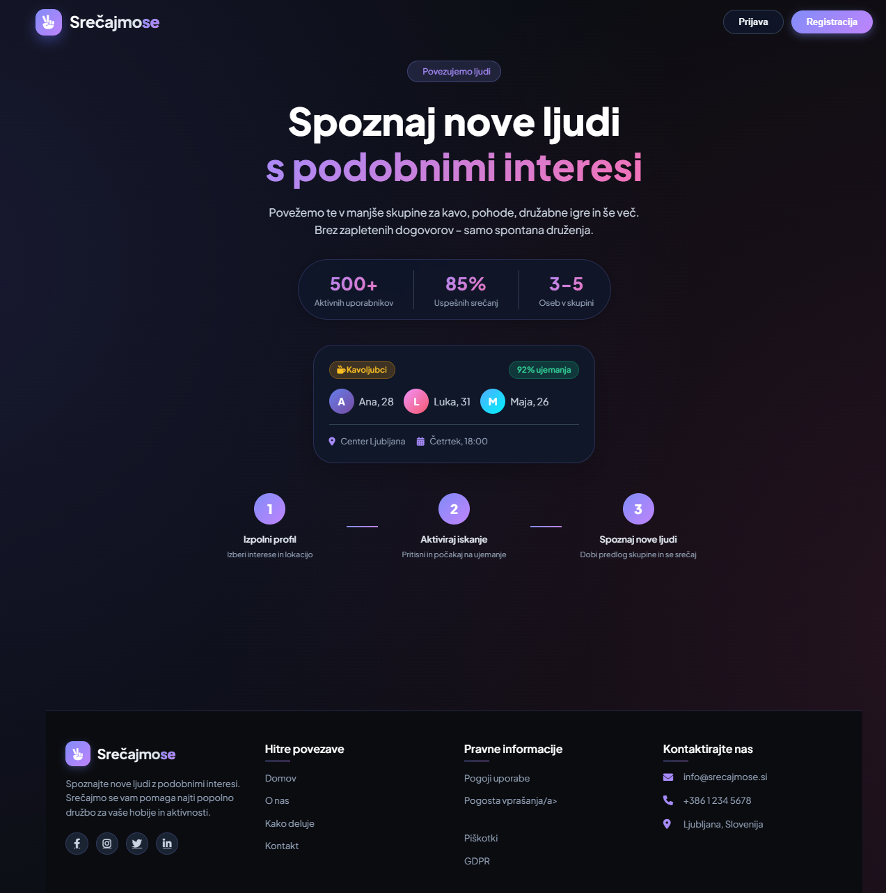

1. Uporabnik vidi kratek opis platforme v osrednjem delu strani.
2. Glava strani vsebuje logo ali ime aplikacije levo ter gumba za prijavo in registracijo desno.
3. Noga strani vsebuje povezave do pogostih vprašanj, kontakta, pogojev uporabe in GDPR.
4. Vsaka povezava v nogi vodi na ustrezno informacijsko masko.

###### 3.1.1.2.2 Maska za registracijo

Maska registracije omogoča prvi vnos podatkov, potrebnih za ustvarjanje računa.

Slike mask: 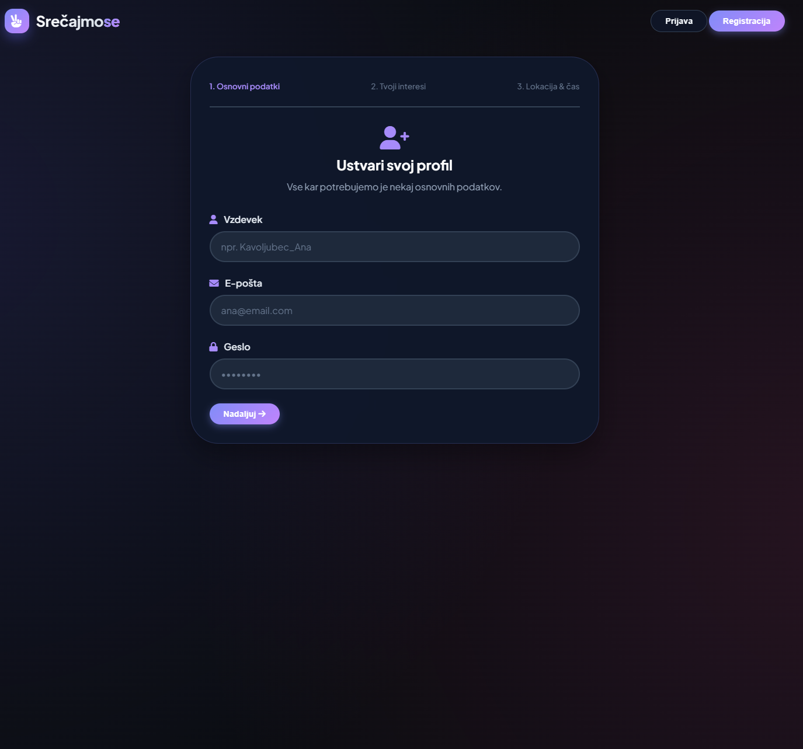
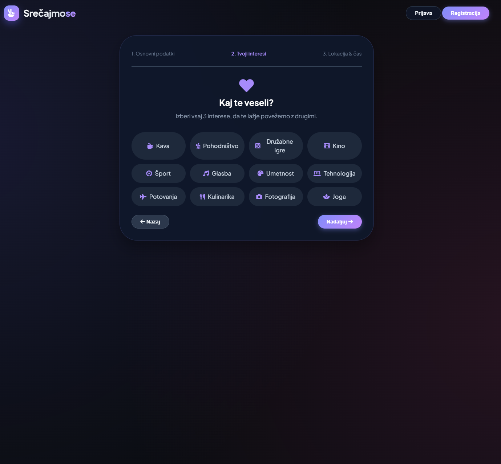
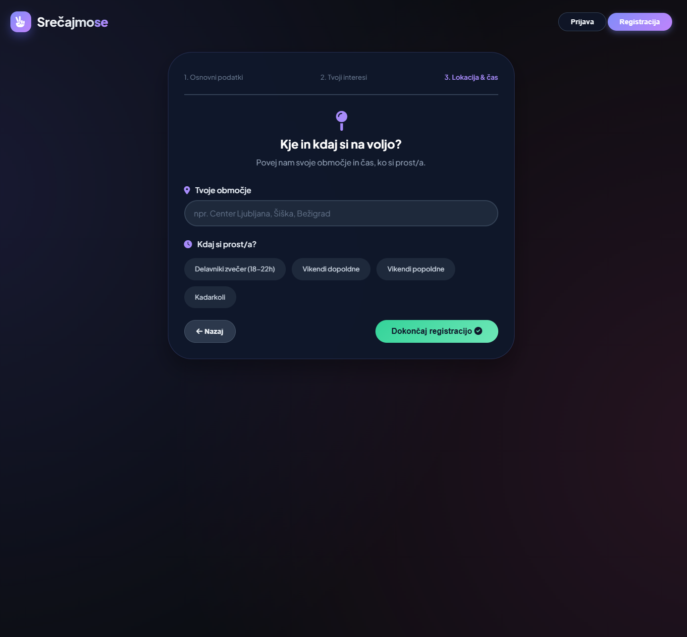

1. Sistem zahteva:
   a. ime,
   b. priimek,
   c. uporabniško ime,
   d. starost,
   e. e-naslov,
   f. geslo,
   g. potrditev gesla,
   h. potrditveno kljukico za pogoje uporabe.
2. Registracija se izvaja v treh korakih in uporabniku prikazuje napredek 1/3, 2/3, 3/3:
   a. osnovni podatki,
   b. interesi,
   c. lokacija in časovna razpoložljivost.
3. Po uspešni oddaji sistem pošlje povezavo za potrditev računa na e-naslov.
4. Uporabnik lahko račun uporablja šele po uspešni potrditvi e-pošte.
5. Maska vedno vsebuje tudi povezavo za skok na prijavo.

###### 3.1.1.2.3 Maska za prijavo

Maska prijave omogoča avtentikacijo obstoječega uporabnika.

Slika maske: 

1. Sistem zahteva:
   a. e-naslov,
   b. geslo.
2. Ob uspešni prijavi sistem preusmeri uporabnika na ustrezno nadzorno ploščo glede na vlogo.
3. Administrator je po prijavi takoj preusmerjen na administratorsko nadzorno ploščo.
4. Maska vsebuje povezavo "Pozabljeno geslo", ki vodi na obrazec za zahtevo ponastavitve gesla.
5. Maska vsebuje tudi povezavo za skok na registracijo za uporabnike brez računa.

###### 3.1.1.2.4 Maska za zahtevo ponastavitve gesla

Maska omogoča začetek postopka obnovitve dostopa do računa.

Slika maske: 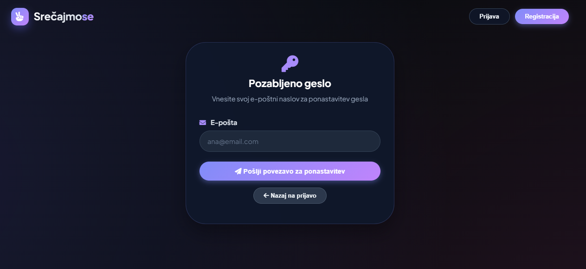

1. Uporabnik vnese e-naslov računa.
2. Sistem preveri, ali račun obstaja, in pošlje povezavo za ponastavitev gesla.
3. Sistem prikaže generično potrditev zahteve in ne razkrije, ali račun obstaja.
4. Po uspešni oddaji se uporabnik lahko vrne na prijavo.

###### 3.1.1.2.5 Maska za nastavitev novega gesla

Maska omogoča zaključek ponastavitve gesla prek e-poštne povezave.

Slika maske: 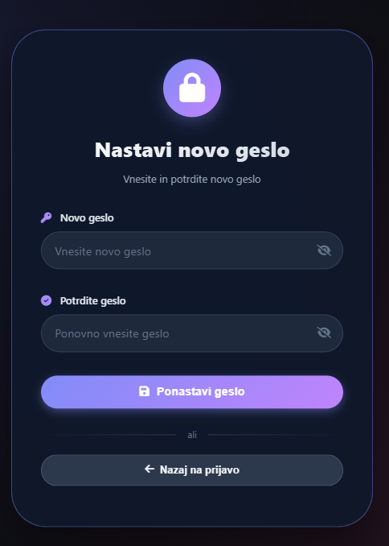

1. Uporabnik odpre veljavno povezavo iz e-pošte.
2. Uporabnik vnese novo geslo in potrditev gesla.
3. Sistem preveri veljavnost žetona in skladnost gesel.
4. Sistem shrani novo geslo in uporabnika preusmeri na masko za prijavo.

###### 3.1.1.2.6 Maska uporabniške nadzorne plošče

Maska združuje ključne funkcije uporabnika po prijavi.

Slika maske: 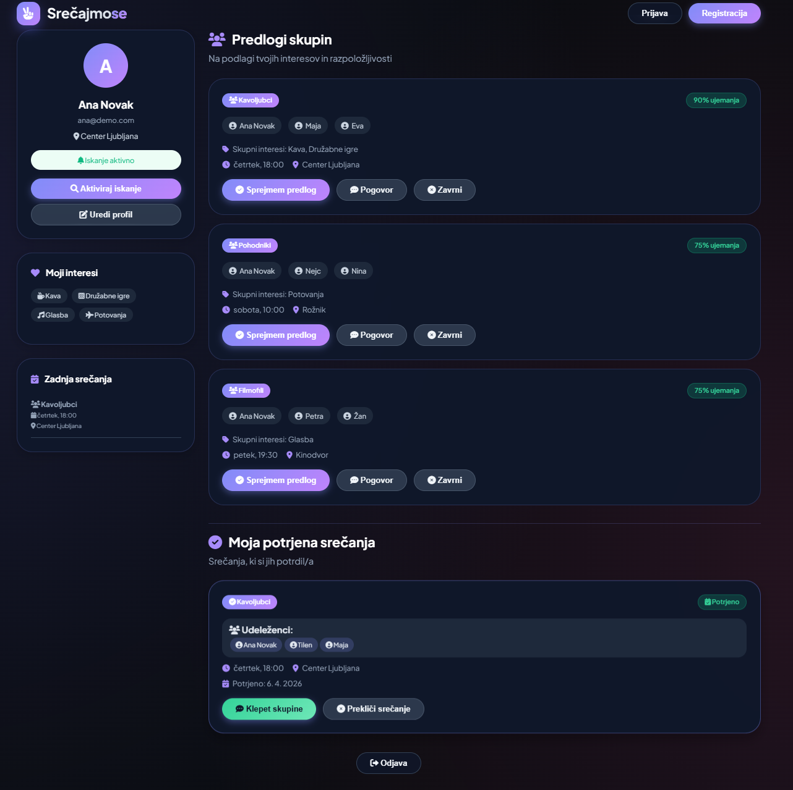

1. Leva stran prikazuje kratek profil (slika, ime, priimek, vzdevek, e-pošta), status iskanja skupine in hitra dejanja.
2. Prikazani so interesi uporabnika ter dostop do urejanja profila.
3. Prikazana so pretekla srečanja z osnovnimi podatki in dostopom do preteklih chatov.
4. Sredinski del prikazuje predlagane skupine in akcije potrdi, zavrni in chat.

###### 3.1.1.2.7 Maska za predloge skupin

Maska prikazuje predlagane skupine in omogoča hiter pregled članov pred potrditvijo.

Slika maske: 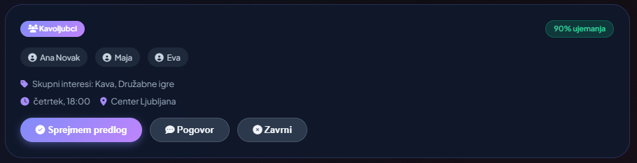

1. Uporabnik vidi seznam predlaganih skupin z osnovnimi podatki, odstotkom ujemanja in ključnimi razlogi za predlog.
2. Uporabnik lahko pri vsaki predlagani skupini odpre hiter pregled članov skupine.
3. Hiter pregled članov je dostopen neposredno iz posameznega predloga skupine.
4. Uporabnik lahko iz predloga nadaljuje na potrditev, zavrnitev ali dostop do chata.
5. Hiter pregled članov je ločen od skupinskega chata in v njem ni pošiljanja sporočil.

###### 3.1.1.2.8 Maska skupinskega chata

Maska prikazuje komunikacijo skupine.

Slika maske: 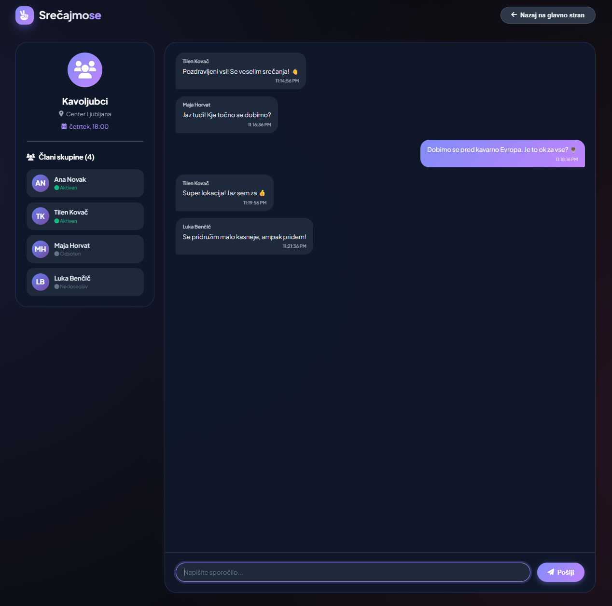

1. Maska vsebuje osnovne informacije o skupini in seznam članov.
2. Uporabnik lahko pregleduje zgodovino sporočil.
3. Uporabnik lahko pošilja nova sporočila.
4. Seznam članov je prikazan informativno, brez potrebe po odpiranju njihovih podrobnosti iz chata.

###### 3.1.1.2.9 Maska za urejanje profila

Maska profila omogoča upravljanje preferenc za delovanje algoritma.

Slika maske: 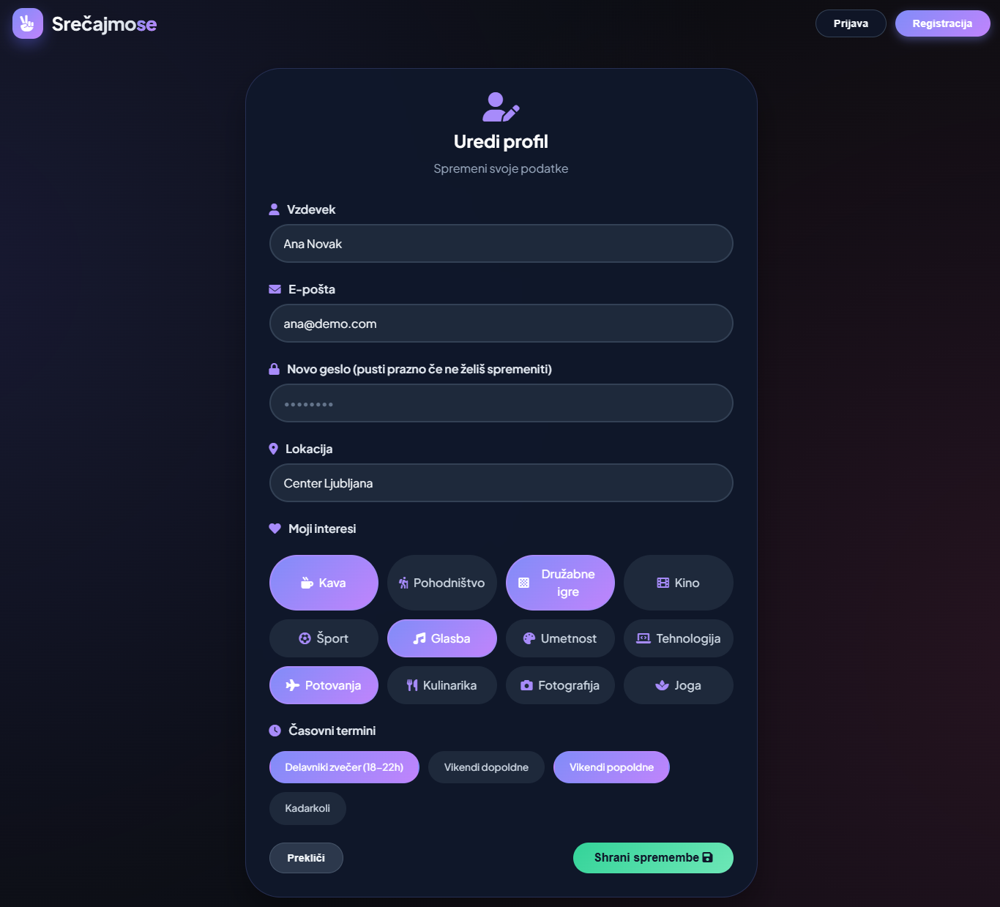

1. Uporabnik lahko ureja:
   a. interese,
   b. približno lokacijo,
   c. časovno razpoložljivost.
2. Sistem spremembe validira in shrani.

###### 3.1.1.2.10 Maska za povratno informacijo

Maska povratne informacije omogoča oddajo ocene po srečanju.

Slika maske: 

1. Uporabnik poda oceno in kratek komentar.
2. Sistem shrani odgovor in potrdi uspešen vnos.

###### 3.1.1.2.11 Maska administratorske nadzorne plošče

Maska omogoča operativni nadzor sistema.

Slike mask: 
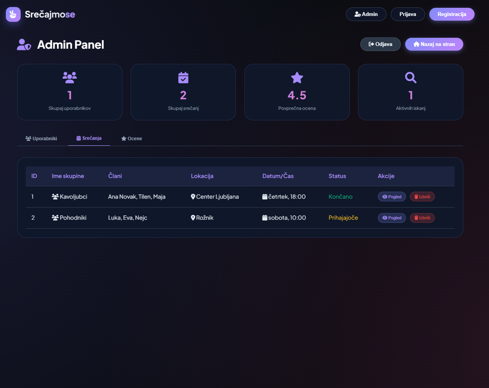

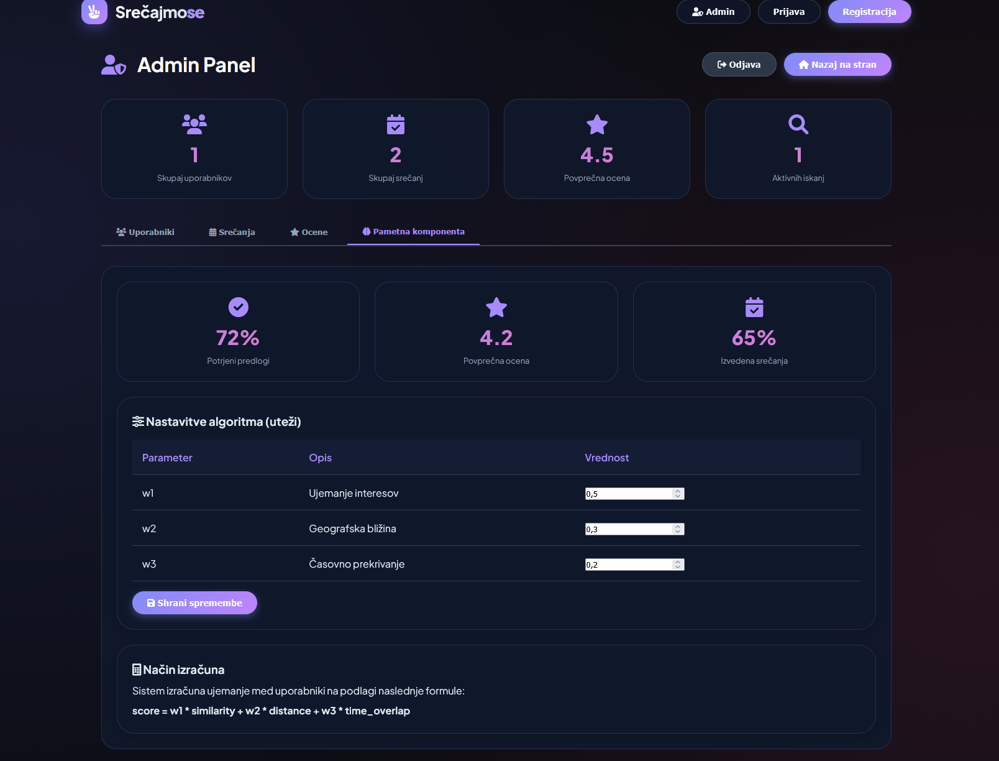

1. Administratorski vmesnik uporablja navigacijski meni s sekcijami: Sistem, Uporabniki, Obvestila, Skupine, Pametna komponenta.
2. Začetni pogled prikazuje osnovne podatke in statistike delovanja sistema.
3. Sekcija Uporabniki vsebuje tabelo uporabnikov s paginacijo, iskanjem in akcijami blokiraj, deblokiraj, aktiviraj in deaktiviraj.
4. Uporabnik z aktivnim opozorilom je vizualno označen z rumeno barvo.
5. Sekcija Obvestila vsebuje seznam vprašanj, prijav in drugih sporočil ter vpogled v podrobnosti.
6. Sekcija Skupine vsebuje pregled vseh ustvarjenih skupin, statusov, članov in dostop do skupinskega chata.
7. Sekcija Pametna komponenta vsebuje metrike kakovosti in nastavitve parametrov algoritma.

###### 3.1.1.2.12 Maska informacijskih strani in kontakta

Maske pokrivajo strani, dostopne iz noge strani (footer).

Slik mask: 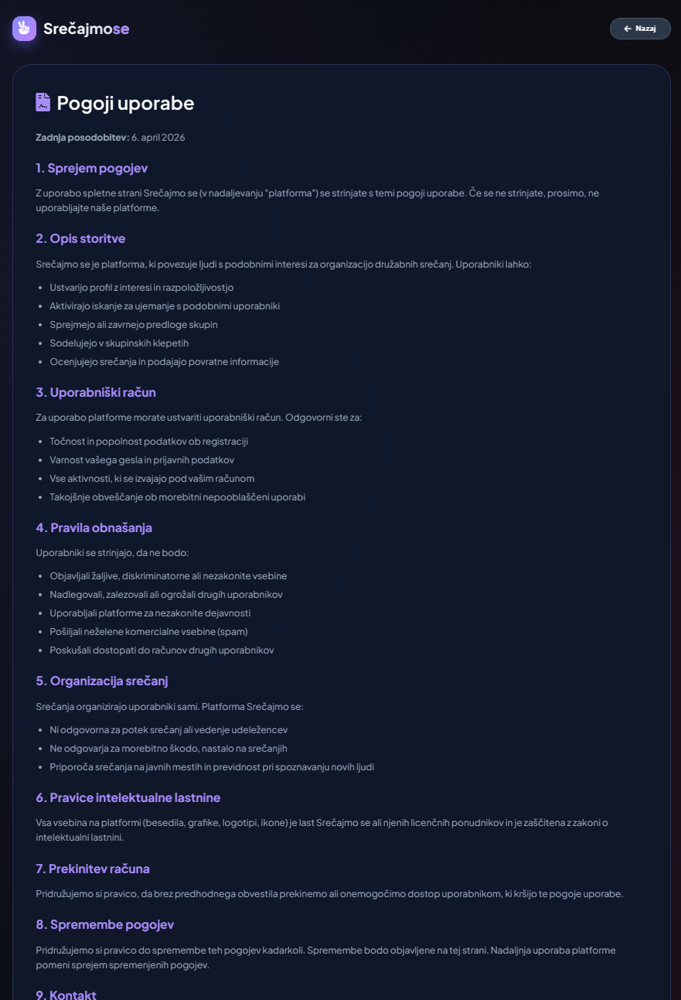
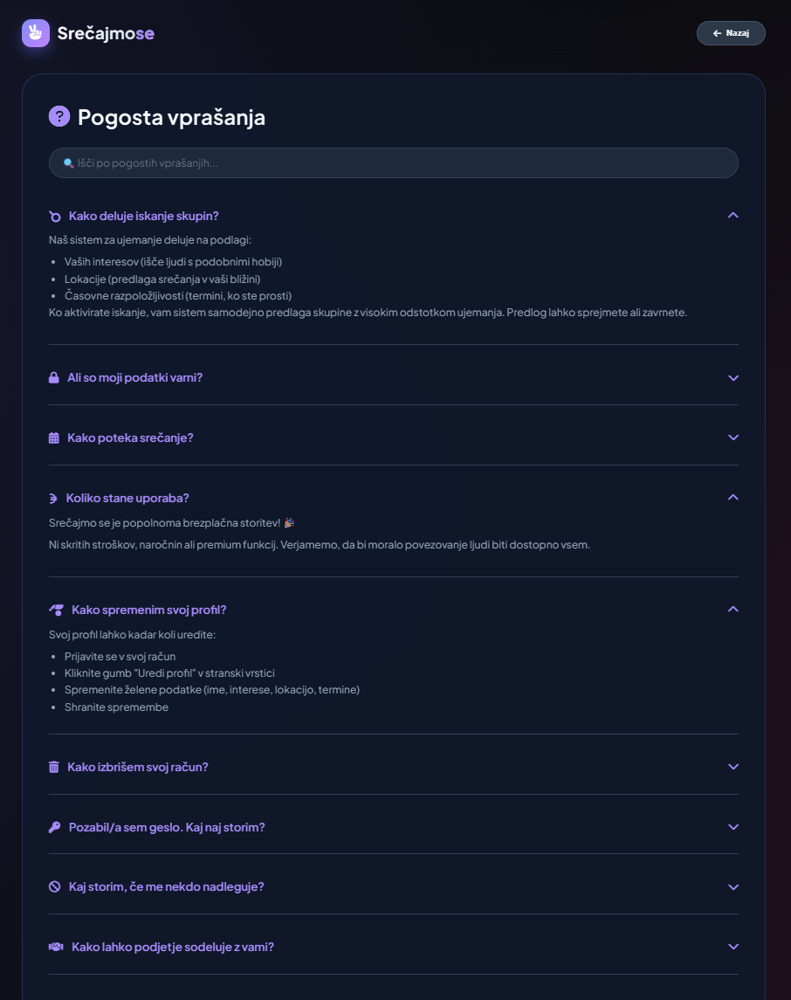


1. Maska pogojev uporabe vsebuje opis pogojev uporabe sistema.
2. Maska GDPR vsebuje opis obdelave osebnih podatkov in uporabnikovih pravic.
3. Maska pogostih vprašanj vsebuje odgovore na najpogostejša vprašanja uporabnikov.
4. Maska kontakta omogoča oddajo sporočila z osnovnimi podatki, kot so ime, priimek, e-naslov, zadeva in sporočilo.
5. Sistem po oddaji kontakta prikaže potrditev prejema sporočila.

#### 3.1.2 Slovar pojmov

V nadaljevanju je slovar ključnih izrazov, ki se uporabljajo v predlogu projekta in tem poročilu.

##### 3.1.2.1 Uporabnik

Registriran končni uporabnik aplikacije, ki upravlja svoj profil, išče skupine, sprejema ali zavrača predloge, uporablja skupinski chat ter oddaja povratne informacije.

##### 3.1.2.2 Primarni naročnik

Skupina končnih uporabnikov (mladi odrasli v urbanih okoljih), za katero se sistem razvija in katere potrebe so osnova funkcionalnih zahtev.

##### 3.1.2.3 Sekundarni deležniki

Zunanji deležniki, ki od sistema nimajo neposredne operativne vloge, imajo pa posredne koristi (npr. lokalna skupnost, ponudniki prostorov).

##### 3.1.2.4 Administrator sistema

Vloga z razširjenimi pravicami za obravnavo prijav, upravljanje uporabnikov, moderatorski vpogled v skupine/chat in spremljanje kakovosti delovanja sistema.

##### 3.1.2.5 Uporabniški profil

Strukturiran zapis o uporabniku, ki vključuje podatke za delovanje sistema (interesi, lokacija, časovna razpoložljivost) in se uporablja pri izračunu predlogov skupin.

##### 3.1.2.6 Interesi

Seznam aktivnosti oziroma tem, ki predstavljajo enega ključnih vhodov za izračun podobnosti med uporabniki.

##### 3.1.2.7 Časovna razpoložljivost

Podatki o prostih terminih uporabnika, uporabljeni za izračun časovnega prekrivanja med potencialnimi člani skupine.

##### 3.1.2.8 Geografska bližina

Mera prostorske oddaljenosti med uporabniki oziroma njihovimi približnimi lokacijami, uporabljena kot kriterij pri razvrščanju predlogov.

##### 3.1.2.9 Kompatibilnost skupine

Skupna ocena ujemanja članov skupine glede na izbrane kriterije (interesi, lokacija, časovna razpoložljivost).

##### 3.1.2.10 Predlog skupine

Rezultat delovanja pametne komponente, ki vsebuje seznam potencialnih članov, predlagan termin, okvirno lokacijo in ključne razloge za ujemanje.

##### 3.1.2.11 Potrditev udeležbe

Odločitev uporabnika, da sprejme predlog skupine in sodeluje pri srečanju; odločitev je vidna ostalim članom preko statusnega indikatorja.

##### 3.1.2.12 Zavrnitev predloga

Odločitev uporabnika, da predloga skupine ne sprejme; status predloga se posodobi brez odstranitve predloga iz zgodovine.

##### 3.1.2.13 Povratna informacija

Ocena in morebitni komentar uporabnika po srečanju, namenjena merjenju kakovosti predlogov in iterativnemu izboljševanju sistema.

##### 3.1.2.14 Prijava neprimernega vedenja

Funkcionalnost, s katero uporabnik odda prijavo neprimernega ravnanja ali vsebine v obravnavo administratorju.

##### 3.1.2.15 Pametna komponenta

Notranja komponenta sistema, ki izvaja izračun kompatibilnosti in oblikovanje predlogov skupin; v kontekstu primerov uporabe ni zunanji akter.

##### 3.1.2.16 Scoring model

Ocenjevalni model, ki združuje več kriterijev ujemanja v enotno numerično oceno za razvrščanje kandidatov in predlogov skupin.

##### 3.1.2.17 MVP

Minimalni delujoči produkt z osnovnimi funkcionalnostmi, potrebnimi za validacijo ideje in preverjanje ključnih predpostavk.

##### 3.1.2.18 REST API

Slog komunikacije med odjemalcem, strežnikom in zunanjimi sistemi prek HTTP protokola.

##### 3.1.2.19 JSON

Format za strukturirano izmenjavo podatkov med sistemi in komponentami aplikacije.

##### 3.1.2.20 GDPR

Pravni okvir varstva osebnih podatkov, ki določa pravila obdelave, hrambe in zaščite osebnih podatkov uporabnikov.

##### 3.1.2.21 Razpoložljivost sistema

Stopnja dostopnosti sistema uporabnikom v določenem časovnem obdobju, izražena z dogovorjenimi ciljnimi metrikami.

##### 3.1.2.22 Razširljivost sistema

Sposobnost sistema, da podpira nove funkcionalnosti in večji obseg uporabe brez večje prenove arhitekture.

##### 3.1.2.23 Skupinski chat

Komunikacijski kanal znotraj aplikacije, ki je na voljo članom predlagane skupine za usklajevanje podrobnosti srečanja.

##### 3.1.2.24 Verifikacijska povezava

Časovno omejena povezava, poslana na e-pošto ob registraciji, s katero uporabnik potrdi lastništvo e-naslova in aktivira račun.

##### 3.1.2.25 Ponastavitveni žeton

Enkratno uporaben, časovno omejen žeton za varno nastavitev novega gesla v postopku "Pozabljeno geslo".

##### 3.1.2.26 Status odziva

Prikaz odločitve uporabnika glede predloga skupine (potrjeno/zavrnjeno), vizualno označen z barvnim indikatorjem.

#### 3.1.3 Uporabniške vloge in zunanji akterji

Spodaj so opredeljene vloge, ki sodelujejo v primerih uporabe, skupaj z njihovo naravo (vloga ali zunanji sistem). Akter v primeru uporabe je vedno zunanja entiteta glede na obravnavani sistem.

##### 3.1.3.1 Uporabniška vloga

Uporabnik je primarni poslovni akter sistema.
Njegova vloga je vnos in vzdrževanje profila, sprožanje iskanja skupin, odločanje o predlogih (potrditev/zavrnitev), uporaba skupinskega chata ter oddaja povratnih informacij in prijav neprimernega vedenja.

##### 3.1.3.2 Gostovska vloga

Gost je neprijavljen uporabnik sistema.
Njegova vloga je dostop do začetne strani ter informacijskih strani v nogi, možnost registracije, prijave in zahtevka za ponastavitev gesla.

##### 3.1.3.3 Administratorska vloga

Administrator je operativni in nadzorni akter sistema.
Njegova vloga je obravnava prijav, upravljanje uporabniških računov, pregled skupin in moderatorski vpogled v chat ter spremljanje metrik kakovosti pametne komponente.

##### 3.1.3.4 Geokodirni API (zunanji sistem)

Geokodirni API je podporni zunanji sistem.
Njegova vloga je pretvorba uporabniško vnesene lokacije v standardizirano obliko in koordinate, ki jih sistem uporabi za ocenjevanje geografske bližine.

##### 3.1.3.5 E-poštni servis (zunanji sistem)

E-poštni servis je komunikacijski zunanji sistem.
Njegova vloga je pošiljanje verifikacijskih povezav ob registraciji in povezav/obvestil za ponastavitev gesla ter komunikacije z uporabniki.

##### 3.1.3.6 Pametna komponenta (notranja komponenta sistema)

Pametna komponenta je notranji del sistema in se v strogi UML razlagi ne šteje kot zunanji akter.
V dokumentu je navedena zaradi preglednosti odgovornosti znotraj primerov uporabe, kjer izvaja izračun ujemanja in pripravo predlogov skupin.

#### 3.1.4 Opisi primerov uporabe

V nadaljevanju so za ključne cilje naročnika podani formalizirani opisi primerov uporabe po enotni strukturi.

##### 3.1.4.1 Registracija

1. **Naslov**: Registracija
2. **Akterji**: Gostovska vloga, Uporabniška vloga
3. **Povzetek funkcionalnosti**: Nov uporabnik opravi registracijo v treh korakih in aktivira račun prek e-pošte.
4. **Osnovni tok**:
   1. Gost odpre masko za registracijo.
   2. Izpolni korake 1/3, 2/3 in 3/3.
   3. Sistem validira podatke, ustvari račun v stanju "nepotrjen" in pošlje verifikacijsko povezavo.
   4. Gost odpre verifikacijsko povezavo.
   5. Sistem aktivira račun in zaključi primer uporabe.
5. **Alternativni tokovi in napake**:
   - A1: Gost popravi vnos v prejšnjem koraku.
     1. Gost odpre masko za registracijo.
     2. Izpolni korake 1/3, 2/3 in 3/3.
     3. Gost v tretjem koraku ugotovi, da je treba dopolniti prejšnji vnos.
     4. Gost se vrne na 2/3 ali 1/3 in popravi podatke.
     5. Sistem ohrani že veljavne podatke, da jih ni treba ponovno vpisovati.
     6. Gost znova nadaljuje do 3/3 in odda registracijo.
     7. Sistem validira podatke, ustvari račun v stanju "nepotrjen" in pošlje verifikacijsko povezavo.
     8. Gost odpre verifikacijsko povezavo.
     9. Sistem aktivira račun in zaključi primer uporabe.
   - E1: E-naslov je že registriran.
     1. Gost odpre masko za registracijo.
     2. Izpolni korake 1/3, 2/3 in 3/3.
     3. Gost pri oddaji vnese e-naslov, ki že obstaja v sistemu.
     4. Sistem zavrne registracijo in prikaže napako o že uporabljenem e-naslovu.
     5. Gost vnese drug e-naslov in ponovno odda obrazec.
     6. Sistem validira podatke, ustvari račun v stanju "nepotrjen" in pošlje verifikacijsko povezavo.
     7. Gost odpre verifikacijsko povezavo.
     8. Sistem aktivira račun in zaključi primer uporabe.
   - E2: Verifikacijska povezava je potekla.
     1. Gost odpre masko za registracijo.
     2. Izpolni korake 1/3, 2/3 in 3/3.
     3. Sistem validira podatke, ustvari račun v stanju "nepotrjen" in pošlje verifikacijsko povezavo.
     4. Gost odpre povezavo za potrditev računa po pretečenem roku.
     5. Sistem zavrne aktivacijo in prikaže obvestilo o neveljavni povezavi.
     6. Gost zahteva novo verifikacijsko povezavo.
     7. Sistem pošlje novo povezavo.
     8. Gost odpre novo verifikacijsko povezavo.
     9. Sistem aktivira račun in zaključi primer uporabe.
6. **Predpogoj**: Gost še nima računa v sistemu.
7. **Popogoj, posledice in učinki**: Uspeh: račun je aktiviran. Neuspeh: račun ostane neaktiven.
8. **Posebne zahteve**: Varna obravnava gesla in validacija obveznih polj.
9. **Prioriteta (MoSCoW)**: Must
10. **Sprejemni testi**:

| Primer uporabe  | Funkcijski sistem       | Začetno stanje   | Vhod                          | Pričakovan izhod                                  |
| --------------- | ----------------------- | ---------------- | ----------------------------- | ------------------------------------------------- |
| Registrirati se | Registracija uporabnika | Gost nima računa | Veljavni podatki registracije | Ustvarjen nepotrjen račun in poslana verifikacija |

11. **Razširitev - pogostost uporabe in triggerji**: Pogostost: nizka. Trigger: klik na registracijo.

##### 3.1.4.2 Prijava

1. **Naslov**: Prijaviti se
2. **Akterji**: Uporabnik (vloga), Administrator (vloga)
3. **Povzetek funkcionalnosti**: Akter se avtenticira in je preusmerjen na ustrezen pogled.
4. **Osnovni tok**:
      1. Uporabnik odpre masko za prijavo.
      2. Vnese e-naslov in geslo.
      3. Sistem preveri poverilnice in vlogo.
      4. Sistem vzpostavi sejo.
      5. Sistem preusmeri na uporabniško nadzorno ploščo.
5. **Alternativni tokovi in napake**:
    - A1: Prijava administratorja.
      1. Admin odpre masko za prijavo.
      2. Vnese e-naslov in geslo za administratorski račun.
      3. Sistem preveri poverilnice in vlogo.
      4. Sistem prepozna administratorsko vlogo.
      5. Sistem vzpostavi sejo.
      6. Sistem preusmeri na administratorsko nadzorno ploščo.
    - A2: Pozabljeno geslo in ponastavitev.
      1. uporabnik odpre masko za prijavo.
      2. Vnese e-naslov in napačno geslo.
      3. Sistem preveri poverilnice in zavrne prijavo.
      4. Sistem poveča števec neuspelih poskusov in prikaže napako.
      5. Ime razširitve: Ponastavitev gesla ob pozabljenem geslu, Pogoj: pozabljeno geslo: Primer uporabe, ki se izvede: Ponastavitev gesla.
      5. Uporabnik vnese novo geslo.
      6. Sistem preveri poverilnice in vlogo.
      7. Sistem vzpostavi sejo.
      8. Sistem preusmeri na ustrezno nadzorno ploščo.
    - E1: Napačno geslo.
      1. uporabnik odpre masko za prijavo.
      2. Vnese e-naslov in napačno geslo.
      3. Sistem preveri poverilnice in zavrne prijavo.
      4. Sistem poveča števec neuspelih poskusov in prikaže napako.
      5. Uporabnik popravi geslo in ponovno odda prijavo.
      6. Sistem preveri poverilnice in vlogo.
      7. Sistem vzpostavi sejo.
      8. Sistem preusmeri na ustrezno nadzorno ploščo.
    - E2: Račun ni verificiran.
      1. Uporabnik odpre masko za prijavo.
      2. Vnese e-naslov in geslo neverificiranega računa.
      3. Sistem preveri poverilnice in ugotovi, da račun ni verificiran.
      4. Sistem zavrne prijavo in ponudi ponovno pošiljanje verifikacije.
      5. Uporabnik potrdi e-poštni naslov preko nove verifikacijske povezave.
      6. Uporabnik ponovno odpre prijavno masko in vnese e-naslov ter geslo.
      7. Sistem preveri poverilnice in vlogo.
      8. Sistem vzpostavi sejo in preusmeri na ustrezno nadzorno ploščo.
6. **Predpogoj**: Račun obstaja.
7. **Popogoj, posledice in učinki**: Uspeh: aktivna seja. Neuspeh: seja ni vzpostavljena.
8. **Posebne zahteve**: Zaščita prijavnega toka in varna seja.
9. **Prioriteta (MoSCoW)**: Must
10. **Sprejemni testi**:

| Primer uporabe | Funkcijski sistem        | Začetno stanje      | Vhod                       | Pričakovan izhod                |
| -------------- | ------------------------ | ------------------- | -------------------------- | ------------------------------- |
| Prijaviti se   | Avtentikacija uporabnika | Uporabnik ima račun | Veljaven e-naslov in geslo | Uspešna prijava in preusmeritev |

11. **Razširitev - pogostost uporabe in triggerji**: Pogostost: visoka. Trigger: klik na prijavo.

11. **Razširitev - pogostost uporabe in triggerji**: Pogostost: visoka. Trigger: klik na prijavo.

##### 3.1.4.3 Ponastavitev gesla

1. **Naslov**: Ponastavitev gesla
2. **Akterji**: Gostovska vloga, Uporabniška vloga
3. **Povzetek funkcionalnosti**: Uporabnik zahteva povezavo za ponastavitev in nastavi novo geslo.
4. **Osnovni tok**:
   1. Gost klikne možnost "Pozabljeno geslo".
   2. Vnese e-naslov računa.
   3. Sistem pošlje ponastavitveno povezavo.
   4. Gost odpre povezavo, vnese novo geslo in potrditev gesla.
   5. Sistem shrani geslo in preusmeri na prijavo.
      Razširitev: Neposredna prijava po ponastavitvi gesla : Geslo je uspešno ponastavljeno : Prijava.
5. **Alternativni tokovi in napake**:
   - A1: Takojšnja prijava po spremembi gesla.
     1. Gost klikne možnost "Pozabljeno geslo".
     2. Vnese e-naslov računa.
     3. Sistem pošlje ponastavitveno povezavo.
     4. Gost odpre povezavo, vnese novo geslo in potrditev gesla.
     5. Sistem shrani geslo in preusmeri na prijavo.
        Razširitev: Neposredna prijava po ponastavitvi gesla : Geslo je uspešno ponastavljeno : Prijava.
     6. Uporabnik takoj vnese nove poverilnice in odda prijavo.
     7. Sistem uspešno vzpostavi sejo.
   - E1: Povezava je neveljavna ali potekla.
     1. Gost klikne možnost "Pozabljeno geslo".
     2. Vnese e-naslov računa.
     3. Sistem pošlje ponastavitveno povezavo.
     4. Uporabnik odpre neveljavno ali poteklo povezavo za ponastavitev.
     5. Sistem zavrne spremembo in ponudi novo zahtevo.
     6. Uporabnik zahteva novo povezavo.
     7. Sistem pošlje novo povezavo.
     8. Uporabnik odpre novo povezavo, vnese novo geslo in potrditev gesla.
     9. Sistem shrani geslo in preusmeri na prijavo.
        Razširitev: Neposredna prijava po ponastavitvi gesla : Geslo je uspešno ponastavljeno : Prijava.
   - E2: Gesli se ne ujemata.
     1. Gost klikne možnost "Pozabljeno geslo".
     2. Vnese e-naslov računa.
     3. Sistem pošlje ponastavitveno povezavo.
     4. Gost odpre povezavo in vnese novo geslo ter potrditev gesla.
     5. Sistem zazna neujemanje gesel in zavrne oddajo.
     6. Uporabnik popravi vnos in znova odda obrazec.
     7. Sistem shrani geslo in preusmeri na prijavo.
        Razširitev: Neposredna prijava po ponastavitvi gesla : Geslo je uspešno ponastavljeno : Prijava.
6. **Predpogoj**: Uporabnik ima ustvarjen račun.
7. **Popogoj, posledice in učinki**: Uspeh: geslo je spremenjeno. Neuspeh: geslo ostane nespremenjeno.
8. **Posebne zahteve**: Časovna omejenost in enkratna uporaba žetona.
9. **Prioriteta (MoSCoW)**: Must
10. **Sprejemni testi**:

| Primer uporabe    | Funkcijski sistem | Začetno stanje      | Vhod                            | Pričakovan izhod          |
| ----------------- | ----------------- | ------------------- | ------------------------------- | ------------------------- |
| Ponastaviti geslo | Obnovitev dostopa | Uporabnik ima račun | Veljavna povezava in novo geslo | Geslo uspešno spremenjeno |

11. **Razširitev - pogostost uporabe in triggerji**: Pogostost: nizka. Trigger: klik na "Pozabljeno geslo".

##### 3.1.4.4 Odjava

1. **Naslov**: Odjava
2. **Akterji**:
   - Uporabniška vloga
   - Administratorska vloga
3. **Povzetek funkcionalnosti**:
   - Prijavljen uporabnik ali administrator zaključi sejo in se vrne na javni del aplikacije.
4. **Osnovni tok**:
   1. Akter izbere možnost "Odjava".
   2. Sistem prekine aktivno sejo.
   3. Sistem uporabnika preusmeri na začetno/prijavno stran.
5. **Alternativni tokovi in napake**:
   - A1: Samodejna odjava zaradi neaktivnosti.
     1. Akter je prijavljen in uporablja aplikacijo.
     2. Sistem zazna presežen čas neaktivnosti.
     3. Sistem opozori akterja o bližnjem izteku seje.
     4. Po izteku sistem invalidira sejo.
     5. Sistem akterja preusmeri na začetno/prijavno stran.
   - E1: Seja je že potekla.
     1. Akter izbere možnost "Odjava".
     2. Sistem preveri aktivno sejo in ugotovi, da je ta že potekla.
     3. Sistem ne izvaja dodatnega zaključevanja seje.
     4. Sistem vseeno izvede preusmeritev na začetno/prijavno stran.
6. **Predpogoj**:
   - Akter je prijavljen.
7. **Popogoj, posledice in učinki**:
   - Uspeh: seja je zaključena.
   - Neuspeh: seja ostane aktivna in sistem prikaže obvestilo.
8. **Posebne zahteve**:
   - Brisanje/invalidacija sejne identitete (token/cookie).
9. **Prioriteta (MoSCoW)**:
   - Must
10. **Sprejemni testi**:

| Primer uporabe | Funkcijski sistem | Začetno stanje          | Vhod           | Pričakovan izhod                         |
| -------------- | ----------------- | ----------------------- | -------------- | ---------------------------------------- |
| Odjaviti se    | Upravljanje seje  | Uporabnik je prijavljen | Klik na odjava | Seja zaključena, preusmeritev na prijavo |
| Odjaviti se    | Upravljanje seje  | Seja je že potekla      | Klik na odjava | Preusmeritev na prijavo brez napake      |

11. **Razširitev - pogostost uporabe in triggerji**:
    - Pogostost: visoka.
    - Trigger: uporabnik/administrator izbere možnost odjave.

##### 3.1.4.5 Urejanje profila

1. **Naslov**: Urejanje profila
2. **Akterji**:
   - Uporabniška vloga
3. **Povzetek funkcionalnosti**:
   - Uporabnik posodobi preference in/ali osnovne podatke profila.
4. **Osnovni tok**:
   1. Uporabnik odpre profil.
   2. Uporabnik spremeni želene podatke.
   3. Sistem validira in shrani spremembe.
5. **Alternativni tokovi in napake**:
   - A1: Posodobitev samo enega sklopa.
     1. Uporabnik odpre profil.
     2. Uporabnik spremeni le en sklop podatkov (npr. interese).
     3. Sistem validira spremenjeni sklop.
     4. Sistem shrani spremembo.
     5. Sistem potrdi uspeh in ostale podatke pusti nespremenjene.
   - E1: Neveljaven format podatkov.
     1. Uporabnik odpre profil in spremeni želene podatke.
     2. Uporabnik odda neveljaven podatek v enem od polj.
     3. Sistem zavrne shranjevanje in označi napačno polje.
     4. Uporabnik popravi podatek in ponovno odda spremembe.
     5. Sistem validira in shrani spremembe.
   - E2: Konflikt sočasnih sprememb.
     1. Uporabnik odpre profil in spremeni želene podatke.
     2. Uporabnik odda spremembe na zastarelem stanju profila.
     3. Sistem zazna konflikt in zahteva osvežitev.
     4. Uporabnik osveži podatke, ponovno uredi profil in odda spremembe.
     5. Sistem validira in shrani novo stanje profila.
6. **Predpogoj**:
   - Uporabnik je prijavljen.
7. **Popogoj, posledice in učinki**:
   - Uspeh: profil je posodobljen.
   - Neuspeh: ostanejo prejšnji podatki.
8. **Posebne zahteve**:
   - Validacija obveznih profilnih podatkov.
9. **Prioriteta (MoSCoW)**:
   - Must
10. **Sprejemni testi**:

| Primer uporabe    | Funkcijski sistem   | Začetno stanje          | Vhod                 | Pričakovan izhod                           |
| ----------------- | ------------------- | ----------------------- | -------------------- | ------------------------------------------ |
| Posodobiti profil | Upravljanje profila | Uporabnik je prijavljen | Novi podatki profila | Podatki so uspešno shranjeni               |
| Posodobiti profil | Upravljanje profila | Uporabnik je prijavljen | Neveljavni podatki   | Shranjevanje zavrnjeno in prikazana napaka |

11. **Razširitev - pogostost uporabe in triggerji**:
    - Pogostost: srednja.
    - Trigger: uporabnik spremeni preference ali profilne podatke.

##### 3.1.4.6 Iskanje skupin

1. **Naslov**: Iskanje skupin
2. **Akterji**:
   - Uporabniška vloga
3. **Povzetek funkcionalnosti**:
   - Prijavljen uporabnik sproži iskanje skupine; sistem zažene izračun predlogov.
4. **Osnovni tok**:
   1. Uporabnik na nadzorni plošči izbere akcijo "Išči skupino".
   2. Sistem preveri, da je profil ustrezno izpolnjen.
   3. Sistem sproži izračun predlogov.
   4. Sistem pripravi seznam predlogov za prikaz.
5. **Alternativni tokovi in napake**:
   - A1: Ponovitev iskanja po posodobitvi profila.
     1. Uporabnik odpre nadzorno ploščo.
     2. Uporabnik izbere akcijo "Išči skupino".
     3. Sistem preveri profil in uporabnik ugotovi, da želi posodobiti preference.
     4. Uporabnik posodobi profil z novimi interesi, lokacijo ali razpoložljivostjo.
     5. Uporabnik ponovno izbere akcijo "Išči skupino".
     6. Sistem preveri, da je profil ustrezno izpolnjen.
     7. Sistem sproži izračun predlogov.
     8. Sistem pripravi in prikaže osvežen nabor predlogov.
   - E1: Profil ni dovolj izpolnjen.
     1. Uporabnik odpre nadzorno ploščo in izbere akcijo "Išči skupino".
     2. Sistem preveri profil in ugotovi manjkajoče podatke.
     3. Sistem zavrne iskanje in navede manjkajoča polja.
     4. Uporabnik dopolni profil in ponovno izbere akcijo "Išči skupino".
     5. Sistem ponovno preveri profil.
     6. Sistem sproži izračun predlogov.
     7. Sistem pripravi seznam predlogov za prikaz.
   - E2: Pametna komponenta je začasno nedosegljiva.
     1. Uporabnik izbere akcijo "Išči skupino".
     2. Sistem preveri profil in sproži izračun predlogov.
     3. Klic pametne komponente ne uspe.
     4. Sistem prikaže obvestilo in možnost ponovnega poskusa.
     5. Uporabnik ponovi zahtevo.
     6. Sistem ponovno sproži izračun predlogov.
     7. Sistem pripravi seznam predlogov za prikaz.
6. **Predpogoj**:
   - Uporabnik je prijavljen.
7. **Popogoj, posledice in učinki**:
   - Uspeh: uporabnik lahko dostopa do predlogov skupin.
   - Neuspeh: predlogi niso pripravljeni in sistem poda razlog.
8. **Posebne zahteve**:
   - Sistem mora jasno prikazati stanje iskanja (v teku/uspeh/napaka).
9. **Prioriteta (MoSCoW)**:
   - Must
10. **Sprejemni testi**:

| Primer uporabe | Funkcijski sistem  | Začetno stanje                              | Vhod                   | Pričakovan izhod                          |
| -------------- | ------------------ | ------------------------------------------- | ---------------------- | ----------------------------------------- |
| Iskati skupine | Iskalni tok skupin | Uporabnik je prijavljen in profil izpolnjen | Klik na "Išči skupino" | Iskanje sproženo in pripravljeni predlogi |
| Iskati skupine | Iskalni tok skupin | Profil ni izpolnjen                         | Klik na "Išči skupino" | Poziv k dopolnitvi profila                |

11. **Razširitev - pogostost uporabe in triggerji**:
    - Pogostost: srednja do visoka.
    - Trigger: uporabnik izbere akcijo za iskanje skupine.

##### 3.1.4.7 Pregled skupin in chata

1. **Naslov**: Pregled skupin in chata
2. **Akterji**:
   - Uporabniška vloga
3. **Povzetek funkcionalnosti**:
   - Uporabnik odpre izbrano predlagano skupino in na istem mestu pregleda osnovne podatke skupine, člane ter skupinski chat.
4. **Osnovni tok**:
   1. Uporabnik iz seznama predlogov odpre izbrano skupino.
   2. Sistem prikaže čas srečanja, približno lokacijo in ključne razloge ujemanja.
   3. Sistem prikaže ikone oziroma kratke kartice članov skupine.
   4. Uporabnik odpre kratek pregled profila posameznega člana.
   5. Sistem prikaže osnovne podatke izbranega člana.
   6. Uporabnik odpre skupinski chat iste skupine.
   7. Sistem prikaže zgodovino sporočil in omogoči nadaljnjo komunikacijo.
5. **Alternativni tokovi in napake**:
   - A1: Pregled posameznega člana.
     1. Uporabnik iz seznama predlogov odpre izbrano skupino.
     2. Sistem prikaže čas srečanja, približno lokacijo in ključne razloge ujemanja.
     3. Uporabnik klikne ikono člana.
     4. Sistem odpre kratek profil člana.
     5. Uporabnik zapre kratek profil in se vrne na pregled skupine.
   - A2: Branje skupinskega chata brez pošiljanja sporočila.
     1. Uporabnik iz seznama predlogov odpre izbrano skupino.
     2. Sistem prikaže osnovne podatke skupine in člane.
     3. Uporabnik odpre skupinski chat.
     4. Sistem naloži zgodovino sporočil.
     5. Uporabnik pregleda vsebino in chat zapre brez novega vnosa.
     6. Sistem ohrani stanje pogovora nespremenjeno.
   - E1: Podatki skupine ali članov niso dosegljivi.
     1. Uporabnik iz seznama predlogov odpre izbrano skupino.
     2. Sistem poskuša prikazati podatke skupine in članov, vendar nalaganje ne uspe.
     3. Sistem prikaže opozorilo in možnost ponovnega nalaganja.
     4. Uporabnik ponovi nalaganje.
     5. Sistem prikaže podatke skupine in članov.
   - E2: Skupina med prikazom postane neveljavna.
     1. Uporabnik iz seznama predlogov odpre izbrano skupino.
     2. Sistem prikaže osnovne podatke skupine.
     3. Sistem zazna, da je skupina med prikazom postala neveljavna.
     4. Sistem zapre pregled skupine in osveži seznam predlogov.
     5. Uporabnik izbere drugo veljavno skupino.
6. **Predpogoj**:
   - Uporabnik je prijavljen in vidi vsaj en predlog skupine.
7. **Popogoj, posledice in učinki**:
   - Uspeh: uporabnik vidi podatke skupine, člane in po potrebi chat.
   - Neuspeh: pregled skupine ni prikazan.
8. **Posebne zahteve**:
   - Pregled mora vključevati čas, lokacijo, razloge ujemanja in neposreden dostop do kratkih profilov članov ter chata.
9. **Prioriteta (MoSCoW)**:
   - Must
10. **Sprejemni testi**:

| Primer uporabe             | Funkcijski sistem | Začetno stanje                  | Vhod                       | Pričakovan izhod                                   |
| -------------------------- | ----------------- | ------------------------------- | -------------------------- | -------------------------------------------------- |
| Pregledati skupino in chat | Predlog skupine   | Uporabnik vidi predlog          | Odprtje predlagane skupine | Prikazani podatki skupine, člani in chat           |
| Pregledati skupino in chat | Predlog skupine   | Podatki skupine niso dosegljivi | Odprtje predlagane skupine | Prikazano opozorilo in možnost ponovnega nalaganja |

11. **Razširitev - pogostost uporabe in triggerji**:
    - Pogostost: srednja.
    - Trigger: uporabnik odpre predlagano skupino iz seznama predlogov.

##### 3.1.4.8 Odločitev o udeležbi

1. **Naslov**: Odločitev o udeležbi
2. **Akterji**:
   - Uporabniška vloga
3. **Povzetek funkcionalnosti**:
   - Uporabnik po pregledu skupine potrdi ali zavrne predlog in sistem posodobi status odziva.
4. **Osnovni tok**:
   1. Uporabnik iz pregleda skupine izbere potrditev ali zavrnitev.
   2. Sistem preveri, ali je skupina še veljavna.
   3. Sistem zabeleži odločitev.
   4. Sistem posodobi status odziva in ga prikaže ostalim članom.
5. **Alternativni tokovi in napake**:
   - A1: Potrditev udeležbe.
     1. Uporabnik iz pregleda skupine izbere potrditev.
     2. Sistem preveri, ali je skupina še veljavna.
     3. Sistem zabeleži status "potrjeno".
     4. Sistem posodobi status odziva in potrdi uspeh.
   - A2: Zavrnitev predloga.
     1. Uporabnik iz pregleda skupine izbere zavrnitev.
     2. Sistem preveri, ali je skupina še veljavna.
     3. Sistem zabeleži status "zavrnjeno".
     4. Sistem posodobi status odziva in potrdi uspeh.
   - E1: Predlog ni več aktiven.
     1. Uporabnik iz pregleda skupine izbere potrditev ali zavrnitev.
     2. Sistem zazna, da predlog ni več veljaven.
     3. Sistem zavrne akcijo in osveži seznam predlogov.
     4. Uporabnik izbere drug veljaven predlog.
     5. Uporabnik ponovno odpre pregled skupine.
6. **Predpogoj**:
   - Uporabnik ima prikazan veljaven predlog skupine.
7. **Popogoj, posledice in učinki**:
   - Uspeh: status predloga je posodobljen.
   - Neuspeh: status ostane nespremenjen.
8. **Posebne zahteve**:
   - Dosledno beleženje sprememb statusa in barvno označevanje odziva.
9. **Prioriteta (MoSCoW)**:
   - Must
10. **Sprejemni testi**:

| Primer uporabe                 | Funkcijski sistem            | Začetno stanje              | Vhod               | Pričakovan izhod                                          |
| ------------------------------ | ---------------------------- | --------------------------- | ------------------ | --------------------------------------------------------- |
| Potrditi ali zavrniti udeležbo | Upravljanje predlogov skupin | Prikazan je aktiven predlog | Potrditev udeležbe | Status predloga posodobljen, oznaka ostalim članom        |
| Potrditi ali zavrniti udeležbo | Upravljanje predlogov skupin | Prikazan je aktiven predlog | Zavrnitev predloga | Status predloga posodobljen in predlog ostane v zgodovini |

11. **Razširitev - pogostost uporabe in triggerji**:
    - Pogostost: srednja.
    - Trigger: uporabnik izbere akcijo na predlogu po pregledu skupine.

##### 3.1.4.9 Oddaja povratne informacije

1. **Naslov**: Oddaja povratne informacije
2. **Akterji**:
   - Uporabniška vloga
3. **Povzetek funkcionalnosti**:
   - Uporabnik po srečanju odda oceno in komentar za izbrano skupino.
4. **Osnovni tok**:
   1. Sistem prikaže poziv za oddajo povratne informacije.
   2. Uporabnik vnese oceno in komentar.
   3. Sistem preveri veljavnost in shrani povratno informacijo.
5. **Alternativni tokovi in napake**:
   - A1: Oddaja samo ocene.
     1. Sistem prikaže poziv za oddajo povratne informacije.
     2. Uporabnik vnese oceno in pusti komentar prazen.
     3. Sistem preveri veljavnost in sprejme oddajo.
     4. Sistem shrani povratno informacijo in potrdi uspeh.
   - E1: Uporabnik je že oddal povratno informacijo.
     1. Sistem prikaže poziv za oddajo povratne informacije.
     2. Uporabnik vnese oceno in komentar za isti dogodek, za katerega je že oddal odgovor.
     3. Sistem zazna podvojitev in zavrne oddajo.
     4. Sistem prikaže obvestilo o obstoječi oddaji.
     5. Uporabnik obrazec zapre ali preide na drug dogodek.
   - E2: Napaka pri shranjevanju.
     1. Sistem prikaže poziv za oddajo povratne informacije.
     2. Uporabnik vnese oceno in komentar.
     3. Sistem preveri veljavnost, vendar ne uspe shraniti podatkov.
     4. Sistem ponudi ponovni poskus.
     5. Uporabnik ponovi oddajo.
     6. Sistem uspešno shrani povratno informacijo in potrdi uspeh.
6. **Predpogoj**:
   - Uporabnik je sodeloval v srečanju.
7. **Popogoj, posledice in učinki**:
   - Uspeh: povratna informacija je shranjena.
   - Neuspeh: povratna informacija ni shranjena.
8. **Posebne zahteve**:
   - Vprašalnik mora biti kratek.
9. **Prioriteta (MoSCoW)**:
   - Should
10. **Sprejemni testi**:

| Primer uporabe              | Funkcijski sistem          | Začetno stanje                  | Vhod                       | Pričakovan izhod                           |
| --------------------------- | -------------------------- | ------------------------------- | -------------------------- | ------------------------------------------ |
| Oddati povratno informacijo | Modul povratnih informacij | Uporabnik ima zaključen dogodek | Ocena in komentar          | Podatki so shranjeni in potrjeni           |
| Oddati povratno informacijo | Modul povratnih informacij | Uporabnik ima zaključen dogodek | Manjkajoči obvezni podatki | Shranjevanje zavrnjeno in prikazana napaka |

11. **Razširitev - pogostost uporabe in triggerji**:
    - Pogostost: srednja.
    - Trigger: sistem po srečanju pošlje poziv za oddajo ocene.

##### 3.1.4.10 Prijava neprimernega vedenja

1. **Naslov**: Prijaviti neprimerno vedenje
2. **Akterji**:
   - Uporabniška vloga
3. **Povzetek funkcionalnosti**:
   - Uporabnik odda prijavo za neprimerno vedenje uporabnika znotraj gruppe.
4. **Osnovni tok**:
   1. Uporabnik odpre skupino in izbere uporabnika, ki se je neprimerno vedel.
   2. Uporabnik izbere možnost "Prijavi neprimerno vedenje".
   3. Sistem prikaže obrazec za prijavo.
   4. Uporabnik vnese opis incidenta in oddaja prijavo.
   5. Sistem preveri veljavnost podatkov.
   6. Sistem shrani prijavo in potrdi prejem.
5. **Alternativni tokovi in napake**:
   - A1: Dopolnitev prijave.
     1. Uporabnik odda prijavo.
     2. Sistem potrdi prejem prijave.
     3. Uporabnik se lahko vrne in dopolni opis, če je potrebno.
     4. Sistem shrani spremembo.
   - E1: Neprimerno izpolnjena prijava.
     1. Uporabnik odpre obrazec za prijavo.
     2. Uporabnik vpiše podatke, ki ne izpolnjujejo zahtev.
     3. Sistem zavrne oddajo in označi obavezna polja.
     4. Uporabnik popravi podatke in ponovno odda prijavo.
     5. Sistem shrani prijavo in potrdi prejem.
6. **Predpogoj**:
   - Uporabnik je prijavljen in je član aktivne skupine.
7. **Popogoj, posledice in učinki**:
   - Uspeh: prijava je shranjena in potrjena.
   - Neuspeh: prijava ni shranjena.
8. **Posebne zahteve**:
   - Zaupna obravnava prijav.
9. **Prioriteta (MoSCoW)**:
   - Should
10. **Sprejemni testi**:

| Primer uporabe               | Funkcijski sistem | Začetno stanje       | Vhod                    | Pričakovan izhod                       |
| ---------------------------- | ----------------- | -------------------- | ----------------------- | -------------------------------------- |
| Prijaviti neprimerno vedenje | Varnostni modul   | Uporabnik je v grupi | Oddaja veljavne prijave | Prijava shranjena in potrjena          |
| Prijaviti neprimerno vedenje | Varnostni modul   | Obrazec je prazan    | Oddaja praznega obrazca | Prikazana napaka, zahtevana izpolnitev |

11. **Razširitev - pogostost uporabe in triggerji**:
    - Pogostost: nizka.
    - Trigger: uporabnik zazna neprimerno vedenje znotraj skupine.

##### 3.1.4.11 Pregled informacij

1. **Naslov**: Pregled informacij
2. **Akterji**:
   - Gostovska vloga
   - Uporabniška vloga
3. **Povzetek funkcionalnosti**:
   - Gost ali uporabnik prek footer povezav dostopa do pogojev uporabe, GDPR in pogostih vprašanj.
4. **Osnovni tok**:
   1. Gost ali uporabnik v footerju odpre izbrano informacijsko stran.
   2. Sistem prikaže vsebino izbrane strani.
   3. Uporabnik po potrebi odpre še drugo informacijsko stran.
5. **Alternativni tokovi in napake**:
   - A1: Branje več informacijskih strani.
     1. Gost ali uporabnik v footerju odpre prvo informacijsko stran.
     2. Sistem prikaže vsebino strani.
     3. Gost ali uporabnik odpre dodatno informacijsko stran.
     4. Sistem prikaže njeno vsebino.
     5. Uporabnik zapre informacijske strani brez nadaljnjih dejanj.
   - E1: Informacijska stran ni dosegljiva.
     1. Gost ali uporabnik v footerju odpre izbrano informacijsko stran.
     2. Sistem poskuša naložiti vsebino, vendar nalaganje ne uspe.
     3. Sistem prikaže opozorilo in možnost ponovnega nalaganja.
     4. Uporabnik ponovi zahtevo.
     5. Sistem prikaže vsebino strani.
6. **Predpogoj**:
   - Gost ali uporabnik ima dostop do spletnega vmesnika.
7. **Popogoj, posledice in učinki**:
   - Uspeh: informacije so prikazane.
   - Neuspeh: izbrana stran ni prikazana.
8. **Posebne zahteve**:
   - Strani morajo biti dostopne tudi brez prijave.
9. **Prioriteta (MoSCoW)**:
   - Should
10. **Sprejemni testi**:

| Primer uporabe                     | Funkcijski sistem   | Začetno stanje              | Vhod                        | Pričakovan izhod                                   |
| ---------------------------------- | ------------------- | --------------------------- | --------------------------- | -------------------------------------------------- |
| Dostopati do informacijskih strani | Informacijski modul | Uporabnik je na aplikaciji  | Klik na povezavo v footerju | Odprta ustrezna informacijska stran                |
| Dostopati do informacijskih strani | Informacijski modul | Stran začasno ni dosegljiva | Poskus odpiranja strani     | Prikazano opozorilo in možnost ponovnega nalaganja |

11. **Razširitev - pogostost uporabe in triggerji**:
    - Pogostost: nizka.
    - Trigger: uporabnik klikne povezavo v footerju.

##### 3.1.4.12 Kontaktni obrazec

1. **Naslov**: Kontaktni obrazec
2. **Akterji**:
   - Gostovska vloga
   - Uporabniška vloga
3. **Povzetek funkcionalnosti**:
   - Gost ali uporabnik prek kontaktnega obrazca pošlje sporočilo sistemu.
4. **Osnovni tok**:
   1. Gost ali uporabnik v footerju odpre stran "Kontakt".
   2. Vpiše ime, priimek, e-naslov, zadevo in sporočilo.
   3. Sistem preveri veljavnost podatkov.
   4. Sistem shrani sporočilo in potrdi prejem.
5. **Alternativni tokovi in napake**:
   - A1: Dopolnitev obrazca pred oddajo.
     1. Gost ali uporabnik v footerju odpre stran "Kontakt".
     2. Vpiše del obrazca, nato opazi manjkajoče podatke.
     3. Dopolni obvezna polja in ponovno odda obrazec.
     4. Sistem preveri veljavnost podatkov.
     5. Sistem shrani sporočilo in potrdi prejem.
   - E1: Neveljavno izpolnjen kontaktni obrazec.
     1. Gost ali uporabnik v footerju odpre stran "Kontakt".
     2. Uporabnik odda obrazec z manjkajočimi ali napačnimi podatki.
     3. Sistem zavrne oddajo in označi napake v poljih.
     4. Uporabnik popravi obrazec in ponovno odda sporočilo.
     5. Sistem shrani sporočilo in potrdi prejem.
6. **Predpogoj**:
   - Gost ali uporabnik ima dostop do spletnega vmesnika.
7. **Popogoj, posledice in učinki**:
   - Uspeh: kontaktno sporočilo je oddano in potrjeno.
   - Neuspeh: sporočilo ni oddano.
8. **Posebne zahteve**:
   - Sistem mora potrditi prejem, ne glede na to, ali je vprašanje vsebinsko že obravnavano.
9. **Prioriteta (MoSCoW)**:
   - Should
10. **Sprejemni testi**:

| Primer uporabe             | Funkcijski sistem | Začetno stanje          | Vhod                        | Pričakovan izhod                              |
| -------------------------- | ----------------- | ----------------------- | --------------------------- | --------------------------------------------- |
| Oddati kontaktno sporočilo | Kontaktni modul   | Uporabnik odpre kontakt | Oddano kontaktno sporočilo  | Potrditev prejema sporočila                   |
| Oddati kontaktno sporočilo | Kontaktni modul   | Obrazec vsebuje napake  | Oddaja neveljavnega obrazca | Prikazane napake v poljih in zavrnjena oddaja |

11. **Razširitev - pogostost uporabe in triggerji**:
    - Pogostost: nizka.
    - Trigger: uporabnik klikne povezavo v footerju in odpre kontaktni obrazec.

##### 3.1.4.13 Upravljanje uporabnikov (administrator)

1. **Naslov**: Upravljanje uporabnikov
2. **Akterji**:
   - Administratorska vloga
3. **Povzetek funkcionalnosti**:
   - Administrator pregleduje seznam uporabnikov in izvaja ukrepe nad računi, vključno z opozorilom uporabniku.
4. **Osnovni tok**:
   1. Administrator odpre sekcijo Uporabniki.
   2. Sistem prikaže paginiran seznam uporabnikov.
   3. Administrator izvede akcijo blokiraj/deblokiraj/aktiviraj/deaktiviraj/opozori.
5. **Alternativni tokovi in napake**:
   - A1: Opozorilo uporabniku.
     1. Administrator odpre sekcijo Uporabniki.
     2. Sistem prikaže paginiran seznam uporabnikov.
     3. Administrator odpre izbranega uporabnika in izbere akcijo "Opozori".
     4. Sistem shrani opozorilo.
     5. Sistem uporabnika označi z rumeno vizualno oznako.
   - E1: Administrator nima ustreznih pravic.
     1. Administrator odpre sekcijo Uporabniki.
     2. Sistem prikaže seznam uporabnikov.
     3. Administrator sproži administrativno akcijo na uporabniku.
     4. Sistem preveri pravice in akcijo zavrne.
     5. Sistem prikaže razlog zavrnitve.
     6. Seznam uporabnikov ostane nespremenjen.
   - E2: Konflikt stanja računa.
     1. Administrator odpre sekcijo Uporabniki.
     2. Sistem prikaže paginiran seznam uporabnikov.
     3. Administrator izvede akcijo nad uporabnikom.
     4. Sistem zazna konflikt stanja v drugi seji.
     5. Sistem osveži seznam uporabnikov.
     6. Administrator ponovi akcijo na osveženih podatkih.
6. **Predpogoj**:
   - Administrator je prijavljen.
7. **Popogoj, posledice in učinki**:
   - Uspeh: status uporabnika je posodobljen.
   - Neuspeh: status ostane nespremenjen.
8. **Posebne zahteve**:
   - Revizijska sled administrativnih akcij.
   - Uporabnik z opozorilom je v seznamu vizualno označen z rumeno.
9. **Prioriteta (MoSCoW)**:
   - Must
10. **Sprejemni testi**:

| Primer uporabe        | Funkcijski sistem                  | Začetno stanje              | Vhod                                             | Pričakovan izhod                      |
| --------------------- | ---------------------------------- | --------------------------- | ------------------------------------------------ | ------------------------------------- |
| Upravljati uporabnike | Administratorski modul uporabnikov | Administrator je prijavljen | Akcija blokiraj/deblokiraj/aktiviraj/deaktiviraj | Status uporabnika uspešno posodobljen |
| Upravljati uporabnike | Administratorski modul uporabnikov | Administrator brez pravic   | Poskus akcije                                    | Akcija zavrnjena                      |

11. **Razširitev - pogostost uporabe in triggerji**:
    - Pogostost: srednja.
    - Trigger: administrator odpre sekcijo Uporabniki.

##### 3.1.4.14 Pregled kontaktnih obrazcev in prijav neprimernega vedenja

1. **Naslov**: Pregled kontaktnih obrazcev in prijav neprimernega vedenja
2. **Akterji**:
   - Administratorska vloga
3. **Povzetek funkcionalnosti**:
   - Administrator pregleda prijave, vprašanja in povratna sporočila uporabnikov.
4. **Osnovni tok**:
   1. Administrator odpre sekcijo Obvestila.
   2. Sistem prikaže seznam obvestil.
   3. Administrator odpre podrobnosti in označi obvestilo kot obdelano.
5. **Alternativni tokovi in napake**:
   - A1: Eskalacija obvestila.
     1. Administrator odpre sekcijo Obvestila.
     2. Sistem prikaže seznam obvestil.
     3. Administrator odpre obvestilo visoke prioritete.
     4. Administrator izbere možnost eskalacije.
     5. Sistem označi obvestilo kot eskalirano in ga posreduje v nadaljnjo obravnavo.
     6. Seznam obvestil se osveži s posodobljenim statusom.
   - A2: Eskalacija na upravljanje uporabnika.
     1. Administrator odpre sekcijo Obvestila.
     2. Sistem prikaže seznam obvestil in prijav.
     3. Administrator odpre prijavo ali kontaktni obrazec.
     4. Administrator ugotovi, da je potrebna administrativna akcija (npr. opozorilo, blokiranje ali deaktivacija uporabnika).
     5. Administrator izbere možnost "Upravljaj uporabnika".
     6. Sistem ga preusmeri na sekcijo Upravljati uporabnike s podatki relevantnega uporabnika.
        Razširitev: Eskalacija na upravljanje uporabnikov : Potrebna je administrativna akcija nad uporabnikom : Upravljanje uporabnikov.
     7. Administrator izvede ustrezno akcijo (blokiraj, deblokiraj, aktiviraj, deaktiviraj, opozori).
     8. Sistem zabeleži akcijo in posodobi status v obvestilih.
   - E1: Podrobnosti obvestila niso dosegljive.
     1. Administrator odpre sekcijo Obvestila.
     2. Sistem prikaže seznam obvestil.
     3. Administrator odpre obvestilo.
     4. Sistem ne naloži podrobnosti.
     5. Sistem prikaže opozorilo in možnost ponovnega nalaganja.
     6. Administrator ponovi zahtevo.
     7. Sistem naloži podrobnosti obvestila.
     8. Administrator obvestilo označi kot obdelano.
6. **Predpogoj**:
   - Administrator je prijavljen.
7. **Popogoj, posledice in učinki**:
   - Uspeh: obvestilo je obravnavano.
   - Neuspeh: obvestilo ostane odprto.
8. **Posebne zahteve**:
   - Zaupna obravnava občutljivih vsebin.
9. **Prioriteta (MoSCoW)**:
   - Should
10. **Sprejemni testi**:

| Primer uporabe                                  | Funkcijski sistem               | Začetno stanje              | Vhod                             | Pričakovan izhod                |
| ----------------------------------------------- | ------------------------------- | --------------------------- | -------------------------------- | ------------------------------- |
| Pregledati obvestila in prijave (administrator) | Administratorski modul obvestil | Administrator je prijavljen | Odprtje obvestila                | Prikazane podrobnosti obvestila |
| Pregledati obvestila in prijave (administrator) | Administratorski modul obvestil | Administrator je prijavljen | Označitev obvestila kot obdelano | Status obvestila posodobljen    |

11. **Razširitev - pogostost uporabe in triggerji**:
    - Pogostost: srednja.
    - Trigger: administrator odpre sekcijo Obvestila.

##### 3.1.4.15 Pregled skupin in chata

1. **Naslov**: Pregled skupin in chata
2. **Akterji**:
   - Administratorska vloga
3. **Povzetek funkcionalnosti**:
   - Administrator ima vpogled v vse ustvarjene skupine, njihove člane in vsebino skupinskega chata.
4. **Osnovni tok**:
   1. Administrator odpre sekcijo Skupine.
   2. Sistem prikaže seznam vseh ustvarjenih skupin.
   3. Administrator odpre izbrano skupino in pregled chata.
5. **Alternativni tokovi in napake**:
   - A1: Filtriranje pred vpogledom.
     1. Administrator odpre sekcijo Skupine.
     2. Sistem prikaže seznam vseh ustvarjenih skupin.
     3. Administrator nastavi filtre (status, obdobje, št. članov).
     4. Sistem osveži seznam skupin.
     5. Administrator odpre izbrano skupino in nadaljuje na pregled chata.
   - E1: Podatki chata niso dosegljivi.
     1. Administrator odpre sekcijo Skupine.
     2. Sistem prikaže seznam vseh ustvarjenih skupin.
     3. Administrator odpre izbrano skupino in pregled chata.
     4. Sistem ne uspe naložiti podatkov chata.
     5. Sistem prikaže opozorilo in možnost ponovnega poskusa.
     6. Administrator ponovi nalaganje in sistem prikaže chat.
6. **Predpogoj**:
   - Administrator je prijavljen.
7. **Popogoj, posledice in učinki**:
   - Uspeh: vpogled je uspešno izveden.
   - Neuspeh: vpogled ni izveden.
8. **Posebne zahteve**:
   - Revizijska sled vpogledov administratorja v chat.
9. **Prioriteta (MoSCoW)**:
   - Must
10. **Sprejemni testi**:

| Primer uporabe             | Funkcijski sistem             | Začetno stanje              | Vhod                              | Pričakovan izhod                                 |
| -------------------------- | ----------------------------- | --------------------------- | --------------------------------- | ------------------------------------------------ |
| Pregledati skupine in chat | Administratorski modul skupin | Administrator je prijavljen | Odprtje izbrane skupine           | Prikazani člani, statusi in chat                 |
| Pregledati skupine in chat | Administratorski modul skupin | Administrator je prijavljen | Chat podatki začasno nedosegljivi | Prikazano opozorilo in možnost ponovnega poskusa |

11. **Razširitev - pogostost uporabe in triggerji**:
    - Pogostost: srednja.
    - Trigger: administrator odpre sekcijo Skupine.

##### 3.1.4.16 Pregled povratnih informacij (administrator)

1. **Naslov**: Pregled povratnih informacij
2. **Akterji**:
   - Administratorska vloga
3. **Povzetek funkcionalnosti**:
   - Administrator pregleda povratne informacije, ki so jih člani oddali za posamezno skupino.
4. **Osnovni tok**:
   1. Administrator odpre sekcijo Skupine.
   2. Sistem prikaže seznam vseh ustvarjenih skupin.
   3. Administrator odpre izbrano skupino.
   4. Sistem prikaže povprečno oceno, število oddanih ocen in seznam komentarjev.
5. **Alternativni tokovi in napake**:
   - A1: Filtriranje povratnih informacij po skupini.
     1. Administrator odpre sekcijo Skupine.
     2. Sistem prikaže seznam vseh ustvarjenih skupin.
     3. Administrator uporabi filtre za določeno skupino ali obdobje.
     4. Sistem osveži prikaz povratnih informacij.
     5. Administrator pregleda podatke za izbrano skupino.
   - E1: Povratne informacije za skupino niso dosegljive.
     1. Administrator odpre sekcijo Skupine.
     2. Sistem prikaže seznam vseh ustvarjenih skupin.
     3. Administrator odpre izbrano skupino.
     4. Sistem ne naloži povratnih informacij.
     5. Sistem prikaže opozorilo in možnost ponovnega nalaganja.
     6. Administrator ponovi nalaganje.
     7. Sistem prikaže razpoložljive povratne informacije.
6. **Predpogoj**:
   - Administrator je prijavljen.
7. **Popogoj, posledice in učinki**:
   - Uspeh: povratne informacije za izbrano skupino so prikazane.
   - Neuspeh: podatki o povratnih informacijah niso prikazani.
8. **Posebne zahteve**:
   - Prikaz mora ločiti povprečne ocene od posameznih komentarjev.
9. **Prioriteta (MoSCoW)**:
   - Should
10. **Sprejemni testi**:

| Primer uporabe                          | Funkcijski sistem             | Začetno stanje              | Vhod                                  | Pričakovan izhod                                   |
| --------------------------------------- | ----------------------------- | --------------------------- | ------------------------------------- | -------------------------------------------------- |
| Pregledati povratne informacije skupine | Administratorski modul skupin | Administrator je prijavljen | Odprtje izbrane skupine               | Prikazane povprečne ocene in komentarji            |
| Pregledati povratne informacije skupine | Administratorski modul skupin | Podatki niso dosegljivi     | Poskus odpiranja povratnih informacij | Prikazano opozorilo in možnost ponovnega nalaganja |

11. **Razširitev - pogostost uporabe in triggerji**:
    - Pogostost: srednja.
    - Trigger: administrator odpre izbrano skupino v sekciji Skupine.

##### 3.1.4.17 Upravljanje pametne komponente

1. **Naslov**: Upravljanje pametne komponente
2. **Akterji**:
   - Administratorska vloga
   - Pametna komponenta (notranja komponenta sistema)
3. **Povzetek funkcionalnosti**:
   - Administrator spremlja metrike kakovosti matching algoritma in po potrebi prilagodi parametre.
4. **Osnovni tok**:
   1. Administrator odpre sekcijo Pametna komponenta.
   2. Sistem prikaže ključne metrike kakovosti.
   3. Administrator po potrebi spremeni parametre algoritma.
   4. Sistem zabeleži spremembo in prikaže primerjavo metrik pred/po spremembi.
5. **Alternativni tokovi in napake**:
   - A1: Spremljanje brez spremembe parametrov.
     1. Administrator odpre sekcijo Pametna komponenta.
     2. Sistem prikaže ključne metrike kakovosti.
     3. Administrator pregleda trend po obdobjih.
     4. Administrator ne spremeni parametrov in zapre pogled.
     5. Sistem ne zabeleži spremembe nastavitev.
   - E1: Parametri so izven dovoljenih mej.
     1. Administrator odpre sekcijo Pametna komponenta.
     2. Sistem prikaže ključne metrike kakovosti.
     3. Administrator spremeni parameter algoritma z neveljavno vrednostjo.
     4. Sistem zavrne spremembo in prikaže dovoljene meje.
     5. Administrator vnese veljavno vrednost.
     6. Sistem zabeleži spremembo in prikaže primerjavo metrik pred/po.
   - E2: Konflikt sočasnih sprememb.
     1. Administrator odpre sekcijo Pametna komponenta.
     2. Sistem prikaže ključne metrike kakovosti in trenutne parametre.
     3. Administrator spremeni parameter, medtem ko drug administrator sočasno ureja isti parameter.
     4. Sistem pri shranjevanju zazna konflikt.
     5. Sistem zahteva osvežitev zadnje verzije.
     6. Administrator osveži podatke, ponovno odda spremembo in sistem jo zabeleži.
6. **Predpogoj**:
   - Administrator je prijavljen in ima pravice za upravljanje parametrov.
7. **Popogoj, posledice in učinki**:
   - Uspeh: sprememba je zabeležena in uporabljena v nadaljnjih izračunih.
   - Neuspeh: parametri ostanejo nespremenjeni.
8. **Posebne zahteve**:
   - Sistem vodi zgodovino sprememb parametrov.
9. **Prioriteta (MoSCoW)**:
   - Should
10. **Sprejemni testi**:

| Primer uporabe                                         | Funkcijski sistem                         | Začetno stanje              | Vhod                                    | Pričakovan izhod                                   |
| ------------------------------------------------------ | ----------------------------------------- | --------------------------- | --------------------------------------- | -------------------------------------------------- |
| Spremljati kakovost pametne komponente (administrator) | Administratorski modul pametne komponente | Administrator je prijavljen | Pregled metrik                          | Prikazane aktualne metrike kakovosti               |
| Spremljati kakovost pametne komponente (administrator) | Administratorski modul pametne komponente | Administrator je prijavljen | Sprememba parametrov v dovoljenih mejah | Sprememba zabeležena, prikazana primerjava pred/po |

11. **Razširitev - pogostost uporabe in triggerji**:
    - Pogostost: srednja.
    - Trigger: administrator odpre sekcijo Pametna komponenta.
      
#### Diagram primerov uporabe


**Diagram primerov uporabe** (izvorna koda [PlantUML](./gradivo/plantuml/Use_case_diagram.puml))

### 3.2 Merila uspeha

Merila uspeha v tem projektu ne merijo le tehnične izvedbe, temveč predvsem to, ali sistem naročniku res prinese uporabno vrednost: boljše ujemanje uporabnikov, manj ročnega usklajevanja in možnost postopnega izboljševanja na podlagi podatkov. Zato smo kriterije oblikovali skladno s povratnimi informacijami po posameznih iteracijah.

#### 3.2.1 Povratne informacije po iteracijah

V prvi iteraciji smo poslali začetni predlog projekta in nato še popravljeno različico z bolj fokusiranim MVP. Povratna informacija je bila, da je problem smiseln in zanimiv, vendar je treba:
- jasno primerjati rešitev s sorodnimi sistemi,
- natančno opredeliti dodano vrednost,
- fokusirati obseg na izvedljiv MVP,
- jedro rešitve postaviti na algoritem za oblikovanje skupin,
- kakovost skupin ovrednotiti z analitiko uporabe in vprašalniki.

V drugi iteraciji smo poslali zaslonske maske in opis uporabniškega toka. Povratna ocena je bila uporabljena predvsem za usklajevanje prikaza aplikacije z dejanskimi uporabniškimi koraki in za potrditev, da so ključni tokovi registracija, prijava, iskanje skupin, pregled predloga in chat dovolj jasno zasnovani.

V tretji iteraciji smo predlagali še strike sistem kot dodatni varnostni mehanizem za obravnavo neprimernega vedenja, vendar na ta predlog nismo prejeli dodatne povratne informacije. Zato ga obravnavamo kot razširitev nad jedrom MVP, ne pa kot del osnovnega merila uspeha projekta.

Povratne informacije iz prve iteracije so dodatno poudarile, da:
- ne bomo razvijali algoritma iz nič, ampak bomo uporabili in prilagodili obstoječe pristope,
- za MVP LLM ni potreben,
- bolj primeren je preprost scoring pristop, kjer se kombinirajo podobnost interesov, oddaljenost in časovno prekrivanje,
- vhodni podatki morajo biti jasno določeni že v dokumentaciji.

#### 3.2.2 Kako vemo, da je naročnik dobil želene koristi

Za naročnika je projekt uspešen, če sistem doseže naslednje učinke:

1. **Jasna dodana vrednost glede na sorodne rešitve**.
   - Merilo: dokumentirana primerjava s sorodnimi sistemi za spoznavanje ljudi in organizacijo dogodkov.
   - Ciljna vrednost: v poročilu je prikazana primerjava najmanj 5 sorodnih rešitev in razvidno, v čem je naš pristop drugačen.

2. **Fokusiran in izvedljiv MVP**.
   - Merilo: sistem pokrije jedrni tok registracija oziroma vnos podatkov, izračun kompatibilnosti in predlog skupine.
   - Ciljna vrednost: implementirane so samo funkcionalnosti, ki so nujne za validacijo ideje.

3. **Kakovost predlaganih skupin**.
   - Merilo: ocena uporabnikov po pregledu skupine in delež sprejetih predlogov.
   - Ciljna vrednost: povprečna ocena predloga je vsaj 3,8/5, delež sprejetih predlogov pa vsaj 60 %.

4. **Merljivost pametne komponente**.
   - Merilo: delujoč scoring model, ki združuje podobnost interesov, oddaljenost in časovno prekrivanje.
   - Ciljna vrednost: model ima dokumentirane vhode, uteži in izhod ter stabilno generira predloge skupin.

5. **Možnost učenja na podlagi podatkov**.
   - Merilo: sistem beleži odzive uporabnikov, potrditve, zavrnitve in povratne informacije po srečanju.
   - Ciljna vrednost: za dovolj velik vzorec testnih uporabnikov je mogoče primerjati predlog, odziv in povratno oceno.

6. **Varnost in obvladovanje neprimernega vedenja**.
   - Merilo: sistem omogoča prijavo neprimernega vedenja in administrativno obravnavo.
   - Ciljna vrednost: prijava je sledljiva, statusi so vidni administratorju, dodatni varnostni mehanizmi pa so lahko vključeni kot razširitev jedrnega MVP.

#### 3.2.3 Metoda preverjanja meril

Merila preverjamo z naslednjimi postopki:
- primerjava s sorodnimi rešitvami in dokumentiran pregled literature,
- pregled delujočega MVP in ključnih uporabniških tokov,
- analiza sprejemanja predlogov in kratki vprašalniki po srečanjih,
- beleženje odzivov uporabnikov ter administrativnih dejanj,
- ocena rezultatov pametne komponente na testnem naboru podatkov.


## 4 Opis sistema

### 4.1 Pregled sistema

- Predstavite sistem in glavne izzive.
  - Povzemite utemeljitve izbranih načrtovalskih odločitev.
  - Narišite kontekstni diagram, ki prikazuje, kako sistem sodeluje z zunanjimi storitvami, podatkovnimi bazami ipd. Jasno označite meje sistema.
- Na kratko pojasnite zunanje interakcije sistema.

### 4.2 Osrednji arhitekturni pogledi

- Za vsak pogled zagotovite osrednji diagram.
- Za arhitekturne elemente v diagramu dodajte katalog elementov z imenom in namenom vsakega elementa.
- Za vsak element določite enega člana ekipe (tudi, če je več članov ekipe prispevalo k elementu), ki bo njen skrbnik.

## 5 Končno stanje

- Kaj deluje? Vključite posnetke zaslona.
- Katere teste ste izvedli?
- Ocenite ustreznost testov.
- Koliko vrstic kode ste napisali (vse skupaj)?

## 6 Vodenje projekta

- Opišite uporabljen razvojni proces.
- Kateri so bili ključni dogodki med projektom? Vključite tudi datume.
- Še kaj drugega?

### 6.1 Usklajevanje ekipe

- Kdaj in kako pogosto se je ekipa sestajala?
- Kako ste komunicirali?
- Kaj ste dosegli med sestanki?

### 6.2 Projektni načrt

- Povzetek razdelitve projekta na aktivnosti s seznamom izdelkov, vključno z Ganttovim diagramom in grafom PERT.

### 6.3 Finančni načrt

- Finančni načrt projekta po metodi COCOMO II.

## 7 Ekipa

### 7.1 Predznanje

- Kakšno je bilo predznanje ekipe?
  - Kakšne predhodne delovne izkušnje pri razvoju programske opreme?
  - Je kateri član ekipe že razvil kaj podobnega?
  - Ali so bila orodja ekipi znana ali nova?

### 7.2 Vloge

- Kakšne so bile vloge članov ekipe pri projektu?
- Kaj je prispeval vsak član ekipe?
- Za določitev posameznih prispevkov uporabite kataloge elementov.
- Navedite grobo oceno prispevka posameznega člana ekipe v odstotkih.

## 8 Omejitve in tveganja

- Ali so bile kakšne družbene, etične, politične ali pravne omejitve?
- Ali ste imeli dostop do podatkov, storitev in virov, ki ste jih potrebovali?
- Ali je bilo še kaj drugega, kar ste potrebovali?

## 9 Refleksija

- Kaj ste se naučili pri tem projektu?
- Kaj je šlo po pričakovanjih?
  - Katero od vaših praks bi opredelili kot najboljšo prakso?
- Kaj ni šlo po pričakovanjih?
- Kaj ne deluje in kako ste to rešili?
  - Kakšne težave ste imeli pri funkcionalnostih, ki jih niste implementirali?

## 9.1 Priporočila

- Kaj bi naredili drugače?
- Kaj svetujete ostalim ekipam?
- Kaj bi priporočili naročniku?
